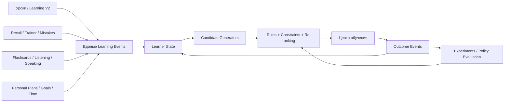
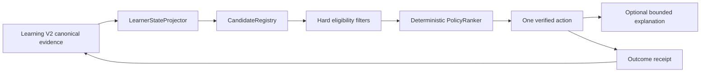

# Персональный центр обучения Phraseman

## Большой аудит, решение по старым «Вызовам дня» и реалистичный план новой системы

**Дата аудита:** 13 августа 2026 года  
**Статус:** этап удаления Daily Tasks реализован; безопасная оболочка и детерминированное ядро «Компаса» уже в разработке; глубокая Learning V2-персонализация остаётся за readiness-gate  
**Основание:** запрос владельца полностью удалить старый раздел «Задания / Вызовы дня» и спроектировать отдельный центр, который знает учебный опыт конкретного пользователя и выбирает для него лучший следующий шаг.

---

## Решение владельца от 13 августа 2026 — обязательная поправка

Этот блок новее остальных разделов документа и заменяет все противоречащие ему
предложения ниже.

- Компас — **ready-only**: загрузка, skeleton, `insufficient`, error и offline-no-action никогда не монтируются в пользовательский интерфейс. Нет полностью готового действия и персонального объяснения — нет кнопки, автопоказа, панели и доступа свайпом.
- Personal Plans остаются самостоятельной функцией до полной замены Learning V2, но Компас их больше не читает и не рекомендует.
- Видимого понятия «просрочено» в Компасе нет. Повторение описывается как возможность закрепить материал.
- Детерминированный движок по-прежнему единолично выбирает действие и проверенный маршрут. AI получает только разрешённые числовые агрегаты и пишет лишь короткое персональное объяснение «Почему сейчас»; при недоступности или браке AI Компас скрыт.
- Удалены тексты «Решение на сейчас», «Пока рано выбирать за тебя» и весь блок «Что будет дальше».
- Поверхность состоит из самостоятельных смысловых блоков: идентичность Компаса, конкретное действие, персональное объяснение и CTA. Вложенной общей карточки внутри панели нет.

Исследовательская основа текста ограничена осторожными выводами о распределённой практике и извлечении из памяти: Cepeda et al. (2006), Roediger & Karpicke (2006), Roediger & Butler (2011). AI не имеет права обещать результат или изображать научную уверенность.

## 1. Решение в двух минутах

### Что предлагается сделать

1. **Полностью удалить старые `Daily Tasks / Вызовы дня`**: экран, карточку на Home, случайную ротацию, реролл, дневной прогресс, XP/осколочную награду за закрытие набора, тосты, события, облачную синхронизацию, серверный callable и тесты. Уже заработанные legacy-достижения сохраняются только как скрытая read-only совместимость, не показываются и больше не выдаются.
2. **Не удалять учебные модули**, в которые старые вызовы только отправляли пользователя: уроки, Learning V2, повторение, тренер ошибок, карточки, аудирование, произношение, диагностический тест и AI-dialog.
3. **Personal Plans сейчас не удалять.** Это временная активная система, которую владелец решил удалить позже — только когда Learning V2 будет готов и станет её полной функциональной заменой.
4. **Не переименовывать старые вызовы в новый центр.** Новый продукт должен быть другой системой: одна объяснимая рекомендация, собранная из реальных учебных сигналов пользователя, а не три случайных обязательства на календарный день.
5. Создать отдельную поверхность **«Центр обучения»** с главным обещанием: **«Вот лучший следующий шаг именно для тебя сейчас»**.
6. Первую версию сделать **без LLM в контуре принятия решения**. Она уже может быть полезной на текущих данных: незавершённый урок, просроченные повторы, частые ошибки, слабые карточки, тренер, активный маршрут, доступное время и возвращение после паузы.
7. Затем добавить единую модель знаний, отложенную проверку, эксперименты, ML-ранжирование и только потом — ограниченные LLM/voice-сценарии.

### Главный продуктовый принцип

> Phraseman не выдаёт пользователю список работы. Он знает, что пользователь изучал, где ошибался, что начинает забывать и сколько времени у него есть, после чего предлагает один следующий шаг и честно объясняет почему.

### Что уже умеет первый работающий Компас — простыми словами

- Сам появляется на Главной после готовности данных, но не чаще одного раза в день и не поверх важных окон.
- Открывается заметной кнопкой. Ещё один способ — провести вправо по Главной и открыть полный экран «Сегодня». Нижний системный край Android не используется.
- Показывает один конкретный следующий шаг, а не случайный набор обязательств.
- Видит незавершённый личный маршрут, начатый урок, слова и фразы, которые пора повторить, а также уже найденное слабое место.
- Объясняет причину: что осталось, сколько повторов накопилось или насколько далеко пользователь уже прошёл урок.
- Показывает примерное время и ведёт сразу в существующий нужный раздел.
- Если данных ещё мало, честно говорит об этом и предлагает безопасно начать или продолжить обучение.
- Не смешивает данные разных аккаунтов, даже если пользователь сменил аккаунт во время загрузки.
- Работает без генеративного AI при выборе действия: поэтому не выдумывает несуществующий урок или совет.
- Personal Plans остаются на месте и временно участвуют в рекомендации. Их удаление разрешено только после полной замены в Learning V2.

### Что он будет уметь после готовности Learning V2

- Понимать не только факт ошибки, но конкретный навык, причину затруднения, подсказки, скорость ответа и забывание со временем.
- Выбирать между чтением, аудированием, произношением, карточками, повтором, уроком и диалогом с учётом реальной пользы именно сейчас.
- Запоминать результат каждого своего совета: начал ли пользователь, закончил ли и стало ли знание сильнее.
- Предлагать другой формат, если текущий не подходит, и учитывать такие отказы в будущих решениях.
- Работать полезно без сети и не советовать действие, для которого нет загруженного контента, доступа или микрофона.
- Становиться лучше через контролируемые эксперименты, но никогда самостоятельно не менять маршруты, награды или правила доступа.

### Что является настоящим moat

Не объём фраз и не сам по себе AI-чат, а накопленная связка:

```text
curriculum graph
→ learner state
→ история выбранных действий
→ измеренный учебный результат
→ улучшенная recommendation policy
```

---

## 2. Что именно обнаружено в приложении

В Phraseman сейчас есть **две разные системы**, которые внешне могут выглядеть как «задания», но архитектурно и по ценности не равны.

### 2.1. Старая система `Daily Tasks` — удалить

Это отдельный контур случайных дневных вызовов:

- около 90 заранее описанных заданий;
- ротация по UTC-дню и игровому уровню;
- три базовых задания в день;
- замена одного задания;
- локальный дневной прогресс;
- XP за отдельные задания;
- осколок за закрытие всего набора;
- специальный экран «Вызовы дня»;
- строка на главном экране;
- тосты и first-visit modal;
- синхронизация старого JSON через `users/{uid}.progress`;
- серверный callable `dailyTasksAllShardsClaim`;
- множество врезок в уроки, карточки, trainer, theory и другие экраны только для увеличения счётчиков.

Источник истины этой системы — `app/daily_tasks.ts`. Она не строит оптимальный маршрут. Она выбирает набор из каталога и затем слушает действия пользователя в других модулях.

### 2.2. `Personal Plans` — сохранить сейчас, полностью заменить Learning V2 позже

В `app/personal_plan_*` уже есть:

- учебные планы и curriculum;
- выбор темпа 5/10/15/20 минут;
- блоки упражнений;
- события попыток;
- теги грамматики, лексики и ошибок;
- сводка слабых мест;
- recovery-кандидаты;
- причины выбора упражнения с evidence;
- маршрутизация в уроки, trainer, review и flashcards;
- локальное состояние активного маршрута;
- часть cloud sync;
- строгие content/release gates.

Это не готовый «мозг»: текущие дни во многом статичны, а богатые сигналы ещё слабо влияют на выбор следующего действия. Сейчас это действующая система, поэтому её нельзя уничтожать вместе с Daily Tasks.

**Решение владельца:** Personal Plans остаются в продукте до готовности Learning V2. После того как Learning V2 даст полную функциональную замену, Personal Plans нужно будет удалить целиком как устаревшую систему.

Масштаб подтверждает, что это отдельная будущая миграция: аудит насчитал около 117 `app/personal_plan*` файлов, около 170 прямых тестов и примерно 123 MB runtime audio плюс несколько мегабайт art. До удаления потребуется отделить shared speech и общие mistake/trainer-компоненты, перенести нужный пользовательский прогресс и доказать parity в Learning V2.

Архитектурное следствие: новый Центр должен считать **Learning V2 целевой учебной платформой**. Personal Plans можно временно читать через изолированный adapter, но нельзя строить новые постоянные контракты Центра непосредственно вокруг plan-specific day/task model — иначе будущая замена снова станет дорогой.

### 2.3. Старый Compass уже в основном удалён

Старый Help Board / Compass-chat оставлен на сервере как disabled tombstone для безопасного поведения старых клиентов. В интерфейсе и документах ещё встречается слово «Компас», а store listing до сих пор обещает AI-наставника. Новый центр не должен автоматически наследовать старое имя и старые обещания.

Старый физический экран «Сегодня / Компас» был удалён вместе со старой моделью дня. В новом решении возвращается только его удачная навигационная идея: скрытая физическая страница слева от Home, но уже с новым содержанием и без зависимостей от Daily Tasks. Логических табов по-прежнему четыре, Arena остаётся отдельным центральным push, а Компас не создаёт новый URL или пятый tab.

Остатки слова Compass сейчас относятся к разным вещам:

- disabled Help Board / Compass server tombstones;
- мёртвые или осиротевшие remote-config/admin toggles;
- AI-dialog/speaking функции;
- weekly review и stats notes;
- onboarding, paywall и update-copy в голосе персонажа.

Удалять всё по строке `compass` нельзя. Мёртвые toggles и коллекции нужно retire отдельно, а живые AI-dialog и review-компоненты оценивать как возможных поставщиков нового центра.

Рекомендация по названию первой версии: **«Центр обучения»** или **«Следующий шаг»**. Имя «Компас» можно вернуть позже только как бренд/персонажа поверх работающего движка, но не как замену архитектуры.

---

## 3. Граница удаления: что удалить, а что сохранить

### 3.1. Удалить целиком как собственность старых Daily Tasks

| Поверхность | Файлы / символы | Действие |
|---|---|---|
| Ядро | `app/daily_tasks.ts`, `app/daily_tasks_es_locale.ts` | удалить каталог, ротацию, реролл, дневной progress/claim |
| Экран | `app/daily_tasks_screen.tsx` | удалить route и экран |
| Навигация | `app/daily_task_navigation.ts`, `app/daily_task_lesson_destination.ts` | удалить |
| UI-модель | `app/daily_task_progress_ui.ts` | удалить |
| Кэш | `app/daily_tasks_screen_cache.ts`, `app/daily_tasks_screen_persist.ts` | удалить |
| Арт/иконки | `app/daily_task_achievement_icons.ts`, `app/daily_task_background_art.ts` | удалить после проверки статических `require()` |
| Компоненты | `components/daily-tasks/*` | удалить |
| Глобальные overlays | `components/DailyTaskRewardToast.tsx`, `components/DailyTasksFirstVisitModal.tsx` | удалить |
| Общий registry | mapping `daily_tasks_screen` в `components/appArtBackdropRegistry.ts` | удалить только эту запись |
| Home-иконки | поле `dayTasks` и статические require в `app/home_menu_icons.ts` | удалить после снятия последнего entry |
| Серверная награда | `functions/src/daily_tasks_shards.ts` и его тест | удалить callable и export |
| Тесты | `tests/daily_task*`, `tests/daily_tasks*`, `tests/unit/daily_tasks.test.ts` | удалить или заменить новыми контрактами центра |

После исчезновения последних статических `require()` можно удалить примерно 1,4 MB `assets/images/daily_task_icons`, около 100 KB `daily_task_card_art` и Home-варианты `*-daily-tasks`. Один survey asset сейчас живёт внутри daily-task каталога: его сначала нужно перенести в survey namespace, иначе удаление каталога сломает отдельную систему опросов.

### 3.2. Удалить интеграции старой системы из общих файлов

Это самая рискованная часть: файлы общие, поэтому удалять нужно только конкретные ветки Daily Tasks.

| Общий файл | Что убрать | Что обязательно сохранить |
|---|---|---|
| `app/(tabs)/home.tsx` | загрузку daily summary, subscriptions на daily events, карточку `/daily_tasks_screen`, survey-as-daily-card | Home, быстрый старт, последний урок, league, stats, tips |
| `app/_layout.tsx` | prime daily cache, route, first-visit modal, reward toast | остальные routes, account transitions, boot hydration |
| `app/events.ts` | `daily_task_completed`, `daily_task_progress_changed`, `daily_task_reward_claimed`, reroll events | типизированную шину остальных событий |
| `app/cloud_sync.ts` | daily progress restore/merge, pending daily-all claim, daily cache cleanup | sync уроков, trainer, recall, flashcards, Personal Plans, auth invariants |
| `app/target_storage_keys.ts` | фабрики ключей `dailyTasks*` и daily-task achievement keys | общую target-scoping инфраструктуру |
| `app/shards_system.ts` | `daily_tasks_all`, pending claim и claim helpers; retired reroll source | все другие shard sources и ledger |
| `app/lifetime_profile_stats.ts` | `lifetime_daily_tasks_claimed_v1`, поле `dailyTasksClaimed` | учебные и экономические lifetime-метрики |
| `app/stats_daily_breakdown.ts` | дневной счётчик claims старых задач | остальные stats rows |
| `app/progress_events_client.ts` | тип `daily_task_reward` | остальные ordered event types; синхронно обновить серверный contract |
| `functions/src/progress_events.ts` | обработку `daily_task_reward` | остальные authoritative progress events |
| `functions/src/index.ts` | export `dailyTasksAllShardsClaim` | все остальные функции |
| `app/product_analytics_screen_registry.ts` | route старого экрана | добавить route нового центра отдельно |
| `app/achievements*` | только достижения, основанные на закрытии Daily Tasks | достижения уроков, recall, trainer, flashcards и т. д. |
| `app/boons/*` | только зависимости от daily completion, если они действительно есть | независимые comeback/login/streak механики |

`getTodayKey()` нельзя потерять вместе с `daily_tasks.ts`: некоторые boons, surveys и общие механики используют его как утилиту даты, а не как задания. В проекте уже есть канонический `getUtcDayKey()` в `app/local_date.ts`; все независимые потребители нужно перевести на него до удаления daily core.

Живая админка также содержит daily-specific чтения, графики, reset UI и label `daily_tasks_all`. Их нужно хирургически удалить из **единственного** рабочего файла `admin/v2/legacy.html`, предварительно прочитав `docs/design/ADMIN_UI_BIBLE.md`. Общие операции пользователя и shard UI при этом сохраняются.

### 3.3. Удалить счётчики из учебных экранов, не сами экраны

Старый `daily_tasks.ts` импортируется множеством полезных модулей только затем, чтобы обновлять прогресс чужого дневного задания. Эти вызовы нужно удалить, сохранив основное действие экрана:

- `app/lesson1.tsx`;
- `app/lesson_words.tsx`;
- `app/lesson_irregular_verbs.tsx`;
- `app/lesson_theory_v2.tsx`;
- `app/lesson_help.tsx`;
- `app/review.tsx`;
- `app/trainer_words_session.tsx`;
- `app/trainer_phrases_session.tsx`;
- `app/flashcards_audio.tsx`;
- `app/flashcards/useCollectionData.ts`;
- `components/AddToFlashcard.tsx`;
- `components/DailyPhraseCard.tsx`;
- `app/diagnostic_test.tsx`;
- `app/club_screen.tsx`;
- `app/streak_stats.tsx`;
- отдельные ветки Personal Plans, если они лишь инкрементируют старый daily counter.

Правило: после удаления старых вызовов урок всё ещё должен завершаться, карточка сохраняться, trainer учитывать ошибку, review обновлять SRS, а диагностика сохранять уровень.

### 3.4. Опросы сохранить, daily-обвязку удалить

`survey_daily_task.ts`, `survey_daily_task_cache.ts`, `SurveyTaskCard` и shard survey сейчас встроены в старый экран как «дополнительное задание». Это не означает, что нужно удалить сам продуктовый опрос.

Рекомендуемая граница:

- убрать опрос из Daily Tasks и Home daily summary;
- сохранить серверный опрос, consent и выдачу награды, если они нужны продукту;
- показывать его через Notification Center, inbox/banner queue или отдельную исследовательскую поверхность;
- переименовать daily-specific client wrappers после удаления старого маршрута.

Две reminder-строки в `app/notifications.ts`, которые говорят о завершении «вызовов/заданий», нужно заменить нейтральным текстом о занятии или учебной цели. Сам notification scheduler не относится к Daily Tasks и сохраняется.

### 3.5. Не удалять по глобальному поиску слова `task`

Слово `task/задание` используется в:

- турнирах и Arena;
- заданиях внутри урока;
- Learning V2 activity contracts;
- content factory;
- Personal Plan exercise blocks;
- тестовых и административных workflow.

Они не принадлежат Daily Tasks. Массовое удаление по имени сломает продукт.

### 3.6. Исторические достижения не отнимать задним числом

Daily-specific достижения и титулы встречаются в `app/achievements.ts`, `app/achievements_screen.tsx`, `constants/achievementCoreArt.ts`, `constants/achievementImageAssets.ts` и `constants/titles.ts`. Новое начисление нужно прекратить и активные прогресс-блоки скрыть/retire. Но уже заработанные пользователем награды нельзя молча удалить из истории аккаунта: это отдельное продуктовое решение о legacy display/migration, а не побочный эффект удаления экрана.

---

## 4. Что Phraseman уже знает о пользователе

Оценка ниже описывает реально найденные источники, а не желаемую архитектуру.

| Сигнал | Текущий источник | Качество сейчас | Можно использовать в первой production-версии |
|---|---|---:|---:|
| Язык обучения | target-scoped storage, language profile | высокое | да |
| Уровень | diagnostic result, level exams, course progress | среднее/высокое | да |
| Последний открытый урок | `lastOpenedLessonKey` и Home hydration | высокое | да |
| Прогресс фраз урока | `lesson{N}_progress` / scoped equivalents | высокое для старых уроков | да |
| Завершения и лучшие scores | lesson progress + authoritative progress events | высокое | да |
| Общая точность | `user_stats_v1` | грубая агрегация | да, только fallback |
| Брошенные уроки | `lessonsStarted/lessonsAbandoned` | агрегат без контекста | ограниченно |
| SRS / дата следующего повтора | `active_recall_items` | полезное SM-2 состояние | да |
| Ошибки по фразам и токенам | `mistake_log_v1` | полезное, target-scoped | да |
| Очередь trainer | `trainer_store_v1` | высокое для практики ошибок | да |
| Слабость слова/фразы | SRS interval + trainer streak/mistakes | эвристика уже есть | да |
| Карточки и их прогресс | flashcards storage, swipe memory, sessions | фрагментировано | да после adapter |
| Personal Plan attempts | `personal_plan_attempt_events_v1` | богатые теги и evidence | да локально |
| Weak spots Personal Plan | `personal_plan_weak_spot_summary.ts` | хорошая чистая модель | да |
| Активный Personal Plan | `PERSONAL_PLAN_STATE_KEY`, completed tasks | синкается частично | да |
| Время в приложении | foreground daily ms | агрегат | да |
| Учебный ритм | `daily_stats`, stats breakdown, streak | полезный агрегат | да |
| Цель пользователя | language profile / plan setup | фрагментировано | частично |
| Предпочитаемый формат | явной устойчивой модели нет | отсутствует | нет, надо собирать |
| Время ответа на уровне концепта | не единообразно | пробел | нет |
| Hint usage на уровне попытки | не единообразно | пробел | нет |
| Listening mastery | есть отдельные progress-поля, общей модели нет | фрагментировано | частично |
| Pronunciation mastery | отдельные readiness/attempt контуры, общего score нет | незрелое | позже |
| Learning V2 evidence | server-side attempts/projections/evidence | строго, но отдельный мир | после server adapter |
| AI-dialog outcome | есть экраны/сессии, общей transfer-метрики нет | пробел | позже |

### Главный вывод из аудита данных

Данных достаточно, чтобы **уже сейчас** выбрать полезный следующий экран. Но данных пока недостаточно, чтобы честно заявлять: «система знает 1 842 слова, точно понимает все времена и предсказывает идеальный 14-минутный урок».

Первая версия должна показывать только доказуемые причины:

- «Этот урок уже начат»;
- «7 фраз пора повторить»;
- «В trainer накопилось 5 ошибок»;
- «Ты дважды ошибся в этой категории»;
- «После паузы лучше начать с короткого повтора».

Нельзя писать «это твоя главная слабость», если evidence состоит из одной попытки.

### 4.1. Три разных уровня достоверности

Сейчас источники нельзя складывать как равноценные:

1. **Authoritative server evidence:** `progress_events`, Learning V2 verified projections, Arena observations, XP/streak и entitlement.
2. **Durable local/synced state:** mistake log, Active Recall, trainer, flashcard memory, POS mastery, Personal Plan attempts.
3. **Consent-gated product analytics:** Firebase Analytics/PostHog.

Третий слой полезен для продуктовых экспериментов, но не может быть обязательным источником персональной рекомендации: пользователь может не дать consent, SDK может быть недоступен, а локальная durable analytics queue не является каноническим учебным ledger.

### 4.2. Критические пробелы до «полной памяти аккаунта»

- Нет единого серверного ledger правильных **и неправильных** ответов. Часть `lesson_answer`/`review_answer` событий связана с выдачей XP и поэтому не является полной траекторией ошибок.
- Нет общего `contentItemId / skillId`, связывающего lesson phrase, mistake log, trainer item, flashcard, Arena task и Learning V2 tuple.
- Learning V2 имеет богатые outcome/timing/hint bodies в контракте, но серверная evidence-проекция во многих местах хранит refs/hashes и звёзды, а не удобную полную историю для recommendation engine.
- Синхронизация EN/FR асимметрична: некоторые EN mistake/POS/flashcard-memory ключи не входят в основной sync, тогда как target-scoped FR варианты входят.
- Irregular-verbs SRS и часть Learning V2 snapshot остаются local/account-local.
- Цели раздроблены между language profile, onboarding и Personal Plan.
- Нет decision log: что было предложено, какие альтернативы рассматривались и улучшилось ли знание после действия.

До устранения этих пробелов первая версия должна быть local-first и маркировать качество каждого источника: `authoritative_server | durable_client | synced_snapshot | analytics`.

### 4.3. Лучшая готовая основа будущего движка

`app/weekly_review_briefing.ts` уже делает значительную часть нужной агрегации:

- параллельно читает mistake log, phrase analytics, activity, trainer и resolved trainings;
- возвращает `ready / insufficient / error`, не превращая сломанный источник в уверенный ноль;
- строит ограниченный allowlist рекомендаций;
- сохраняет `evidenceRegistry` с конкретными счётчиками;
- умеет предлагать due words/phrases, слабые категории и продолжение урока.

Его разумно использовать как прототип read-adapter слоя нового Центра, а не переносить weekly UI целиком. Для production-релиза его нужно расширить flashcard strength, незавершёнными Learning V2 sessions, recommendation receipts и единым policy contract.

---

## 5. Целевая архитектура



### 5.1. Слой 1 — единый контракт учебного события

Каждый модуль должен уметь сообщить не «пользователь что-то нажал», а нормализованный учебный факт.

```ts
type LearningEventV1 = {
  eventId: string;
  occurredAtMs: number;
  accountScope: string;
  studyTarget: string;
  sourceLocale: string;
  sourceModule:
    | 'lesson'
    | 'learning_v2'
    | 'recall'
    | 'trainer'
    | 'flashcards'
    | 'personal_plan'
    | 'listening'
    | 'speaking'
    | 'diagnostic';
  activityId: string;
  conceptIds: string[];
  contentUnitIds: string[];
  outcome: 'correct' | 'wrong' | 'skipped' | 'completed' | 'abandoned';
  responseMs?: number;
  hintCount?: number;
  errorCodes?: string[];
  difficulty?: number;
  evidenceConfidence: number;
  schemaVersion: 'learning-event.v1';
};
```

Требования:

- append-only и идемпотентность;
- account/study-target isolation;
- offline queue;
- никакого raw audio в общей истории;
- старые модули подключаются adapters, а не массовой переписью;
- server-verified события помечаются отдельно от client observations.

### 5.2. Слой 2 — `LearnerState`

Это снимок, а не бесконечный журнал.

```ts
type LearnerStateV1 = {
  profile: {
    studyTarget: string;
    sourceLocale: string;
    level: string | null;
    goalIds: string[];
    availableMinutes: 3 | 5 | 10 | 15 | 20;
  };
  continuity: {
    lastActivityAtMs: number | null;
    interruptedActivity?: { module: string; activityId: string; progress: number };
    recentSessionMinutes: number[];
  };
  concepts: Record<string, {
    exposures: number;
    correct: number;
    wrong: number;
    lastSeenAtMs: number;
    recallProbability?: number;
    masteryEstimate: number;
    confidence: number;
    errorCodes: Record<string, number>;
  }>;
  queues: {
    recallDue: number;
    trainerDue: number;
    weakFlashcards: number;
    planRecovery: number;
  };
  stateVersion: string;
};
```

Критично разделить:

- **оценку знания**;
- **уверенность в этой оценке**;
- **выбор следующего действия**.

Одна ошибка не должна превращаться в вечный ярлык «плохо знает Past Perfect».

### 5.3. Слой 3 — генераторы кандидатов

Каждый продуктовый модуль предлагает 0–N безопасных действий общего формата.

```ts
type LearningActionCandidateV1 = {
  candidateId: string;
  sourceModule: string;
  actionType: string;
  deepLink: string;
  titleKey: string;
  estimatedMinutes: number;
  conceptIds: string[];
  evidenceIds: string[];
  reasonCodes: string[];
  learningNeed: number;
  forgettingRisk: number;
  goalFit: number;
  continuationValue: number;
  expectedFriction: number;
  abandonmentRisk: number;
  confidence: number;
  eligible: boolean;
  blockedReasons: string[];
};
```

Первая очередь генераторов:

1. `ContinueInterruptedGenerator` — закончить начатый урок/сессию.
2. `RecallDueGenerator` — повторить то, что начинает забываться.
3. `RecurringMistakeRepairGenerator` — исправить повторяющуюся ошибку.
4. `TrainerQueueGenerator` — разобрать очередь слов/фраз.
5. `PersonalPlanNextBlockGenerator` — продолжить выбранную жизненную цель.
6. `FlashcardWeakSetGenerator` — короткая работа со слабыми карточками.
7. `ComebackGenerator` — мягкий сценарий после паузы.
8. `DiagnosticGenerator` — уточнить уровень, если данных недостаточно.
9. `DiscoveryGenerator` — безопасный fallback для нового пользователя.

Позже:

- listening weakness;
- pronunciation;
- scenario transfer;
- AI conversation;
- goal/deadline plan.

### 5.4. Слой 4 — объяснимый rules-based ranking

Первая версия формулы:

```text
score =
  learningNeed
  forgettingRisk
  goalFit
  continuationValue
  confidence
  novelty
  comebackFit
  - expectedFriction
  - recentRepetition
  - abandonmentRisk
```

После scoring обязательны ограничения:

- не рекомендовать заблокированный или недоступный контент;
- учитывать Premium/free access до показа CTA;
- не вести в voice без microphone consent;
- не повторять один режим несколько раз подряд;
- не давать трудный remediation после серии ошибок;
- не обещать уложиться в 3 минуты, если маршрут обычно занимает 10;
- при неполных/повреждённых данных использовать безопасный fallback;
- сохранять evidence и `policyVersion` для каждого решения.

### 5.5. Слой 5 — журнал решений и outcomes

Для обучения политики нужно логировать не только выбранную карточку.

```ts
type RecommendationDecisionV1 = {
  decisionId: string;
  policyVersion: string;
  learnerStateVersion: string;
  candidateIds: string[];
  candidateScores: Record<string, number>;
  selectedCandidateId: string;
  reasonCodes: string[];
  shownAtMs: number;
  startedAtMs?: number;
  completedAtMs?: number;
  dismissedAtMs?: number;
  alternativeChosenId?: string;
  outcomeWindowEndsAtMs: number;
};
```

Без списка рассмотренных кандидатов и версии policy невозможно честно понять, почему система ошиблась и чему научился эксперимент.

---

## 6. Как должен выглядеть пользовательский центр

### 6.1. Главное отличие от «Вызовов дня»

| Старые вызовы | Новый центр |
|---|---|
| три случайных обязательства | один лучший следующий шаг |
| сброс по UTC | непрерывная память обучения |
| цель — закрыть набор | цель — улучшить конкретный навык |
| XP/осколок как причина | учебная польза как причина |
| реролл случайным заданием | «выбрать другое» из подходящих кандидатов |
| прогресс `0/3` | понятное доказательство: что и почему |
| одинаковая механика дня | учитывает паузу, ошибки, forgetting и цель |

### 6.2. Рекомендуемая структура экрана

```text
КОМПАС · СЕГОДНЯ
Решение на сейчас

Повтори 6 фраз с at / in / on
Вчера ты дважды перепутал эти предлоги.

[ Повторить · 4 мин → ]
[ Почему именно это? ]

В полном центре:
Почему сейчас
• К повторению готовы — 6 фраз
• Просрочены — 2

После занятия Компас учтёт результат
и пересчитает следующий шаг.
```

В первом кадре не показываются raw confidence, технические названия источников,
облако чипов, будущий второй шаг или декоративная статистика. Движок пока выбирает
только одного победителя, поэтому изображать полноценный roadmap было бы ложью.

Целевая поверхность — глобальный `CompassCenterHost`, а не native `<Modal>`. Он открывается автоматически по безопасной политике или заметной кнопкой на Home; вторичный вход — свайп вправо с Home на скрытую полноэкранную страницу «Сегодня». Буквальный свайп от нижнего системного края исключён: на Android он конфликтует с кнопочной и жестовой системной навигацией. Уже открытая панель свободно тянется за верхнюю ручку между компактным и развёрнутым состояниями. Существующие destination routes (`/lesson_menu`, `/review`, `/trainer`, flashcards, diagnostic, exams, AI dialogs) переиспользуются как проверенные действия; их копии внутри Компаса не создаются.

### 6.3. Обязательные состояния

- новый пользователь без данных;
- достаточно данных для уверенной рекомендации;
- мало данных / low confidence;
- offline с локальным snapshot;
- нет доступного кандидата;
- всё важное на сегодня сделано;
- возвращение после 3/7/30 дней;
- пользователь отверг рекомендацию;
- Premium-кандидат недоступен;
- microphone consent отсутствует;
- account transition / stale snapshot;
- ошибка источника: не показывать уверенную ложь.

### 6.4. Агентность пользователя

Новый центр не должен стать жёстким автопилотом. Нужны:

- «Почему это?» с evidence простым языком;
- «Выбрать другое» после появления реального ranked alternatives contract;
- быстрый выбор времени после того, как time-fit станет частью policy;
- формат: читать / слушать / говорить / карточки после готовности capability-aware Learning V2;
- «не предлагать это сейчас» после подключения outcome/feedback receipt;
- возможность открыть обычные разделы напрямую.

Отказ от рекомендации — ценный сигнал, но не доказательство незнания.

---

## 7. Реалистичный пользовательский сценарий

### Сценарий A — текущие данные, без AI

1. Пользователь открывает Центр.
2. Снимок показывает: урок 8 начат на 62%, в recall просрочено 7 фраз, последняя сессия длилась 6 минут.
3. Генераторы создают три кандидата.
4. Policy выбирает короткий recall, потому что forgetting risk высокий, а доступное время — 5 минут.
5. Центр пишет: «Повтори 7 фраз — они подошли к сроку. Около 4 минут».
6. После сессии события обновляют интервалы и learner state.
7. Следующая рекомендация — продолжить урок 8.

### Сценарий B — повторяющаяся ошибка

1. В нескольких проверяемых ответах появляется ошибка `preposition:at-in-on`.
2. После минимального evidence threshold создаётся weak spot с confidence.
3. Центр предлагает remediation только на утверждённых фразах.
4. Через 1–7 дней появляется отложенная проверка на новом парафразе.
5. Ошибка считается исправленной не по completion, а по transfer/delayed recall.

### Сценарий C — возвращение после паузы

1. Пользователь отсутствовал 12 дней.
2. Центр не предлагает длинный трудный урок и не обвиняет в потере серии.
3. `ComebackGenerator` создаёт 3-минутный знакомый набор с высокой вероятностью успеха.
4. После успешного завершения policy возвращает пользователя к curriculum.

### Сценарий D — голос позже

1. Пользователь выбирает цель «через три недели работать официантом в Мадриде».
2. Curriculum graph определяет допустимые ситуации и CEFR-границы.
3. LLM ведёт короткий диалог только в этом контексте.
4. ASR, pronunciation, grammar и communicative-goal оцениваются раздельно.
5. В learner state попадают структурированные признаки, а не вечная сырая аудиозапись и не свободный AI-вердикт.

---

## 8. Где нужен AI, а где он будет вредить

### Нужен позже

- сценарные диалоги в ограниченном curriculum;
- вариативные парафразы утверждённого материала;
- короткое объяснение уже детерминированно найденной ошибки;
- адаптация тона и сложности объяснения;
- разговорная практика;
- суммаризация evidence для пользователя;
- предложение плана под цель и срок в границах curriculum graph.

### Не должен быть источником истины

- mastery score;
- факт правильности там, где есть канонический ответ;
- начисление XP/звёзд/осколков;
- entitlement и paywall decisions;
- prerequisites и unlock;
- выбор победителя эксперимента;
- запись долгосрочной «слабости» по одному свободному ответу;
- безопасность детей;
- полный curriculum без human-approved graph.

LLM должен получать минимальный структурированный snapshot и возвращать валидируемый JSON. Нельзя отправлять ему полный аккаунт и надеяться, что он сам решит, что важно.

---

## 9. Эксперименты и экран владельца `Learning V3.14`

Идея из запроса реализуема. Но цифры должен считать статистический сервис, а не LLM и не Jarvis по свободному тексту.

### 9.1. Карточка решения

```text
Learning Policy V3.14
Статус: готова к решению
Экспозиция: 42 180 пользователей
Длительность: 21 день

Primary
6,8% delayed lesson completion
+4,1% D7 retention

Guardrails
−11% lesson abandonment
Crash-free sessions: без ухудшения
Cost / MAU: +€0,018
Подгруппы: 11 из 12 без ухудшения

Рекомендация: DEPLOY
Уверенность: 97%

[Approve rollout] [Продлить тест] [Отклонить]
```

### 9.2. Что обязано быть рядом с красивыми процентами

- абсолютное значение control и treatment;
- относительное изменение;
- sample size;
- длительность;
- confidence interval;
- зрелость D7/D30 когорты;
- primary metric, secondary metrics и guardrails;
- разбивка по target language, source locale, уровню, Premium/free, платформе;
- стоимость;
- версия app/content/policy;
- журнал решения администратора;
- staged rollout 5% → 25% → 50% → 100%;
- kill switch;
- заранее определённые rollback thresholds.

### 9.3. Где реализовывать

Единственная рабочая админка — `admin/v2/legacy.html`. Перед будущей реализацией этого экрана обязательно прочитать `docs/design/ADMIN_UI_BIBLE.md`.

Новая схема/коллекция experiments затронет правила проекта:

- проверить `functions/src/jarvis/*_firestore_fetcher.ts`;
- обновить `functions/src/jarvis/jarvis_data_contract_guard.test.ts`, если Jarvis читает новые поля;
- при новом департаменте обновить `all_departments_snapshot.ts` и `JF_DEPARTMENT_META`;
- закрыть новую коллекцию в `firestore.rules`;
- App Check для админских функций не включать без отдельного прямого распоряжения владельца.

### 9.4. Рекомендованный экспериментальный порядок

1. **Shadow mode:** центр считает рекомендации, но не показывает их.
2. **Rules A/B:** обычная навигация против одной объяснимой рекомендации.
3. **Mastery A/B:** простые counters против HLR/BKT-подобной модели.
4. **Bandit:** только среди уже безопасных кандидатов и с постоянным holdout.
5. **LLM/voice:** отдельные эксперименты, чтобы не смешать эффект интерфейса, контента и модели.

---

## 10. Метрики успеха

### 10.1. Главная ошибка — оптимизировать только completion

Если всегда давать лёгкие действия, completion вырастет, а обучение ухудшится. Поэтому primary learning metric должна включать отложенный результат.

Рекомендуемый north star:

```text
Delayed Learning Gain
= успех на отложенной проверке ранее изученного концепта,
  скорректированный на сложность и исходный уровень
```

### 10.2. Учебные метрики

- recall через 1/7/30 дней;
- повтор той же ошибки через 7/30 дней;
- transfer на новый парафраз;
- free response correctness;
- pre-test → post-test gain;
- calibration mastery model: Brier score / log loss;
- доля рекомендаций с последующим улучшением целевого concept;
- speaking goal completion;
- отдельно intelligibility, pronunciation, fluency и grammar.

### 10.3. Продуктовые метрики

- impression → start;
- start → completion;
- abandonment;
- «выбрать другое»;
- dismiss;
- time to first useful action;
- полезные учебные минуты;
- D1/D7/D30;
- comeback after 7/30 days;
- candidate coverage;
- diversity и repetition rate;
- доля объяснений, открытых через «Почему это?».

### 10.4. Guardrails

- crash/error rate;
- p95 snapshot/recommendation latency;
- stale-account leaks;
- стоимость на MAU и voice-minute;
- жалобы на неверное объяснение;
- safety flags;
- ухудшение по языкам/уровням/платформам;
- рост completion при падении delayed recall;
- чрезмерная нагрузка и длинные сессии;
- cold-start failure rate.

---

## 11. Этапы реализации

### Этап 0 — безопасно удалить старые вызовы

**Результат:** ни одного пользовательского входа, награды, события или cloud write старых Daily Tasks; остальные модули работают как раньше.

Работы:

- первым маленьким slice снять route-entry и Home-card, оставив данные нетронутыми;
- перевести независимых потребителей даты на `getUtcDayKey()` из `app/local_date.ts`;
- следующим slice снять daily-tracking calls из обычных учебных экранов;
- убрать overlays;
- удалить ядро и UI;
- удалить cross-module counters;
- удалить shard callable/source;
- удалить sync/restore fields;
- сохранить read-only migration cleanup для старых локальных ключей на ограниченный срок;
- обновить достижения, stats, analytics, screen registry, store copy;
- проверить неиспользуемые арты по статическим `require()`;
- добавить negative contract: `daily_tasks_screen`, `dailyTasksAllShardsClaim` и active daily event types не должны вернуться.

**Важно:** удаление облачных legacy-полей из документов пользователей не требуется для первого релиза. Достаточно перестать их читать и писать. Массовая data deletion — отдельная операция с backup/retention решением.

### Этап 1 — безопасный production-фундамент Компаса

**Статус:** в реализации. Оболочка, account-isolation, verified routes и первая deterministic policy уже созданы. Полный outcome-контур и глубокие V2-сигналы ждут gate из раздела 18.

**Целевой результат этапа:** глобальный интерактивный Compass sheet с одной честной рекомендацией, deterministic policy, offline fallback и полным outcome receipt; LLM не входит в контур выбора действия. Сейчас готовы поверхность, локальный выбор, причины и безопасная навигация; offline freshness и outcome receipts ещё предстоит добавить.

Поставщики:

- last lesson;
- active recall due;
- trainer due/mistakes;
- active Personal Plan через временный adapter до полной замены Learning V2;
- weak flashcards;
- diagnostic/cold start;
- comeback.

Read-adapter можно начать с декомпозиции `app/weekly_review_briefing.ts`, сохранив его fail-closed coverage и evidence registry. Это быстрее и безопаснее, чем ещё раз независимо агрегировать те же mistake/trainer/activity источники.

Текущий layout первого слоя:

```text
app/compass_recommendation*.ts
app/compass_presenter.ts
app/compass_auto_open.ts
app/compass_sheet_lifecycle.ts
components/compass/
  CompassCenterHost.tsx
  CompassQuickSheet.tsx
  CompassPage.tsx
  CompassSurface.tsx
```

### Этап 2 — единые события и кросс-девайсный learner state

**Результат:** recommendation остаётся персональной после переустановки и на втором устройстве.

- canonical event taxonomy;
- adapter для старых lessons/trainer/recall/flashcards;
- adapter для strict Learning V2 evidence;
- append-only cloud event store;
- derived learner snapshot;
- conflict/account-transition policy;
- privacy/export/delete contract;
- Firestore rules и Jarvis contract.

### Этап 3 — learning model и отложенная проверка

**Результат:** система оценивает forgetting/mastery, а не только сортирует очереди.

- HLR-like recall probability;
- concept/error taxonomy;
- evidence confidence;
- delayed probe scheduler;
- calibration reports;
- no-data/low-data behavior;
- content graph prerequisites.

### Этап 4 — эксперименты и owner approval

**Результат:** `Learning Policy V3.14` является проверяемым релизным решением.

- immutable experiment definition;
- assignment/exposure/outcome;
- mature cohorts;
- report computation;
- admin decision card;
- audit log;
- staged rollout and rollback.

### Этап 5 — LLM explanations и turn-based speaking

**Результат:** AI расширяет полезность, не управляя истиной.

- retrieval только из approved content;
- strict response schema;
- evals по языку/уровню;
- confidence/fallback;
- 2–5 минутные turn-based voice sessions;
- quota и cost guard;
- child/privacy flow;
- raw audio deletion policy.

### Этап 6 — bandit / adaptive policy

Только после достаточного трафика и стабильных outcome logs:

- safe candidate set;
- exploration cap;
- permanent holdout;
- policy propensity logging;
- subgroup guardrails;
- kill switch;
- no sensitive features.

### Этап 7 — удалить Personal Plans после полной замены Learning V2

Этот этап **запрещено начинать раньше готовности Learning V2**. Его цель — не сосуществование двух плановых систем навсегда, а окончательная полная замена старых Personal Plans.

Минимальные gates перед удалением:

- Learning V2 покрывает все пользовательские сценарии, которые владелец решил сохранить;
- есть эквивалентные или лучшие маршруты уроков, practice, listening, speaking, recall, quiz и recovery;
- Home, Lessons, paywall и onboarding больше не ведут в Personal Plans;
- активный пользователь не теряет доступ, entitlement и нужный учебный прогресс;
- shared speech/mistake/trainer код больше не импортирует plan-specific contracts;
- новый Центр получает кандидатов из Learning V2, а не из Personal Plans;
- plan-specific cloud/local state имеет утверждённую migration/retention policy;
- узкие parity и no-regression tests зелёные;
- только после этого удаляются routes, `app/personal_plan*`, plan-only tests, runtime audio и art.

Итоговое целевое состояние:

```text
Learning Center → Learning V2 + общие Review / Trainer / Flashcards / Speaking adapters
Personal Plans → удалены
```

---

## 12. Точная оценка реализуемости

| Возможность | Реализуемость сейчас | Комментарий |
|---|---:|---|
| Удалить старые Daily Tasks | высокая | большая связность, но граница найдена |
| Сохранить Personal Plans до готовности Learning V2 | высокая | обязательное переходное решение владельца |
| Полностью удалить Personal Plans после parity Learning V2 | средняя/высокая позже | отдельная миграция большого runtime и shared contracts |
| Одна next-best-action | высокая | текущих локальных данных достаточно |
| Объяснять «почему» | высокая | только evidence-backed причины |
| Учитывать 3/5/10/15 минут | высокая | time tiers уже есть в Personal Plans |
| Продолжать незавершённое | высокая | last lesson и progress существуют |
| Повторять забываемое | высокая | active recall уже хранит interval/nextDue |
| Исправлять частые ошибки | высокая | mistake log/trainer/plan attempts существуют |
| Знать все модули аккаунта | средняя | нужны adapters и единый snapshot |
| Работать между устройствами | средняя | часть данных sync есть, часть local-only |
| Честный mastery по concepts | средняя | нужна taxonomy и нормализация evidence |
| Автоматически строить идеальный 14-минутный урок | низкая сейчас | сначала curriculum graph + candidates |
| Голосовой tutor | средняя технически | высокий cost/privacy/quality risk |
| Learning V3.14 approve screen | средняя | analytics foundation есть, causal experiment service неполный |
| Полностью автономно улучшать продукт | низкая/опасная | approve и rollout должны оставаться human-controlled |

---

## 13. Риски проекта

### 13.1. Fake personalization

Самый опасный провал — написать «подобрано по твоим ошибкам», а фактически показать статический блок. Каждая персональная причина обязана иметь evidence IDs и confidence.

### 13.2. Разрозненные истины

Старые lessons, Learning V2, trainer, flashcards и Personal Plans хранят разные формы прогресса. Нельзя выбрать один старый JSON и объявить его полной моделью пользователя.

### 13.3. Потеря прогресса между устройствами

`personal_plan_attempt_events_v1` сейчас относится к account-local keys, а не к обычному `SYNC_KEYS`. Богатые ошибки плана могут исчезнуть на другом устройстве. До cloud learner state персонализация должна честно работать как local-first.

### 13.4. Уверенная ложь при ошибке источника

Как и в правилах Jarvis: пустой/сломанный source нельзя превращать в уверенный ноль. Snapshot должен нести `ready | empty | error | stale` и confidence.

### 13.5. Стоимость voice

Voice нельзя сразу делать бесконечным realtime. Даже одна только транскрипция при масштабе может стоить десятки/сотни тысяч долларов в месяц. Начинать с turn-based, квот и измеренного unit economics.

### 13.6. Детские данные и голос

Raw voice, свободные факты и долгосрочное профилирование требуют отдельного age/privacy дизайна. Собирать нужно минимально необходимые структурированные признаки.

### 13.7. Оптимизация engagement вместо обучения

Recommendation policy легко научить выдавать короткое и приятное. Delayed recall и transfer должны быть primary learning guardrails.

### 13.8. Текущий dirty worktree

На момент аудита незакоммиченные изменения уже есть в ключевых файлах:

- `app/(tabs)/home.tsx`;
- `app/_layout.tsx`;
- `app/cloud_sync.ts`;
- `app/events.ts`;
- `app/shards_system.ts`;
- `functions/src/index.ts`;
- `admin/v2/legacy.html`;
- `firestore.rules` и множестве учебных модулей.

Реализацию удаления нужно делать небольшими проверяемыми slices, сохраняя существующие изменения владельца. Нельзя применять массовую перезапись этих файлов.

---

## 14. Безопасные миграции

### Локальные ключи старых Daily Tasks

Runtime больше не читает и не пишет legacy daily keys. Старые значения не удаляются автоматически: они остаются нетронутой историей до отдельного retention-решения владельца. Это исключает потерю уже заработанных наград и позволяет расследовать старые claim/outbox записи. Новая система не имеет права использовать эти ключи как learning evidence.

### Firestore

На первом этапе:

- перестать писать legacy daily fields;
- игнорировать их при restore;
- сохранить документы как есть;
- отдельно решить retention/deletion старых полей после мониторинга релиза.

### Rewards

Старые pending claims нужно либо узко дренировать до cutoff, либо явно прекратить. Нельзя оставить бесконечный background retry callable, которого больше нет.

---

## 15. Узкие quality gates будущей реализации

### После удаления Daily Tasks

- нет route `/daily_tasks_screen`;
- нет Home CTA/summary;
- нет import из `daily_tasks` в пользовательских модулях;
- нет callable/export `dailyTasksAllShardsClaim`;
- нет `daily_task_reward` в ordered progress event contract;
- нет активных shard reasons `daily_tasks_all` / `daily_task_reroll`;
- нет mounted Daily overlays;
- survey продолжает работать вне daily surface;
- уроки, trainer, recall, flashcards, Personal Plans не потеряли своё поведение;
- cloud restore не пытается прогреть удалённый экран;
- account wipe и account switch не поднимают legacy keys в активный runtime;
- store copy и onboarding не обещают удалённый Compass/Daily Tasks.

### Для первой production-версии Компаса

- одинаковый snapshot даёт детерминированное решение;
- каждый выбранный кандидат eligible;
- у персональной причины есть evidence;
- low confidence не маскируется уверенным текстом;
- account generation не смешивает пользователей;
- target language изолирован;
- offline snapshot работает;
- Premium gate проверяется до navigation;
- dismiss/alternative не считается учебной ошибкой;
- нет LLM/network call на открытие центра;
- p95 вычисления укладывается в продуктовый budget.

### Для экспериментов

- assignment стабилен;
- exposure пишется только после фактического показа;
- outcome не приписывается пользователю без exposure;
- зрелые D7/D30 когорты не смешиваются с незрелыми;
- абсолютные и относительные значения совпадают;
- CI и sample size обязательны;
- admin approve логируется;
- rollout не включает App Check на админских функциях без отдельного приказа владельца.

---

## 16. Внешние исследования, на которых основано решение

### Персонализация и модель ученика

- [Duolingo: Introducing Birdbrain](https://blog.duolingo.com/learning-how-to-help-you-learn-introducing-birdbrain/)
- [Duolingo engineering: personalization and model experiments](https://blog.duolingo.com/unique-engineering-problems/)
- [Duolingo: human expertise with AI](https://blog.duolingo.com/how-duolingo-experts-work-with-ai/)

### Spaced repetition

- [A Trainable Spaced Repetition Model for Language Learning](https://aclanthology.org/P16-1174.pdf)
- [Open-source Half-Life Regression implementation](https://github.com/duolingo/halflife-regression)

### Recommendation pipeline и experiments

- [Google ML: recommendation systems overview](https://developers.google.com/machine-learning/recommendation/overview/types)
- [Google ML: re-ranking](https://developers.google.com/machine-learning/recommendation/dnn/re-ranking)
- [Duolingo: improving one experiment at a time](https://blog.duolingo.com/improving-duolingo-one-experiment-at-a-time/)
- [Duolingo: Time Spent Learning Well](https://blog.duolingo.com/time-spent-learning-well/)
- [Duolingo bandit notifications paper](https://research.duolingo.com/papers/yancey.kdd20.pdf)
- [Adaptive exercise recommendation with contextual bandits](https://arxiv.org/pdf/2207.14003)

### AI conversation и voice

- [Busuu Conversations](https://www.busuu.com/en/languages/language-learning-with-busuu-conversations)
- [Memrise MemBot](https://www.memrise.com/blog/introducing-membot)
- [Praktika agent architecture — vendor case study](https://openai.com/index/praktika/)
- [ETRI: ASR for non-native language learning](https://onlinelibrary.wiley.com/doi/full/10.4218/etrij.2023-0322)

### Safety и privacy

- [NIST Generative AI Profile](https://tsapps.nist.gov/publication/get_pdf.cfm?pub_id=958388)
- [European Commission: purpose limitation and data minimisation](https://commission.europa.eu/law/law-topic/data-protection/rules-business-and-organisations/principles-gdpr/overview-principles/what-data-can-we-process-and-under-which-conditions_en)
- [GDPR official text](https://eur-lex.europa.eu/eli/reg/2016/679/oj)
- [FTC COPPA FAQ](https://www.ftc.gov/business-guidance/resources/complying-coppa-frequently-asked-questions)
- [FTC guidance on children and voice recordings](https://www.ftc.gov/news-events/news/press-releases/2017/10/ftc-provides-additional-guidance-coppa-and-voice-recordings)

---

## 17. Итоговая рекомендация владельцу

### Делать

1. Удалить старые Daily Tasks как отдельную продуктовую систему.
2. Сохранить Personal Plans без удаления до полной готовности Learning V2.
3. Строить Learning Center вокруг целевой архитектуры Learning V2; Personal Plans подключать только временным adapter.
4. Сохранить остальные учебные модули и превратить их в поставщиков кандидатов.
5. Запустить отдельный Learning Center сначала на объяснимых правилах.
6. Объединить события и построить learner state с confidence.
7. Измерять delayed learning, а не только completion.
8. Версионировать policy и показывать владельцу доказательный approve-screen.
9. Добавлять LLM/voice после чистой архитектуры, evals, privacy и unit economics.
10. После доказанной полной замены удалить Personal Plans, их routes, plan-only данные и тяжёлые assets.

### Не делать

1. Не заменять три случайных задания тремя «AI-заданиями».
2. Не отправлять полный аккаунт в один LLM prompt.
3. Не заявлять персонализацию без evidence.
4. Не удалять все файлы со словом `task`.
5. Не удалять Personal Plans до функциональной готовности и parity Learning V2.
6. Не расширять новый Центр постоянными зависимостями от plan-specific модели.
7. Не оптимизировать только XP, клики или completion.
8. Не начинать с realtime voice.
9. Не давать системе самостоятельно деплоить learning policy без владельческого approve и rollout guardrails.

### Самый сильный первый релиз

Первая версия не обязана выглядеть фантастически. Она обязана **ни разу не врать**.

Если Phraseman уже сегодня сможет сказать:

> «У тебя 5 минут. Семь фраз пора повторить, потому что срок подошёл. После этого продолжим начатый урок»

— и действительно приведёт пользователя в правильную сессию, запомнит результат и завтра изменит рекомендацию, это уже будет качественно новый продукт, а не библиотека контента и не переименованный список заданий.

---

## 18. Авторитетный план «Компас: возобновление»

Этот раздел заменяет ранние предложения про отдельный промежуточный route. Оболочка, account-isolation и первая полезная deterministic policy реализуются уже сейчас на безопасных существующих источниках. Глубокая модель знаний и Learning V2 outcome-policy включаются только после readiness Learning V2. Personal Plans до parity остаются активными и подключаются только временным adapter.

### 18.1. Архитектура поверхности

| Компонент | Ответственность | Основание в текущем приложении |
|---|---|---|
| `CompassCenterHost` | единственный владелец visibility, auto-open, Home-кнопки, Back, account/overlay guards | root `GestureHandlerRootView` и `OverlayArbiterProvider` в `app/_layout.tsx` |
| `CompassPage` | скрытая физическая страница слева от Home; полноэкранный второй вход без нового tab/URL | `TabSlider` и `tab_page_model` |
| `CompassQuickSheet` | absolute overlay, backdrop, compact/expanded snap, handle, nested scroll, interactive open/close | Reanimated и существующие sheet/scroll patterns |
| `CompassRecommendationController` | account-scoped hydration, invalidation, stale-while-revalidate, offline fallback | account generation, V2 progress, weekly review cache patterns |
| `LearnerStateProjector` | canonical V2 evidence → bounded learner state и coverage | V2 evidence/progress contracts |
| `CandidateRegistry` + `PolicyRanker` | генерация, hard filters, deterministic ranking, verified route | V2 optional practice и verified destination patterns |
| `RecommendationOutcomeRecorder` | impression → launch → start → completion/abandonment | V2 attempt/progress idempotency и analytics |

Не использовать native `<Modal>`: текущая архитектура уже защищается от iOS/Android freeze при наложении native modals. `CompassCenterHost` живёт внутри существующего root gesture tree и рисует обычный абсолютный overlay. Ключ `compassBriefing` остаётся независимым protected owner в `OverlayArbiter`, но больше не входит в `NATIVE_MODAL_KEYS`. Удаление `dailyPlan` и `dailyTaskRewardToast` его не затрагивает.



### 18.2. Gesture contract

1. Основной вход — заметная кнопка Компаса на Home с touch target не меньше 44×44. Автопоказ разрешён не чаще одного раза в локальный учебный день и только после готовности аккаунта, Home и overlay slot.
2. Вторичный жест — горизонтальный свайп вправо с Home на скрытую страницу «Сегодня». Он работает выше системной навигационной зоны и не зависит от нижнего Android edge.
3. После открытия вертикальный pan распознаётся только на ручке/шапке. Пока палец движется, sheet следует за ним 1:1 на UI thread; backdrop, радиус и translate интерполируются без JS round-trip.
4. На release snap выбирается по projected position и velocity. Состояния: `closed`, `compact`, `expanded`; внутри одной поверхности, без dismiss + push.
5. Контент скроллится независимо; вертикальный pan не вешается поверх всего ScrollView. Это сохраняет клики, Dynamic Type и обычный scroll.
6. Android Back работает ступенчато: `expanded → compact → closed`; на физической странице — возврат к Home без отдельного route history.
7. Панель не показывается поверх onboarding, security/ban/update/paywall, активной сессии, клавиатуры, account transition, background и другого защищённого overlay.
8. Жест не является единственным входом: доступны Home-кнопка, явные expand/collapse/close, VoiceOver/TalkBack labels/actions и Switch Control. При открытии focus переходит на видимый заголовок.
9. `Reduce Motion`: переходы сразу приходят в конечное состояние; нет spring travel, parallax, вращения, typewriter и бесконечных фоновых loops.

### 18.3. Машины состояний

Engine:

```text
hydrating
→ insufficient | ready_fresh | ready_cached
→ offline_stale | offline_no_action | recoverable_error
```

Surface:

```text
closed → interactive_opening → open
open → launching_action | interactive_closing → closed
```

`insufficient` не имитирует персонализацию: сообщает «я ещё собираю достаточно данных» и предлагает безопасный первый/продолжаемый шаг. Ошибка одного source уменьшает coverage/confidence; last-known-good можно показать только с честной отметкой актуальности.

### 18.4. Recommendation envelope

```ts
type CompassRecommendationV1 = {
  schemaVersion: 'compass-recommendation.v1';
  accountScopeHash: string;
  accountGeneration: number;
  localDayKey: string;
  studyTarget: string;
  learnerSourceLocale: string;
  seasonId: string;
  releaseId: string;
  policyId: string;
  policyVersion: number;
  recommendationId: string;
  generatedAtMs: number;
  validUntilMs: number;
  action: {
    kind: CompassActionKind;
    verifiedRoute: VerifiedRoute;
    expectedMinutes: number;
  };
  candidates: readonly {
    id: string;
    kind: CompassActionKind;
    score: number;
    eligible: boolean;
    reasonCodes: readonly string[];
  }[];
  evidenceRefs: readonly string[];
  coverage: number;
  confidence: 'low' | 'medium' | 'high';
  offlineAssetsReady: boolean;
  sourceFreshness: Record<string, number>;
  experiment: { experimentId: string; variant: string } | null;
};
```

Raw mistake text, voice audio и свободный profile dump в envelope/receipt не пишутся. Last-known-good хранится account-scoped. Инвалидация обязательна при смене account generation, target/locale, V2 release/policy, completion outcome, entitlement/capability и границы локального учебного дня.

### 18.5. Ranker и граница AI

Кандидаты первого production policy:

- `continue_in_progress`;
- `repair_weak_evidence`;
- `due_delayed_probe`;
- `personal_plan_step` — только временный adapter;
- `next_required_session`;
- `optional_practice`;
- `comeback_micro_session`.

Сначала применяются hard filters: route существует и разрешён; release/entitlement/gate пройдены; нужная capability доступна; действие помещается во время; контент/offline assets готовы; нет active session, дубля и недавнего повтора. Затем deterministic score:

```text
learning value
+ due urgency
+ continuity
+ target alignment
+ confidence
+ time fit
− fatigue
− recent repeat
− friction
```

LLM не выбирает action, route, score, reward или entitlement. Он может только переписать уже выбранное bounded explanation по allowlisted reason/evidence. При timeout, offline или invalid output используется локальный шаблон.

### 18.6. Auto-open policy

Автопоказ разрешён только после готовности root, account и content snapshot, на безопасном Home/tab route, без protected flow, keyboard и другого overlay. Максимум один раз за локальный учебный день; короткий resume не считается новым входом. `Не сейчас` подавляет дальнейший auto-open на сессию/день, но edge swipe и кнопка остаются доступны. В Settings есть отдельный переключатель auto-open.

Карточка всегда содержит:

- один конкретный следующий шаг;
- 1–3 evidence chips «почему»;
- ожидаемое время;
- доступность/offline status;
- primary CTA;
- `Почему это?`, `Не сейчас`, `Не подходит`.

### 18.7. Readiness gate Learning V2

Все пункты обязательны:

- production-route работает для всех 32 уроков и семи принятых modes, не только для Lesson 1 slice;
- canonical evidence пишется для success/needs-work, hints, skip, accessibility/system-invalid, delayed probes, completion и abandonment;
- стабильны verified deep links, account switch/delete/restore fencing, offline resume/assets/capability reporting, release/policy versioning;
- Learning V2 закрывает сценарии Personal Plans; parity adapter и перенос прогресса проверены, а удаление Personal Plans выполняется отдельным последующим пакетом;
- старые Daily Tasks нигде не пишут counter, claim, reward или event; исторические строки только read-only и не являются evidence;
- physical-device QA пройден на iOS/Android: home indicator/gesture navigation, nested scroll, Back, rotation, large text, VoiceOver/TalkBack/Switch Control, reduced motion, slow/offline/account transition и overlay stress.

Текущий gate = **не пройден**. Readiness-документ Learning V2 фиксирует один Lesson 1 vertical slice и незавершённые остальные 31 урок, семь modes, планы и полный offline/runtime rollout. Поэтому сейчас выполняется только retirement Daily Tasks и фиксация архитектуры — UI Компаса не внедряется преждевременно.

### 18.8. Rollout, метрики и owner approve

Rollout: internal allowlist → 1% → 5% → 10% → 25% → 50% → 100% через stable-account cohort policy, с kill switch, pause/rollback и ручным approve владельца на каждой ступени. Manual-open качество доказывается раньше, чем отдельно экспериментируется auto-open.

Primary:

- recommendation → action start;
- action completion;
- time-to-start/time-to-complete;
- lesson completion;
- delayed learning outcome;
- D1/D7.

Guardrails:

- abandonment;
- crash/ANR и JS/UI jank;
- false edge opens и конфликт с системным Home gesture;
- overlay starvation;
- offline dead ends;
- privacy/support complaints;
- деградация по platform/target/cohort.

Карточка `Learning V3.14` показывает не только проценты, но и absolute N, control/treatment, CI, длительность, зрелость когорты, platform/segment, guardrails и cost. Финальное решение остаётся человеческим.

### 18.9. Definition of Done

- один concrete action имеет traceable evidence и понятную причину;
- одинаковый snapshot + policy всегда дают одинаковый результат;
- невозможный или ложный route не запускается;
- offline даёт полезный шаг или честное отсутствие действия;
- edge open/drag/scroll/Back не конфликтуют и имеют доступную альтернативу;
- новый аккаунт никогда не видит cache предыдущего;
- auto-open соблюдает once-per-local-day, snooze и safe-route policy;
- владелец может pause/rollback без нового app release;
- focused contracts, performance budget и physical-device matrix зелёные.

---

## 19. Фактический результат этапа удаления

Удалён активный контур Daily Tasks во всех слоях:

- Home, root navigation, экран, cache/persist, first-visit modal, reward toast и art;
- tracker-вызовы из уроков, review, trainer, flashcards, theory, hint, diagnostic и Personal Plan exercise;
- события, XP reason, shard reward/callable, pending claims и admin reset/analytics;
- cloud-sync merge/restore/upload, storage-key ownership и дневные breakdown-поля;
- активные achievement unlocks и title, связанные только с Daily Tasks;
- dedicated backend, scripts, workflows, tests и bundled assets.

Сохранены и защищены отдельными контрактами:

- Personal Plans без функциональных сокращений;
- Daily Phrase и её собственная quest/XP-логика;
- Survey как самостоятельный Home → `/survey_screen` flow;
- boons с общим UTC day key;
- Weekly Review, learning insights и независимый overlay key `compassBriefing`;
- уже заработанные legacy-достижения в скрытой read-only compatibility без UI и новых unlocks;
- исторические пользовательские записи без массового destructive purge.

Проверка этапа: Functions TypeScript `--noEmit` прошёл; в root TypeScript после исправления двух остатков Daily Tasks остаются только четыре диагностики в параллельно изменяемом Arena-коде (`arena_matchmaking`, `ArenaTimerRing`, `arena_stars`), не относящиеся к этому удалению. Основной focused Jest-пакет дал 172 успешные проверки и обнаружил два устаревших achievement assertions; после их перевода на retired-контракт итоговый achievement/title/cloud/retirement пакет — 48/48, включая retirement guard 5/5. Functions — 77/77; RNTL опроса — 25/25; multi-agent learning slice — 62/62; tooling/Gustav slice — 30/30; focused ESLint — 0 ошибок; `git diff --check` прошёл.
