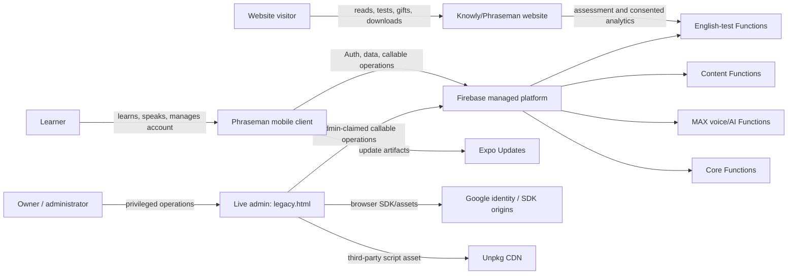

# Phraseman system context

Status: initial C4-lite baseline  
Machine-readable source: [SERVICE_CATALOG.json](SERVICE_CATALOG.json)  
Verified against manifests: 2026-09-11

## Purpose and boundary

Phraseman is a mobile-first language-learning service with two public web surfaces: the Knowly/Phraseman marketing and assessment website, and a privileged owner/admin console. Firebase provides identity, persistence, server execution and hosting; Expo/EAS provides the native application and update delivery path.

This baseline covers topology declared by `.firebaserc`, `firebase.json`, `app.json` and `eas.json`. It does not claim that every runtime vendor or data flow is present: domain contracts and the vendor register extend this view. Origins discovered from CSP or manifests are allowed/referenced endpoints, not proof that a specific data category is transmitted on every request.

## Context diagram



## Containers and authority

| Container | Authority / role | Main trust boundary | Criticality |
|---|---|---|---|
| Mobile client | Personal progress and ordinary economy operations are client-authoritative under the Economy Constitution; identity and external purchases remain separately confirmed | user device ↔ managed cloud | Tier 0 |
| Public website | Public content, acquisition, gifts and English-test entry | anonymous/consented browser ↔ public hosting/functions | Tier 1 |
| Live admin | Operator UI only; server callables must enforce admin authorization | public browser ↔ privileged admin session | Tier 0 |
| Core Functions | Identity, persistence, admin operations and cross-domain backend contracts | managed privileged runtime | Tier 0 |
| MAX Functions | Voice/AI server operations with consent-sensitive inputs | AI/voice trust boundary | Tier 1 |
| Content Functions | Content jobs and controlled publishing pipelines | authoring/admin ↔ content runtime | Tier 1 |
| English-test Functions | Public assessment API and analytics | public web ↔ managed API | Tier 1 |

## Non-negotiable architecture constraints

- `admin/v2/legacy.html` is the only live admin entry; extraction may create only scripts directly loaded by it.
- Admin authorization is enforced server-side through the admin claim. App Check for admin functions remains off until the owner explicitly authorizes the documented enablement sequence.
- Ordinary economy state remains client-authoritative; no standalone debit or direct legacy balance writer is allowed.
- Schema/content changes must keep Jarvis readers, contract guard and Firestore Rules synchronized where applicable.
- Learning V2 work follows the language-specific start documents before any action; it is outside this topology task.
- Deployment uses guarded Firebase/EAS paths and the current checkout; no alternative branch/worktree or shadow hosting surface is introduced here.

## Data classes

The catalog uses coarse discovery labels, not a completed privacy inventory:

- account/authentication identifiers;
- learning progress and assessment responses/results;
- purchases, entitlements and economy operations;
- consent and consented analytics;
- voice input and generated learning feedback;
- support/admin data and audit events;
- public content, scripts, fonts and update artifacts;
- request/device metadata visible to delivery providers.

Retention, legal basis, residency, subprocessor terms and deletion coverage remain inputs to the Privacy Data Lifecycle and Vendor Register enablers.

## Recovery state

Most Tier 0/1 entries deliberately use `recoveryTier: unapproved`. This is a visible owner decision gap, not missing JSON. Task 7.2 must approve RTO/RPO and replace `unapproved` with R0/R1 only after backup and recovery capabilities are measured and tested.

## Verification

Run:

```text
node --test scripts/verify_service_catalog.test.mjs
node scripts/verify_service_catalog.mjs --root .
```

The verifier fails when a Hosting target, Functions codebase or explicit HTTP(S) origin in the four canonical manifests lacks catalog coverage, when required governance metadata is empty, or when Tier 0/1 ownership is unknown.
