# Lesson Teaching Notes Audit

Date: 2026-05-31

Scope: after-answer explanation cards in lessons and Personal Plans.

## Current State

- The runtime pipeline exists in `app/lesson_teaching_notes.ts`.
- The lesson screen renders the card in `app/lesson1.tsx` through `lessonTeachingNote`.
- Correct answers show a note only once per lesson/plan scope.
- Wrong answers can show the note again and try to resolve the note near the mistaken token.
- `plan_phrase_recall` correctly suppresses explanations for correct answers, but still allows explanations after mistakes.
- Base lesson data files currently have no `teachingNote` content.
- Real authored teaching notes currently live in `app/personal_plan_phrase_lessons.ts`, mainly for `Гавань · день 1`.

## Coverage Gaps

- Lessons 1-32: no per-word `teachingNote` coverage in the lesson data files.
- Plan phrase lessons after `Гавань · день 1`: not authored yet, so no explanation coverage.
- Quiz explanations exist separately in the quiz screen and are not the same system as lesson assembly cards.
- Preposition explanations exist separately and are useful as a logic source, but they do not automatically cover lesson cards.
- Flashcard explanations exist in some bundles, but they are not unified with lesson cards.
- Diagnosis trainer explanations are richer, but isolated from normal lessons.

## What Is Already Good

- Explanations appear after the user acts, not before.
- Correct and wrong answers can have different tone.
- Name slots are skipped, so the app does not over-explain user names.
- The resolver can explain a nearby meaningful word when the mistake happens on a service word before it.
- The current plan standards already require explanation notes for key route vocabulary like `viewing`, `appointment`, `postcode`, `deposit`, `landlord`, `clinic`, `prescription`, `account`, `card`.

## Main Problems

- Coverage is the biggest issue: ordinary lessons have the UI, but almost no authored cards.
- There is no global quality gate for explanation text length, banned phrasing, missing locales, or missing notes on first-use words.
- Some notes are too long for the empty middle area of the lesson screen.
- Some wrong-answer copy can become too theatrical or too strange. Humor is allowed, but the meaning must stay instantly clear.
- Explanations are stored as plain strings, so they do not yet carry structured metadata like `grammar`, `vocabulary`, `collocation`, `firstUse`, or `routeVocabulary`.
- There is no generated coverage report showing which lesson phrase introduces a new word or structure without a card.

## Style Rules

- Title: 2-5 words, concrete. Good: `Почему I'm`, `Viewing = просмотр`, `Здесь нужен for`.
- Body: 1-2 short sentences. Target: 90-180 Russian characters, hard max around 240.
- First sentence answers the immediate question: why this answer is correct or why the chosen answer fails.
- Second sentence may add a tiny contrast or everyday context.
- Explain words, not only grammar. If a user may not know `appointment`, `viewing`, `deposit`, `landlord`, the note is mandatory.
- For correct answers: calm confirmation plus why it works.
- For wrong answers: no shame, no “ты должен”. Use `Почти`, `Тут лучше`, `Здесь нужен`.
- Avoid developer wording: `конструкция`, `токен`, `слот`, `актив реколл`, `маршрут применяет`, `сцена`.
- Avoid unclear jokes, absurd imagery, and metaphors that can confuse older users or beginners.
- Do not explain everything every time. Explain first-use and mistakes; let repeated correct answers stay clean.

## Quality Gate Needed

- Every first-use grammar point has `teachingNote`.
- Every first-use route word has `teachingNote`.
- Every plan phrase has at least one meaningful note outside the name slot.
- Every note has RU correct/wrong text.
- UK/ES fallback is explicit or intentionally inherited.
- Note body length passes limits.
- Text contains no banned developer wording.
- Wrong-answer notes mention the correct form or correct word.
- Notes for plan content do not introduce grammar that the day has not opened yet.
- Recall mode only shows notes after mistakes.

## Priority Checklist

- P0: Polish `Гавань · день 1` notes and remove any wording that feels odd or unclear.
- P0: Add a quality gate test/report for missing or bad `teachingNote` content.
- P1: Add lesson 1 note coverage for `I am / I'm`, `you are / you're`, `it is / it's`, `here`, basic name/contact phrases.
- P1: Connect plan day validation to explanation coverage, not only phrase/quiz count.
- P2: Build a small authoring map for lessons 1-8: each lesson lists new grammar, new vocabulary, and required notes.
- P2: Reuse strong patterns from quiz/diagnosis explanations, but shorten them for lesson-card space.
- P3: Add a report command that prints coverage by lesson, phrase, word, category, and missing note reason.

## Research Notes

- Corrective feedback research supports feedback close to practice, especially when it helps the learner retry the form instead of only seeing right/wrong.
- Retrieval practice works best when feedback and later recall are connected: explain the mistake, then bring the item back later.
- Microlearning guidance points to one clear objective, short feedback, and clean interaction loops.

Sources:

- https://pmc.ncbi.nlm.nih.gov/articles/PMC9995700/
- https://www.cambridge.org/core/journals/language-teaching/article/timing-of-corrective-feedback-in-second-language-learning/0E8856852D0183E9DD91EDB4C249E245
- https://www.nature.com/articles/s41599-024-03983-6
- https://learnstream.io/blog/microlearning-best-practices/

---

## Audit Log

### Audit 01 - 2026-05-31 - базовая карта объяснений

Цель: найти все текущие источники объяснений, понять где уроковые карточки пустые, и зафиксировать единую карту улучшений для будущих аудитов.

#### Локальные находки

| Область | Файл | Что найдено | Вывод |
| --- | --- | --- | --- |
| Уроковая карточка после ответа | `app/lesson1.tsx` | Рендер `lessonTeachingNote` через `testID="lesson-teaching-note"` | UI-место есть, можно улучшать контент без перестройки урока |
| Выбор объяснения | `app/lesson_teaching_notes.ts` | `resolvePhraseTeachingNote`, seen-key, wrong/correct tone | Движок рабочий, но ему не хватает контента и quality gate |
| Плановые фразы | `app/personal_plan_phrase_lessons.ts` | Первые authored `LessonTeachingNote` для Гавани | Это текущий эталон, но стиль надо ещё полировать |
| Обычные уроки | `app/lesson_data_1_8.ts`, `app/lesson_data_9_16.ts`, `app/lesson_data_17_24.ts`, `app/lesson_data_25_32.ts` | `teachingNote=0` | Главная дыра: пользователь в обычном уроке почти не получает карточки “почему так” |
| Квизы | `app/quiz_data.ts`, `app/(tabs)/quizzes.tsx` | 2576 вхождений `explanations` в данных | Богатый источник паттернов, но не подключён к сборке фраз |
| Предлоги | `app/preposition_explanations.ts`, `app/lesson_prepositions.ts` | Rule-based explanation layer | Можно использовать как модель для коротких точечных объяснений |
| Диагностика | `app/diagnosis_training_*.ts` | 60 файлов, 124 `explanationBlock` | Сильный стиль “ошибка -> причина -> тренировка”, но он изолирован |
| Карточки | `components/AddToFlashcard.tsx`, `components/DailyPhraseCard.tsx`, flashcard bundles | Есть explanation-поля | Контент есть, но нет общего стандарта с уроками |
| Feedback engine | `app/feedback_engine.ts` | Есть hints/explanations | Может стать источником категорий ошибок |

#### Схема текущей системы

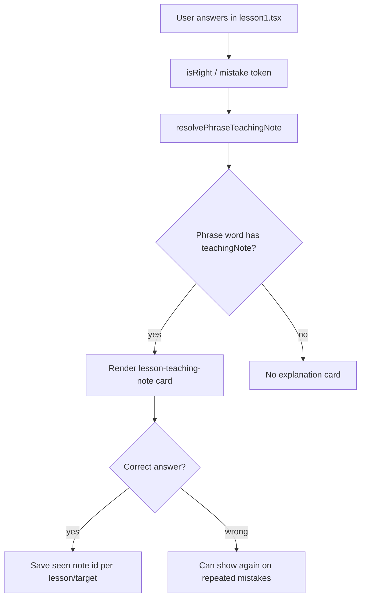
```mermaid
flowchart TD
  A[User answers in lesson1.tsx] --> B[isRight / mistake token]
  B --> C[resolvePhraseTeachingNote]
  C --> D{Phrase word has teachingNote?}
  D -->|yes| E[Render lesson-teaching-note card]
  D -->|no| F[No explanation card]
  E --> G{Correct answer?}
  G -->|yes| H[Save seen note id per lesson/target]
  G -->|wrong| I[Can show again on repeated mistakes]
```

#### Схема пробелов

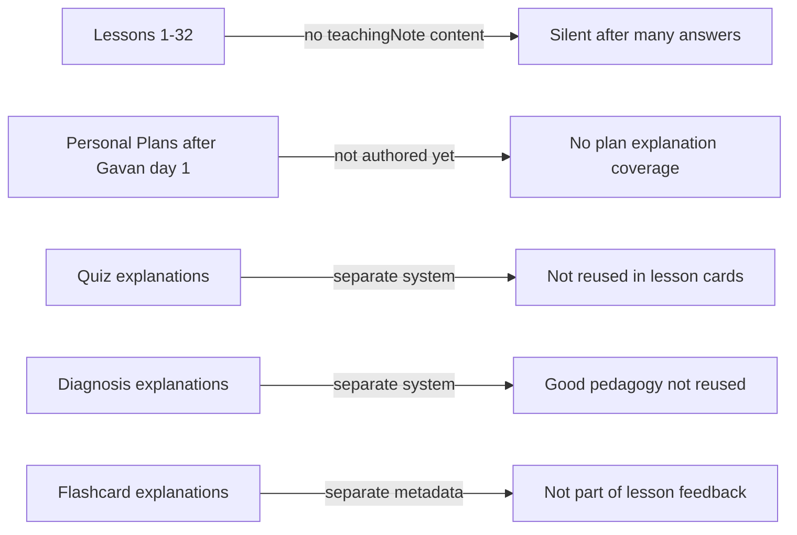
```mermaid
flowchart LR
  L[Lessons 1-32] -->|no teachingNote content| Gap1[Silent after many answers]
  P[Personal Plans after Gavan day 1] -->|not authored yet| Gap2[No plan explanation coverage]
  Q[Quiz explanations] -->|separate system| Gap3[Not reused in lesson cards]
  D[Diagnosis explanations] -->|separate system| Gap4[Good pedagogy not reused]
  F[Flashcard explanations] -->|separate metadata| Gap5[Not part of lesson feedback]
```

#### Объединённая карта улучшений

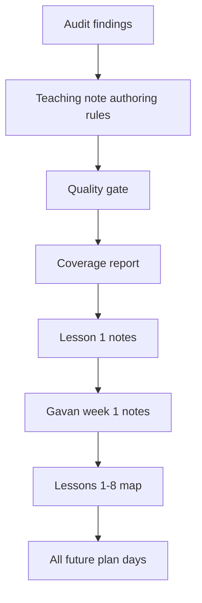
```mermaid
flowchart TD
  A[Audit findings] --> B[Teaching note authoring rules]
  B --> C[Quality gate]
  C --> D[Coverage report]
  D --> E[Lesson 1 notes]
  E --> F[Gavan week 1 notes]
  F --> G[Lessons 1-8 map]
  G --> H[All future plan days]
```

#### Новые выводы этого аудита

- Нужно вести этот файл как накопительную карту: каждый следующий аудит добавляет новый блок `Audit XX`, а не заменяет предыдущий.
- Уроковые объяснения должны стать единым продуктовым слоем, а не набором отдельных решений в квизах, карточках и диагностике.
- Самая важная работа сейчас не UI, а покрытие и контроль качества текста.
- Для будущей генерации дней плана нужен обязательный check: каждая новая фраза должна знать, какие слова и формы уже объяснены обычным уроком.
- Если слово новое и жизненно важное для ситуации, карточка обязательна даже если грамматика простая.

#### Риск, который надо не пропустить

Если просто добавить много объяснений без лимита, урок начнёт ощущаться тяжёлым. Поэтому правило такое:

- правильный ответ показывает только новое и только один раз;
- ошибка показывает разбор по месту ошибки;
- повтор без ошибки остаётся чистым;
- длинные объяснения уходят в отдельный справочный слой, а не в карточку после ответа.

#### Backlog после Audit 01

| Priority | Улучшение | Почему важно | Проверка |
| --- | --- | --- | --- |
| P0 | Quality gate для `LessonTeachingNote` | Не даст плохой copy и пустому покрытию пройти дальше | Jest/report по длине, banned words, required fields |
| P0 | Полировка Гавань day 1 | Это эталон для всех следующих дней | Snapshot или contract test на тексты и note ids |
| P0 | Coverage report по урокам | Нужно видеть где объяснения отсутствуют | CLI/report: lesson -> phrase -> word -> missing reason |
| P1 | Урок 1 teaching notes | Первый опыт должен объяснять `I'm / you're / it's` без сухости | Test: lesson 1 has required first-use notes |
| P1 | Связка plan day validator + notes | День нельзя считать готовым без объяснений | `validatePersonalPlanDay` проверяет plan phrase notes |
| P2 | Единый explanation style guide | Чтобы все следующие генерации писали одинаково качественно | Markdown rules + tests на banned phrases |
| P2 | Reuse patterns from quiz/diagnosis | Там уже есть сильные объяснения | Вытащить короткие шаблоны в lesson-note authoring |
| P3 | Metadata for notes | Нужны типы: grammar/vocab/collocation/firstUse | Type расширен без ломки старых данных |

#### Definition of Done для будущего внедрения

- Документ содержит минимум 10 аудитов или пользователь решает начать внедрение раньше.
- Для каждого найденного риска есть строка в backlog.
- Для каждого P0 пункта есть конкретный тест или report.
- Для каждого будущего plan day есть requirement: phrase content, explanation coverage, quiz coverage, recall behavior.

### Audit 02 - 2026-05-31 - конкурирующие подсказки, UX карточки и source-gate риски

Цель: проверить не только наличие `teachingNote`, но и то, что вокруг карточки объяснения нет старых подсказок, которые ломают новый стиль обучения.

#### Новые локальные находки

| Область | Файл | Что найдено | Риск |
| --- | --- | --- | --- |
| Старые grammar hints | `app/lesson1.tsx` | `GRAMMAR_HINTS` для `articles` и `some/any` показываются до ответа | Это другой педагогический слой: он объясняет до действия, а новая система должна объяснять после ответа |
| Copy старых hints | `app/lesson1.tsx` | Есть текст вида `Пока просто используй как показано` | Слабая формулировка: пользователь не понимает почему, а просто получает приказ запомнить |
| Source gate для hints | `app/lesson1.tsx` | `lessonHintSupportBlocked` вычисляется, но затем только `void lessonHintSupportBlocked` | Риск: hint-layer может обходить intended gate для target-language support |
| Target-scoped memory | `app/lesson1.tsx` | `triggerGrammarHint` читает/пишет `AsyncStorage.getItem(hint.key)` и `setItem(hint.key)` | Риск смешивания seen-state между study targets; рядом уже есть тесты, ожидающие scoped key |
| Result UI layering | `app/lesson1.tsx` | Result screen показывает wrong answer block, correct answer block, teaching note, report button | Карточка объяснения может теряться среди нескольких блоков, особенно на маленьком экране |
| Visual language | `app/lesson1.tsx` | Teaching note - простая карточка с border-left | Это функционально, но визуально слабее новых premium плановых карточек |
| Report button proximity | `app/lesson1.tsx` | `ReportErrorButton` сразу после teaching note | Может визуально конкурировать с объяснением; report должен быть вторичным |
| DEV grammar hint | `app/lesson1.tsx` | `DEV: grammar hint` принудительно показывает старый hint | Для разработки полезно, но его нельзя считать эталоном нового explanation UX |

#### Схема конкурирующих подсказок

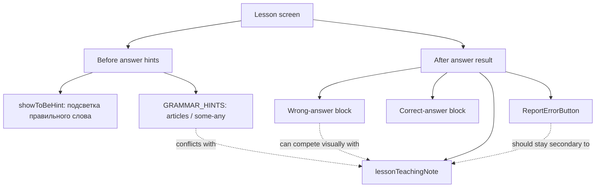
```mermaid
flowchart TD
  A[Lesson screen] --> B[Before answer hints]
  A --> C[After answer result]
  B --> B1[showToBeHint: подсветка правильного слова]
  B --> B2[GRAMMAR_HINTS: articles / some-any]
  C --> C1[Wrong-answer block]
  C --> C2[Correct-answer block]
  C --> C3[lessonTeachingNote]
  C --> C4[ReportErrorButton]
  B2 -. conflicts with .-> C3
  C1 -. can compete visually with .-> C3
  C4 -. should stay secondary to .-> C3
```

#### Что это значит для продукта

- Новая карточка объяснения должна стать главным учебным объяснением в уроке.
- Старые `GRAMMAR_HINTS` нельзя расширять в текущем виде. Их надо либо переписать в `teachingNote`, либо оставить только как редкий safety hint.
- Формулировка `просто используй как показано` не проходит новый стандарт: она не учит, а просит поверить приложению.
- Для планов правильно, что `GRAMMAR_HINTS` сейчас suppressed, но для обычных уроков их стиль всё равно надо привести к новому уровню.

#### UX-выводы по карточке

- Карточка должна быть ниже правильной фразы, но выше report button.
- У карточки должен быть спокойный визуальный приоритет: она не кричит, но явно объясняет.
- Wrong tone должен отличаться цветом и микро-заголовком, но не выглядеть как наказание.
- Correct tone должен быть мягким, без огромного зелёного “молодец”, потому что цель - объяснить, а не устроить конфетти.
- На маленьких экранах текст должен укладываться в 2-4 строки, иначе урок станет тяжёлым.
- Для premium/plan контента можно дать карточке более дорогой стиль, но не менять поведение обычного урока.

#### Research notes for Audit 02

- Исследования corrective feedback разделяют implicit feedback и explicit/metalinguistic feedback. Для Phraseman лучше гибрид: сначала действие пользователя, затем короткое явное объяснение по конкретной ошибке.
- Systematic review по timing показывает, что immediate feedback часто полезен в language-learning задачах, но не должен превращаться в длинную лекцию после каждого шага.
- Retrieval-practice research поддерживает связку: ошибка получает feedback, затем возвращается позже, чтобы пользователь реально достал форму из памяти.

Sources added:

- https://www.cambridge.org/core/journals/studies-in-second-language-acquisition/article/implicit-and-explicit-corrective-feedback-and-the-acquisition-of-l2-grammar/CDE67D4A4E286921DA4BE9C40BAD9FE6
- https://pmc.ncbi.nlm.nih.gov/articles/PMC9995700/
- https://pmc.ncbi.nlm.nih.gov/articles/PMC10229024/

#### Backlog additions after Audit 02

| Priority | Улучшение | Почему важно | Проверка |
| --- | --- | --- | --- |
| P0 | Проверить `lessonHintSupportBlocked` wiring | Сейчас вычисляется, но не влияет на `GRAMMAR_HINTS` | Test должен падать, если gate не используется перед показом hints |
| P0 | Scoped storage для grammar hints | Иначе hints могут смешиваться между English/French и future targets | Test на `grammarHintSeenKey(hint.key, studyTarget)` |
| P0 | Запретить расширять `GRAMMAR_HINTS` без миграции | Старый слой не должен расти параллельно новому | Contract test: новые hint keys не добавляются без allowlist |
| P1 | Переписать articles/some-any hints в after-answer notes | Новый стандарт должен объяснять после действия | Lesson phrases with articles/some-any have `teachingNote` |
| P1 | Визуально усилить teaching-note card | Сейчас карточка функциональная, но не ощущается как premium learning moment | Screenshot/visual contract на result screen |
| P2 | Report button сделать ещё более вторичным рядом с note | Он не должен конкурировать с объяснением | UI audit: report link muted and separated |
| P2 | Единая taxonomу notes | Нужны типы `grammar`, `vocabulary`, `collocation`, `route-word`, `mistake-pattern` | Type/test coverage |

#### Обновлённая карта улучшений после Audit 02

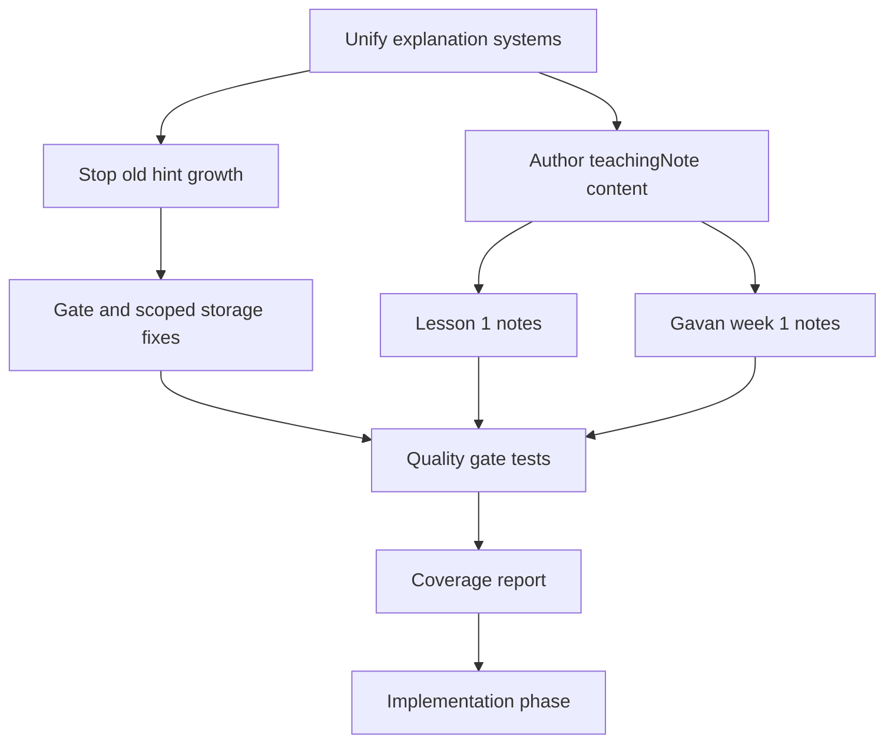
```mermaid
flowchart TD
  A[Unify explanation systems] --> B[Stop old hint growth]
  A --> C[Author teachingNote content]
  B --> D[Gate and scoped storage fixes]
  C --> E[Lesson 1 notes]
  C --> F[Gavan week 1 notes]
  D --> G[Quality gate tests]
  E --> G
  F --> G
  G --> H[Coverage report]
  H --> I[Implementation phase]
```

#### Decision candidate

В будущей реализации стоит принять правило: `GRAMMAR_HINTS` не является будущим направлением продукта. Будущее направление - `LessonTeachingNote` как единый слой объяснений после ответа, плюс отдельные подробные справки только там, где пользователь сам открывает помощь.

### Audit 03 - 2026-05-31 - валидаторы, тесты и риск ложного quality gate

Цель: проверить, насколько текущие тесты и `validatePersonalPlanDay` реально защищают стиль объяснений, а не только создают ощущение защиты.

#### Новые локальные находки

| Область | Файл | Что найдено | Риск |
| --- | --- | --- | --- |
| Day quality gate | `app/personal_plan_quality.ts` | Есть `missing_teaching_notes`, `bad_copy`, `quiz_question_count`, `forbidden_question_grammar` | База хорошая, но gate пока не проверяет сам текст `teachingNote` |
| Teaching-note coverage | `app/personal_plan_quality.ts` | Проверяется: в каждой нужной phrase есть хотя бы один note не на name-slot | Это минимальный check; он не гарантирует, что объяснены все новые слова |
| Key vocab coverage | `app/personal_plan_quality.ts` | Проверяются категории `route-place`, `route-task`, `place`, `adjective`, `verb` | Слишком узко: `preposition`, `possessive`, `collocation`, `article`, `contact`, `service-word` могут выпасть |
| Bad copy patterns | `app/personal_plan_quality.ts` | `BAD_COPY_PATTERNS` сейчас содержит mojibake-строки вида `Ð...` | Очень высокий риск: guard может быть привязан к сломанной кодировке, а не к нормальному русскому тексту |
| Day 1 quality test | `tests/personal_plan_day1_quality_contract.test.ts` | Проверяет quiz=10, отсутствие questions, name distractors, teaching notes | Хороший контракт, но часть expected copy тоже mojibake |
| Generation standards test | `tests/personal_plan_generation_standards_contract.test.ts` | Проверяет, что standards documented and day 1 passes passport | Полезно, но тестирует документ строками с mojibake |
| Passport DEV surface | `tests/personal_plan_day_quality_gate.test.ts` | Проверяет, что passport подключён к DEV calendar | DEV видимость есть, но user-facing quality не гарантируется |
| Note text quality | отсутствует | Нет теста на длину title/body, forbidden wording внутри correctRu/wrongRu, наличие correct/wrong | Самая большая дыра после покрытия |

#### Схема текущего quality gate

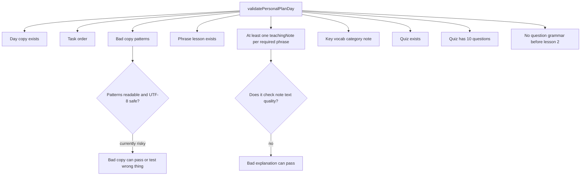
```mermaid
flowchart TD
  A[validatePersonalPlanDay] --> B[Day copy exists]
  A --> C[Task order]
  A --> D[Bad copy patterns]
  A --> E[Phrase lesson exists]
  A --> F[At least one teachingNote per required phrase]
  A --> G[Key vocab category note]
  A --> H[Quiz exists]
  A --> I[Quiz has 10 questions]
  A --> J[No question grammar before lesson 2]
  F --> K{Does it check note text quality?}
  K -->|no| L[Bad explanation can pass]
  D --> M{Patterns readable and UTF-8 safe?}
  M -->|currently risky| N[Bad copy can pass or test wrong thing]
```

#### Что именно gate пока НЕ проверяет

- `teachingNote.titleRu` есть и короткий.
- `teachingNote.correctRu` и `teachingNote.wrongRu` оба есть.
- Correct/wrong тексты отличаются по смыслу.
- Длина body подходит экрану урока.
- Внутри note нет запрещённых слов: `конструкция`, `сцена`, `маршрут`, `применяем`, `просто используй как показано`.
- В wrong note есть мягкий разбор, а не наказание.
- В note объясняется конкретное слово, если именно оно новое.
- В note нет грамматики, которой день ещё не открыл.
- UK/ES fallback осознанный, а не случайная пустота.
- В тестах нет mojibake, из-за которого проверяется не тот текст.

#### Схема будущего quality gate

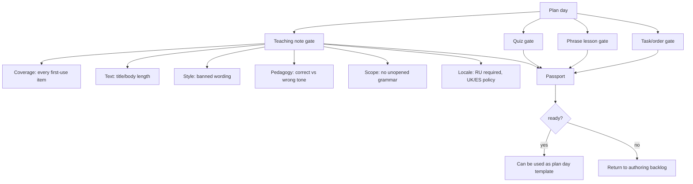
```mermaid
flowchart TD
  A[Plan day] --> B[Task/order gate]
  A --> C[Phrase lesson gate]
  A --> D[Quiz gate]
  A --> E[Teaching note gate]
  E --> E1[Coverage: every first-use item]
  E --> E2[Text: title/body length]
  E --> E3[Style: banned wording]
  E --> E4[Pedagogy: correct vs wrong tone]
  E --> E5[Scope: no unopened grammar]
  E --> E6[Locale: RU required, UK/ES policy]
  B --> F[Passport]
  C --> F
  D --> F
  E --> F
  F --> G{ready?}
  G -->|yes| H[Can be used as plan day template]
  G -->|no| I[Return to authoring backlog]
```

#### Обновление карты улучшений

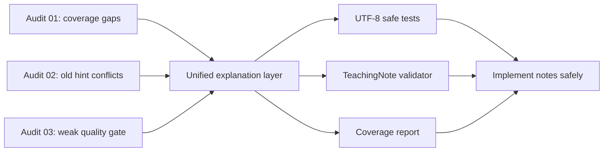
```mermaid
flowchart LR
  A[Audit 01: coverage gaps] --> D[Unified explanation layer]
  B[Audit 02: old hint conflicts] --> D
  C[Audit 03: weak quality gate] --> D
  D --> E[UTF-8 safe tests]
  D --> F[TeachingNote validator]
  D --> G[Coverage report]
  E --> H[Implement notes safely]
  F --> H
  G --> H
```

#### Backlog additions after Audit 03

| Priority | Улучшение | Почему важно | Проверка |
| --- | --- | --- | --- |
| P0 | Починить mojibake в quality tests/patterns | Иначе тесты могут защищать битый текст, а не продуктовый русский | `rg "Ð|Ñ|â€|Â"` по targeted files должен быть clean или documented legacy |
| P0 | Добавить validator для `LessonTeachingNote` | Сейчас note может быть плохим, пустым или слишком длинным и всё равно пройти | Unit test на title/body length, correct/wrong required, banned wording |
| P0 | Расширить category coverage | Новые важные слова и служебные ловушки могут выпасть | `preposition`, `possessive`, `article`, `contact`, `collocation`, `route-word` проверяются |
| P1 | Проверять note scope against day lesson order | План не должен объяснять то, чего ещё не было в уроке | Day passport ловит unopened grammar ids |
| P1 | Добавить `noteKind` metadata | Без типа сложно строить отчёты и персонализацию | Type supports `grammar`, `vocab`, `collocation`, `usage`, `route-word` |
| P1 | Quality report в DEV calendar | DEV должен показывать не только ready/issues count, но и missing-note reasons | DEV passport lists missing note details |
| P2 | Locale policy для notes | Сейчас RU есть, UK/ES optional; надо решить fallback policy | Test documents expected fallback behavior |

#### Decision candidate

Перед генерацией большого контента нужно сначала сделать `LessonTeachingNote` quality gate. Иначе мы напишем много фраз, а потом будем руками вылавливать длинные, странные или технические объяснения.

### Audit 04 - 2026-05-31 - контент Гавань день 1, дистракторы и педагогическая честность

Цель: пройти не абстрактный quality gate, а конкретный эталонный контент `Гавань · день 1`: фразы, quiz, дистракторы, объяснения, и понять, что нужно исправить перед генерацией недели 1.

#### Correction к Audit 03

В Audit 03 был отмечен высокий риск mojibake в тестах и паттернах. Дополнительная проверка через Node `fs.readFileSync(..., 'utf8')` и regex по реальным Unicode code points показала:

- `app/personal_plan_phrase_lessons.ts`: 0 mojibake-like hits
- `app/personal_plan_quizzes.ts`: 0 mojibake-like hits
- `app/personal_plan_quality.ts`: 0 mojibake-like hits
- `tests/personal_plan_day1_quality_contract.test.ts`: 0 mojibake-like hits
- `tests/personal_plan_generation_standards_contract.test.ts`: 0 mojibake-like hits
- `tests/personal_plan_teaching_notes_contract.test.ts`: 0 mojibake-like hits

Вывод: текущая проблема в основном похожа на отображение PowerShell/console, а не на фактическую порчу этих файлов. Но UTF-8 guard всё равно нужен, потому что раньше такая порча уже случалась при редактировании русских строк.

#### Контент Гавань day 1 сейчас

| Phrase | Current English | Main purpose | Notes |
| --- | --- | --- | --- |
| `gavan_identity_001` | `Hi, I'm {{name}}` | представиться | Живая фраза, имя подставляется корректно |
| `gavan_identity_002` | `I'm here for the viewing` | прийти на просмотр жилья | Хорошая бытовая фраза, есть notes для `I'm`, `here`, `for`, `viewing` |
| `gavan_identity_003` | `I'm here for my appointment` | прийти на запись | Хорошая фраза, есть notes для `appointment`, но `my` без note |
| `gavan_identity_004` | `It's under {{name}}` | запись/бронь на имя | Полезная реальная фраза, но wrong-note про `I'm under Alex` нужно смягчить |
| `gavan_identity_005` | `It's nice to meet you` | короткое знакомство | Полезно, но `to` и `you` без notes; возможно нормально, если они открыты уроком |

#### Дистракторы

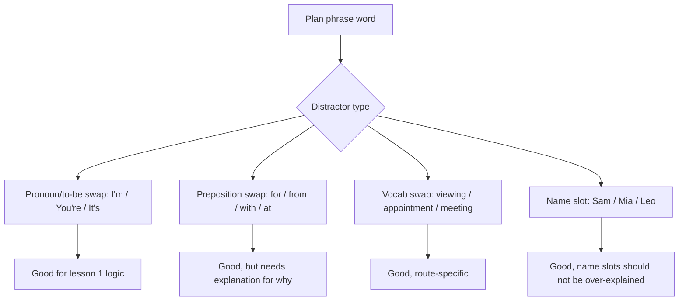
```mermaid
flowchart TD
  A[Plan phrase word] --> B{Distractor type}
  B --> C[Pronoun/to-be swap: I'm / You're / It's]
  B --> D[Preposition swap: for / from / with / at]
  B --> E[Vocab swap: viewing / appointment / meeting]
  B --> F[Name slot: Sam / Mia / Leo]
  C --> G[Good for lesson 1 logic]
  D --> H[Good, but needs explanation for why]
  E --> I[Good, route-specific]
  F --> J[Good, name slots should not be over-explained]
```

Что хорошо:

- Дистракторы не случайный шум, они проверяют реальную ловушку.
- Name slot защищён: любое имя пользователя считается гибко, а варианты похожи на имена.
- `viewing` vs `appointment` - хороший контраст для Гавани.
- `for/from/with/at` - хороший контраст, потому что пользователь реально путает предлоги цели.

Что требует улучшения:

- `the` в `the viewing` без `teachingNote`; если пользователь ошибся на `the`, resolver может объяснить `viewing`, но сам артикль останется “магией”.
- `my` в `my appointment` без `teachingNote`; для новичка `my/your/the` может быть неочевидно.
- `to` в `nice to meet you` без `teachingNote`; фраза устойчивая, но если пользователь выбирает `for`, нужно короткое объяснение.
- `you` без `teachingNote`; возможно допустимо, но для эталона лучше явно решить: pronouns opened by lesson or not.

#### Teaching notes: качество текста

| Note | Good | Risk |
| --- | --- | --- |
| `gavan_intro_im` | Хорошо объясняет разговорное `I'm` | correct text 160 chars, близко к верхней границе |
| `gavan_here_im` | Хорошо объясняет невидимую связку в русском | Можно сделать чуть короче |
| `gavan_for_purpose` | Отлично объясняет `for` как цель | Нужно оставить как эталон |
| `gavan_word_here` | Хорошо объясняет бытовой смысл `here` | wrong text длинноват |
| `gavan_booking_its` | Нужный разбор `It's` для записи | wrong text со странным образом “физически под Alex”; лучше заменить на более нейтральное |
| `gavan_word_viewing` | Отличный route-word note | Можно сохранить как эталон словаря |
| `gavan_word_appointment` | Отличный route-word note | Можно сохранить |
| `gavan_word_nice_meet` | Объясняет фразу целиком | Нужно решить, достаточно ли одной note на `nice` и `meet` |
| `gavan_under_name` | Хороший living-English usage | Нужен пример с `booking/reservation/appointment under name` позже |

#### Quiz day 1

Quiz содержит 10 вопросов:

- 5 близки к plan phrases.
- 5 проверяют похожие ответы из lesson-1 зоны: `I'm here`, `You're right`, `It's important`, `It's my email`, `It's my phone number`.

Плюсы:

- Нет question grammar `Are/Is/Am?`, это правильно до урока 2.
- 10 questions есть.
- Инструкция хорошая: пользователь понимает, что выбрать естественный вариант.

Риски:

- Quiz использует `email` и `phone number`, хотя phrase lesson day 1 не тренирует contact phrases напрямую. Day goal говорит “оставляем контакт”, но в plan phrase lesson нет фраз `It's my email` / `It's my phone number`.
- Если linked lesson slice первые 6 фраз не содержит email/phone, quiz может ощущаться как “откуда это взялось?”.
- Quiz explanations сейчас короткие, но однотипные; wrong-option-specific explanations в quiz data для plan quiz пока фактически один explanation на item, а не полноценные 4 разных разбора.

#### Схема честности Day 1

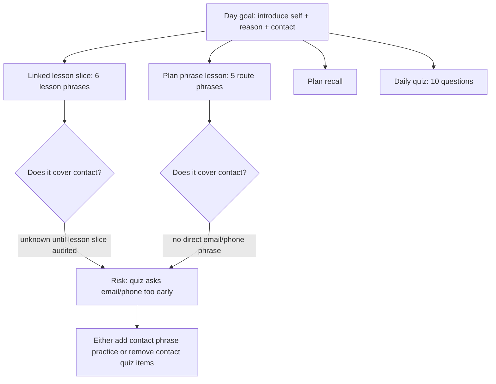
```mermaid
flowchart TD
  A[Day goal: introduce self + reason + contact] --> B[Linked lesson slice: 6 lesson phrases]
  A --> C[Plan phrase lesson: 5 route phrases]
  A --> D[Plan recall]
  A --> E[Daily quiz: 10 questions]
  B --> F{Does it cover contact?}
  C --> G{Does it cover contact?}
  F -->|unknown until lesson slice audited| H[Risk: quiz asks email/phone too early]
  G -->|no direct email/phone phrase| H
  H --> I[Either add contact phrase practice or remove contact quiz items]
```

#### Что нужно решить перед Гавань week 1

- День 1 действительно про `имя + зачем пришёл + контакт`, или только `имя + зачем пришёл + запись/просмотр`.
- Если контакт остаётся в goal, добавить plan phrase content для email/phone/phone number.
- Если контакт не тренируем в day 1, убрать email/phone quiz items из day 1 quiz.
- Сделать rule: daily quiz cannot test phrase family that was not present in linked lesson slice or plan phrase lesson.

#### Backlog additions after Audit 04

| Priority | Улучшение | Почему важно | Проверка |
| --- | --- | --- | --- |
| P0 | Проверить lesson-1 required slice against day quiz | Quiz не должен спрашивать то, чего пользователь не видел в задачах дня | Report: quiz item -> covered by linked lesson or plan phrase |
| P0 | Решить contact scope day 1 | Сейчас goal говорит contact, но plan phrase lesson не даёт email/phone фразы | Either add contact phrases or remove contact quiz items |
| P0 | Смягчить `gavan_booking_its.wrongRu` | Странный образ может раздражать и путать | Text does not rely on absurd physical imagery |
| P1 | Добавить note для `my` или явно открыть possessive в linked lesson | `my appointment/email/phone number` важно для Гавани | `possessive` category covered or documented as already taught |
| P1 | Добавить note для `to` in `nice to meet you` if wrong choice is `for` | Ошибка `nice for meet` типична и должна объясняться | Wrong token `to` resolves to stable phrase note |
| P1 | Plan quiz explanations сделать per-choice | Сейчас explanation array может быть одинаковым/слишком общим | 4 explanations per quiz item, each explains selected option |
| P2 | Сделать content passport `coverageMatrix` | Нужно видеть, какая фраза чем покрыта | Passport includes linkedLessonCoverage, planPhraseCoverage, quizCoverage |

#### Updated implementation map after Audit 04

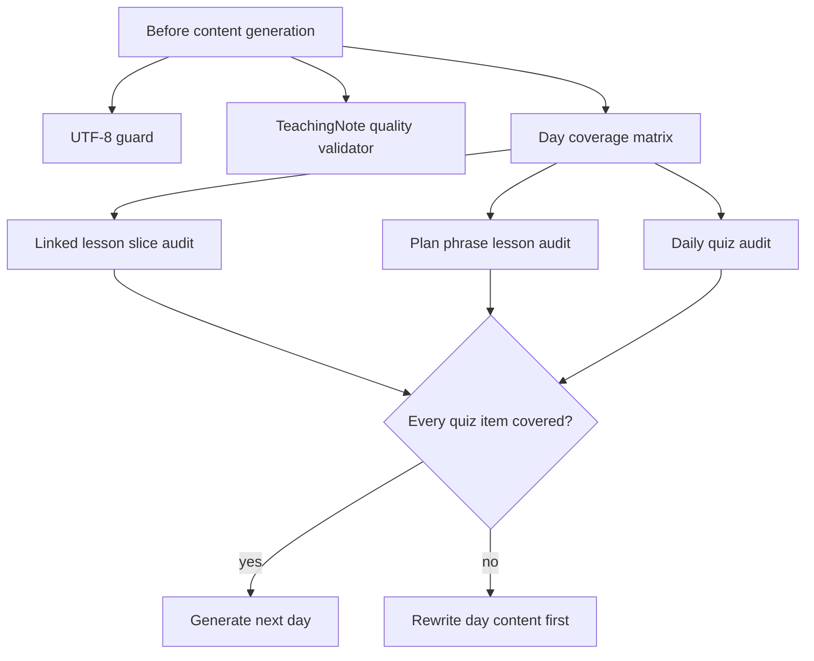
```mermaid
flowchart TD
  A[Before content generation] --> B[UTF-8 guard]
  A --> C[TeachingNote quality validator]
  A --> D[Day coverage matrix]
  D --> E[Linked lesson slice audit]
  D --> F[Plan phrase lesson audit]
  D --> G[Daily quiz audit]
  E --> H{Every quiz item covered?}
  F --> H
  G --> H
  H -->|yes| I[Generate next day]
  H -->|no| J[Rewrite day content first]
```

#### Decision candidate

Не писать `Гавань · день 2` до того, как день 1 станет честным эталоном: quiz должен проверять только то, что было в задачах дня, а contact/email/phone должны либо появиться в practice, либо уйти из quiz day 1.

### Audit 05 - 2026-05-31 - linked lesson slice coverage и честность quiz

Цель: проверить, действительно ли первое задание `6 фраз из урока 1` покрывает то, что потом спрашивают plan phrases и daily quiz.

#### Новые локальные находки

| Область | Файл | Что найдено | Риск |
| --- | --- | --- | --- |
| Plan lesson counter | `app/lesson1.tsx` | `planRequiredPhrases` просто считает правильные ответы в обычном уроке | План не фиксирует конкретные lesson phrase ids, которые пользователь прошёл |
| Completion logic | `app/lesson1.tsx` | `setPlanLessonAnswered(prev + 1)` на каждый правильный ответ | Можно выполнить задание любыми 6 правильными фразами урока, не обязательно нужными для дня |
| Day 1 lesson task | `app/personal_plan_catalog.ts` | `lessonId: 1, requiredPhrases: 6` | Нет whitelist/playlist фраз для плана |
| Lesson 1 first six | `app/lesson_data_1_8_phrases_source.ts` | `I am here`, `You are ready`, `He is busy`, `She is calm`, `We are together`, `They are happy` | Даже если брать первые 6, они не покрывают `It is important`, `You are right`, `email`, `phone number` |
| Quiz day 1 | `app/personal_plan_quizzes.ts` | Спрашивает `You're right`, `It's important`, `It's my email`, `It's my phone number` | Эти quiz items не гарантированно открыты задачами дня |

#### Lesson 1 required slice vs quiz

Если linked lesson slice буквально означает первые 6 фраз урока 1, покрытие такое:

| Covered by first 6 lesson phrases | Quiz item | Covered? |
| --- | --- | --- |
| `I am here` | `I'm here` | partial, contraction variant |
| `You are ready` | `You're right` | no, same `you are`, different adjective |
| `He is busy` | none | no direct quiz item |
| `She is calm` | none | no direct quiz item |
| `We are together` | none | no direct quiz item |
| `They are happy` | none | no direct quiz item |
| not covered | `It's important` | no |
| not covered | `It's my email` | no |
| not covered | `It's my phone number` | no |

Если linked lesson slice означает “любые 6 фраз из текущего урока”, покрытие ещё менее честное: пользователь может закрыть задание на фразах, которые вообще не связаны с quiz day 1.

#### Схема текущего риска

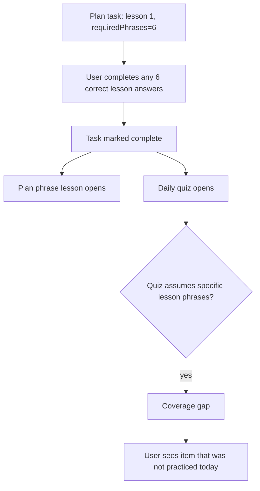
```mermaid
flowchart TD
  A[Plan task: lesson 1, requiredPhrases=6] --> B[User completes any 6 correct lesson answers]
  B --> C[Task marked complete]
  C --> D[Plan phrase lesson opens]
  C --> E[Daily quiz opens]
  E --> F{Quiz assumes specific lesson phrases?}
  F -->|yes| G[Coverage gap]
  G --> H[User sees item that was not practiced today]
```

#### Что должно быть вместо этого

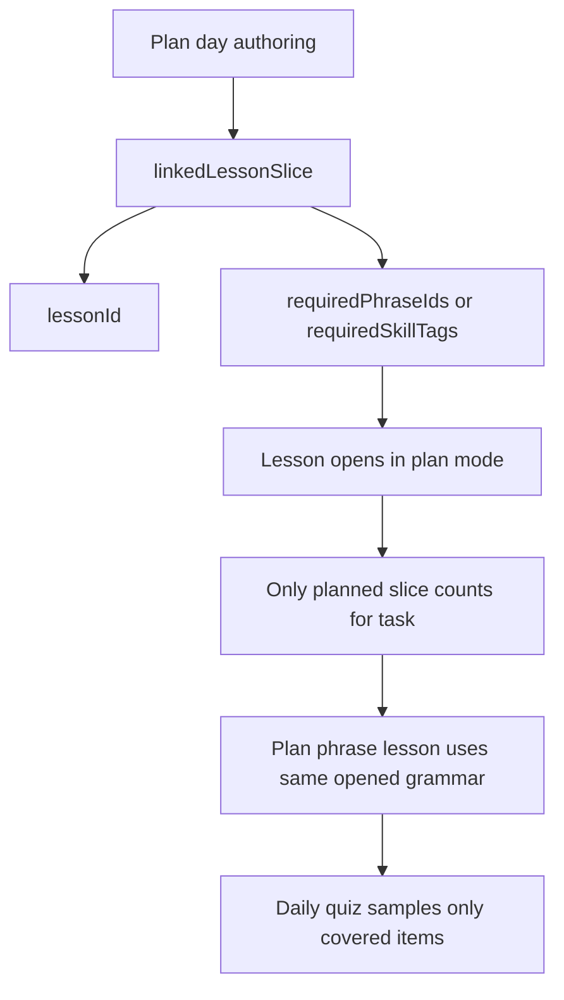
```mermaid
flowchart TD
  A[Plan day authoring] --> B[linkedLessonSlice]
  B --> C[lessonId]
  B --> D[requiredPhraseIds or requiredSkillTags]
  D --> E[Lesson opens in plan mode]
  E --> F[Only planned slice counts for task]
  F --> G[Plan phrase lesson uses same opened grammar]
  G --> H[Daily quiz samples only covered items]
```

#### Product conclusion

Для Personal Plans недостаточно `lessonId + requiredPhrases`. Нужен один из вариантов:

- `requiredPhraseIds`: конкретный список фраз урока, которые надо пройти для этого дня.
- `requiredSkillTags`: список навыков/конструкций, которые должны быть покрыты, плюс runtime выбирает подходящие фразы.
- `coverageMatrix`: day passport явно связывает quiz items с lesson phrase ids или plan phrase ids.

Лучший вариант для старта: `requiredPhraseIds`, потому что он самый честный и предсказуемый для эталона Гавани week 1.

#### Что делать с Day 1

Вариант A: сделать day 1 уже:

- linked lesson slice: `I am here`, `You are ready`, `It is important`, `You are right`, плюс ещё 2 релевантные phrase ids;
- plan phrase lesson: name, viewing, appointment, under name, nice to meet you;
- quiz: только эти lesson/plan фразы.

Вариант B: оставить current lesson slice свободным, но тогда daily quiz должен проверять только plan phrase lesson и очень базовые `I am / you are / it is`, без `email/phone`.

Вариант C: добавить contact plan phrases:

- `It's my email`
- `It's my phone number`
- `My email is ...`
- `My phone number is ...`

Но тогда это уже другой day 1 scope и нужно увеличить/пересчитать нагрузку.

#### Backlog additions after Audit 05

| Priority | Улучшение | Почему важно | Проверка |
| --- | --- | --- | --- |
| P0 | Добавить `requiredPhraseIds` в linked lesson task | Плановый урок должен вести по конкретному срезу, а не “любые 6 фраз” | Task destination supports phrase ids; lesson mode counts only them |
| P0 | Day passport: quiz coverage matrix | Нельзя спрашивать quiz item без источника в задачах дня | Every quiz item maps to lesson phrase id or plan phrase id |
| P0 | Пересобрать Gavan day 1 quiz | Убрать или покрыть `email/phone/right/important` | Quiz items all have coverage source |
| P1 | UI modal after required slice complete should say what completed | Если slice specific, пользователь понимает “готова нужная часть урока” | Modal copy references task purpose, not generic lesson count |
| P1 | Track phrase ids completed via plan task | Нужно для аналитики и честного progress | Plan task completion stores completedPhraseIds |
| P2 | Skill-tag based future generator | Для масштабирования 18 недель лучше skill tags, но после requiredPhraseIds MVP | Generator can produce skill coverage report |

#### Updated map after Audit 05

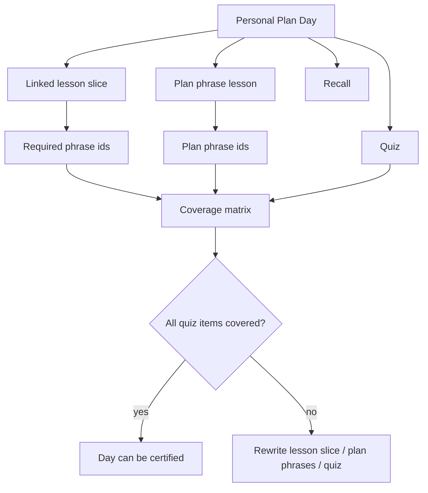
```mermaid
flowchart TD
  A[Personal Plan Day] --> B[Linked lesson slice]
  A --> C[Plan phrase lesson]
  A --> D[Recall]
  A --> E[Quiz]
  B --> F[Required phrase ids]
  C --> G[Plan phrase ids]
  F --> H[Coverage matrix]
  G --> H
  E --> H
  H --> I{All quiz items covered?}
  I -->|yes| J[Day can be certified]
  I -->|no| K[Rewrite lesson slice / plan phrases / quiz]
```

#### Decision candidate

Перед внедрением контента week 1 надо изменить модель `linked_lesson_slice`: `requiredPhrases` оставляем как fallback/count, но для планов нужен конкретный список `requiredPhraseIds`. Иначе Personal Plans не смогут честно обещать, что задания дня подготовили пользователя к quiz.

### Audit 06 - 2026-05-31 - ошибки, аналитика и персонализация планов

Цель: проверить, становятся ли ошибки из плановых заданий реальным топливом для “Моей практики”, Тренера, аналитики и будущего генератора дня, а не просто засчитываются как обычные ошибки урока.

#### Новые локальные находки

| Область | Файл | Что найдено | Вывод |
| --- | --- | --- | --- |
| Контекст ошибки | `app/lesson1.tsx` | Плановые ошибки собирают `phraseId`, `tokenText`, `tokenIndex`, `expected`, `picked`, `rawCategory`, `planId`, `planInstanceId`, `planTaskId`, `planDayIndex`, `planPhraseLessonId` | База для честной аналитики уже есть |
| Гибкое имя | `app/personal_plan_mistake_context.ts` | Категории `name`, `user-name`, `contact-name`, `person-name` не пишутся в грамматическую аналитику; имя засчитывается гибко | Правильно: выбор имени не должен ломать прогресс и статистику |
| Mistake log | `app/mistake_log.ts` | `MistakeEntry` хранит plan context, `getTopMistakePhraseDetails` считает `planCounts` и `topPlanId` | Можно видеть, что ошибка пришла именно из маршрута |
| TrainerStore | `app/trainer_store.ts` | `recordPhraseMistake` переносит plan context в очередь Тренера; item получает `planId`, `planInstanceId`, `planTaskId`, `planDayIndex`, `planPhraseLessonId` | Ошибки маршрута могут возвращаться в будущие тренировки |
| Runtime дня | `app/personal_plan_state.ts` | Practice появляется только если есть минимум 3 due practice; trainer появляется только если `dueTrainerCount > 0`; незавершенные дни переносятся | Хорошая защита от пустых заданий |
| Progress isolation | `app/personal_plan_progress.ts` | Completion key = `planInstanceId::taskId` | Старый прогресс не должен прилипать к новому запуску плана |
| Персонализация | `app/personal_plan_generator.ts` | Есть `buildPlanGeneratorInput` и `derivePlanPersonalization`: уроки, квизы, ошибки, карточки, practice, trainer, activity | Каркас персонализации уже создан |
| Использование персонализации | `rg derivePlanPersonalization` | В продуктовых файлах вызова почти нет; есть в контрактном тесте | Генератор пока больше “готов к подключению”, чем реально управляет днями |

#### Текущий поток ошибки

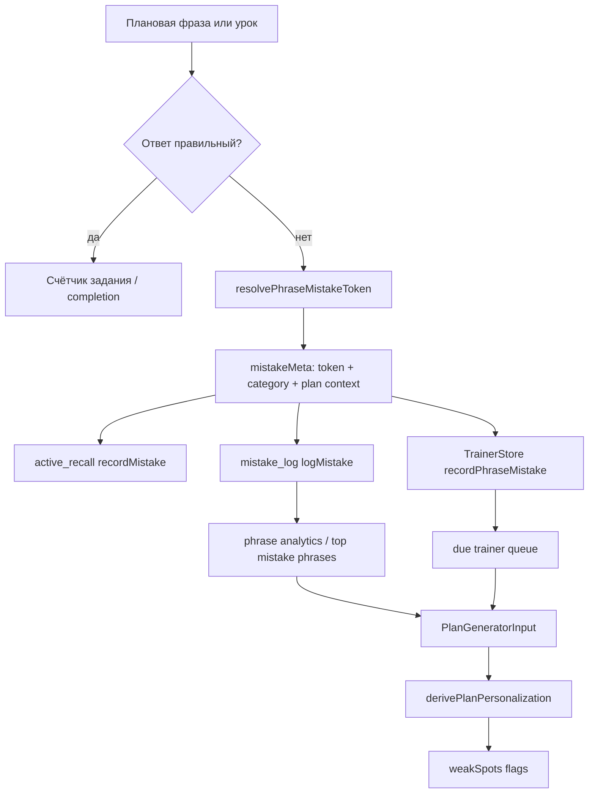
```mermaid
flowchart TD
  A[Плановая фраза или урок] --> B{Ответ правильный?}
  B -->|да| C[Счётчик задания / completion]
  B -->|нет| D[resolvePhraseMistakeToken]
  D --> E[mistakeMeta: token + category + plan context]
  E --> F[active_recall recordMistake]
  E --> G[mistake_log logMistake]
  E --> H[TrainerStore recordPhraseMistake]
  G --> I[phrase analytics / top mistake phrases]
  H --> J[due trainer queue]
  I --> K[PlanGeneratorInput]
  J --> K
  K --> L[derivePlanPersonalization]
  L --> M[weakSpots flags]
```

#### Что уже хорошо

- Ошибка в плановой фразе не теряется: она уходит в SRS/active recall, общий mistake log и TrainerStore.
- У ошибки есть конкретная часть фразы: `tokenText`, `expected`, `picked`, `rawCategory`, `tokenIndex`.
- У ошибки есть контекст маршрута: какой план, какой запуск плана, какой день, какое задание, какой plan phrase lesson.
- Имя пользователя обрабатывается честно: `Alex`, `Beta8958` или другое имя не должно считаться грамматической ошибкой.
- Runtime не показывает “Мою практику” без материала: practice требует минимум 3 элемента, trainer требует due элементы.
- Переход на следующий день уже защищён: если задания не закончены, день висит; если день закончен, следующий открывается только на новую локальную дату.

#### Главный разрыв

Система уже собирает сигналы, но ещё не превращает их в отдельную “память маршрута”. Сейчас данные идут в общие механики:

- `mistake_log`;
- `TrainerStore`;
- `phrase_analytics`;
- общие счетчики уроков/квизов/карточек.

Для killer feature нужен слой выше: `PlanWeakSpotStore` или эквивалент, который отвечает не просто “пользователь ошибся в to-be”, а:

- в каком плане это случилось;
- в каком дне;
- в какой ситуации;
- на какой фразе;
- какой токен был выбран;
- повторялась ли ошибка;
- была ли потом исправлена;
- надо ли переносить это в завтрашний день;
- какую задачу выбрать из-за этой ошибки.

#### Риски

| Риск | Почему опасно | Как исправить |
| --- | --- | --- |
| Персонализация остаётся общей | План может сказать “мы подобрали задание”, но фактически взять обычную слабую категорию | Добавить plan-level aggregation: route skill + phrase id + token category |
| Нет позитивного mastery-сигнала по плану | Ошибки пишутся хорошо, но правильные ответы не формируют уверенность по конкретным фразам маршрута | Писать `PlanAttemptEvent` для правильных и неправильных ответов |
| `derivePlanPersonalization` не управляет каталогом дней | Каркас есть, но generated days остаются шаблонными | Подключить результат персонализации к выбору optional/review tasks |
| Нет объяснения “почему это задание выбрано” | Пользователь не чувствует умный маршрут | Генерировать `PlanRecommendation` из конкретных сигналов: “вчера путалась запись / viewing / appointment” |
| Plan quiz errors тоже должны быть plan-aware | Lesson path уже хорош, quiz path нужно держать на том же стандарте | Контракт: quiz task всегда передает `planInstanceId`, `planTaskId`, `planDayIndex` и пишет exact mistake meta |
| Ошибка возвращается в TrainerStore, но не обязательно в следующий день маршрута | Тренер может быть отдельно, а плану нужен active recall именно внутри маршрута | `plan_phrase_recall` должен читать missedPhraseIds / weakSpot queue |

#### Будущая схема, которая сделает планы умными

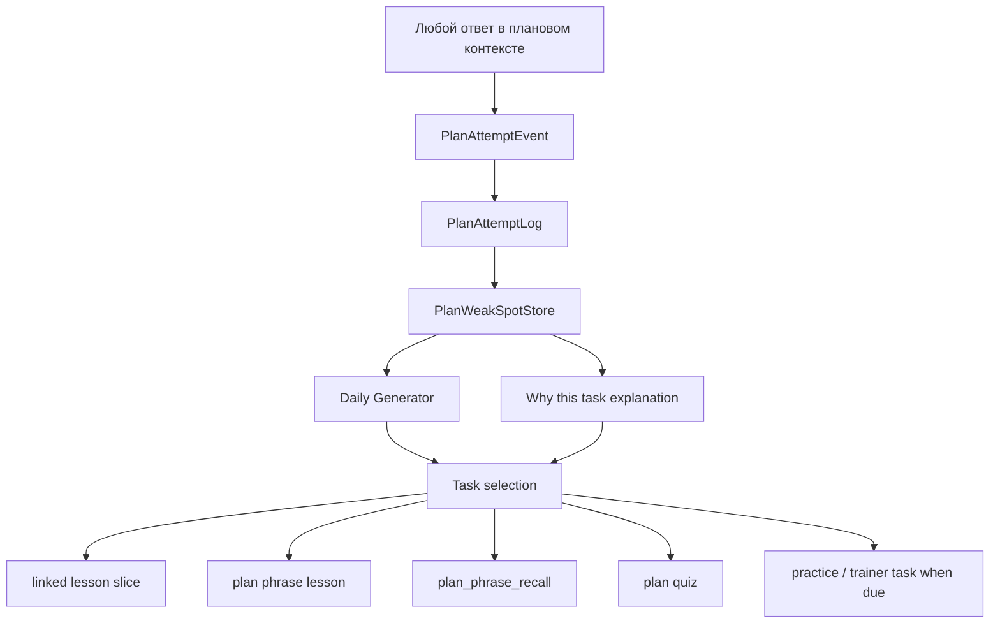
```mermaid
flowchart TD
  A[Любой ответ в плановом контексте] --> B[PlanAttemptEvent]
  B --> C[PlanAttemptLog]
  C --> D[PlanWeakSpotStore]
  D --> E[Daily Generator]
  E --> F[Task selection]
  F --> G[linked lesson slice]
  F --> H[plan phrase lesson]
  F --> I[plan_phrase_recall]
  F --> J[plan quiz]
  F --> K[practice / trainer task when due]
  D --> L[Why this task explanation]
  L --> F
```

#### Минимальная модель события

```ts
type PlanAttemptEvent = {
  planId: string;
  planInstanceId: string;
  dayIndex: number;
  taskId: string;
  mode: 'linked_lesson_slice' | 'plan_phrase_lesson' | 'plan_phrase_recall' | 'plan_quiz' | 'practice' | 'trainer';
  phraseId?: string;
  quizQuestionId?: string;
  tokenIndex?: number;
  tokenText?: string;
  expected?: string;
  picked?: string;
  category?: string;
  isRight: boolean;
  attemptNumber: number;
  createdAt: string;
};
```

#### Backlog additions after Audit 06

| Priority | Улучшение | Почему важно | Проверка |
| --- | --- | --- | --- |
| P0 | Добавить `PlanAttemptEvent` для всех plan modes | Нужны не только ошибки, но и правильные попытки | Contract test: right/wrong answers create plan attempt events |
| P0 | Добавить `PlanWeakSpotStore` или агрегатор поверх существующего лога | План должен помнить слабые места маршрута отдельно от общей статистики | Ошибка в `appointment` создаёт weak spot для `gavan/day1/appointment` |
| P0 | Подключить `derivePlanPersonalization` к runtime/generator | Сейчас каркас персонализации почти не влияет на план | Snapshot дня меняет review/trainer task при due слабом месте |
| P0 | `plan_phrase_recall` читает missed/recent weak phrases | Повтор должен возвращать конкретные ошибки, а не просто общий набор | Ошибка сегодня появляется в recall завтра или в переносе |
| P1 | Completion task хранит `completedPhraseIds` и `missedPhraseIds` | Нужна прозрачная карта, что реально было пройдено | `personal_plan_completed_tasks_v1` содержит phrase-level details |
| P1 | Plan quiz пишет same-level exact mistake meta | Квиз должен кормить ту же аналитику, что и уроки/фразы | Wrong quiz option stores expected/picked/category/plan context |
| P1 | `PlanRecommendation` для UI | Пользователь должен видеть понятное “почему это сегодня” | Task card может показать короткую причину без developer-copy |
| P2 | Plan mastery score по route skills | Progress должен быть не только completed tasks, но и реальная уверенность | Route progress учитывает correct streak, repeated mistakes, due recall |

#### Updated improvement map after Audit 06

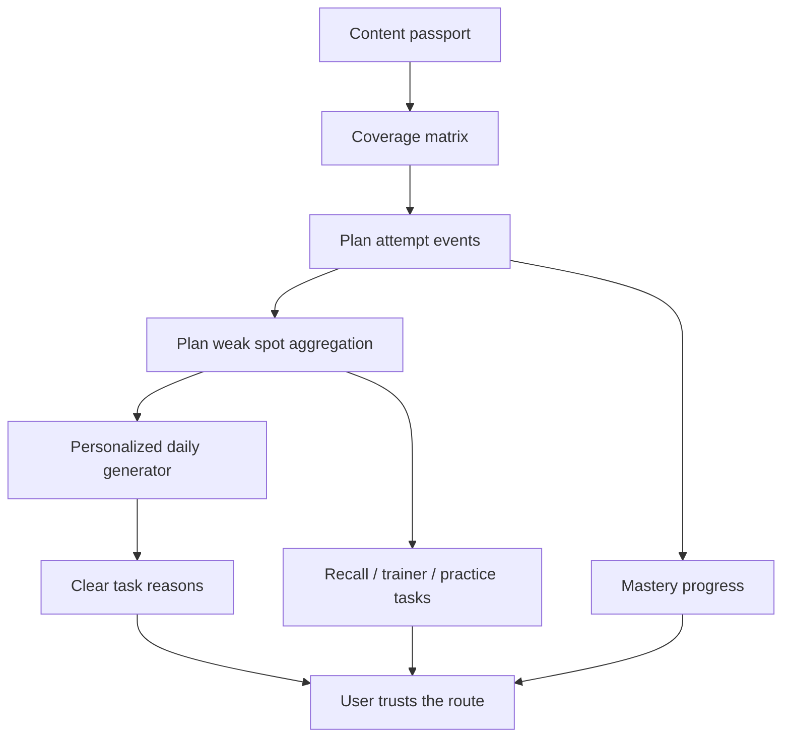
```mermaid
flowchart TD
  A[Content passport] --> B[Coverage matrix]
  B --> C[Plan attempt events]
  C --> D[Plan weak spot aggregation]
  D --> E[Personalized daily generator]
  E --> F[Clear task reasons]
  F --> G[User trusts the route]
  C --> H[Mastery progress]
  H --> G
  D --> I[Recall / trainer / practice tasks]
  I --> G
```

#### Decision candidate

Следующий технический слой после честности day 1: не писать ещё больше контента вслепую, пока не появится `PlanAttemptEvent` + plan-level weak spot aggregation. Иначе можно создать много хороших фраз, но план всё равно будет ощущаться как статический календарь, а не как живой персональный маршрут.

### Audit 07 - 2026-05-31 - plan quiz explanations и потеря контекста ошибок

Цель: проверить дневной квиз плана как обучающий экран: понятно ли человеку, что делать, получает ли он нормальный разбор после ответа, и попадают ли ошибки квиза обратно в маршрутную аналитику.

#### Новые локальные находки

| Область | Файл | Что найдено | Риск |
| --- | --- | --- | --- |
| Plan quiz source | `app/personal_plan_quizzes.ts` | `gavan_day1_identity` содержит 10 вопросов и отдельную copy для choice/typing | База есть |
| Quiz explanations | `app/personal_plan_quizzes.ts` | Helper `q(...)` принимает `explanations: string[]`, но для каждого вопроса передан 1 текст | Экран умеет показывать explanation по индексу ответа, а данных на 4 варианта нет |
| Explanation selection | `app/(tabs)/quizzes.tsx` | `quizExplanationIndexForAnswer` выбирает explanation по выбранному варианту | При выборе 2/3/4 варианта у plan quiz часто не будет explanation |
| Completion | `app/(tabs)/quizzes.tsx` | При завершении quiz task вызывается `markPersonalPlanTaskCompleted({ taskId, planInstanceId, planId, dayIndex })` | Задача закрывается корректно |
| Mistake logging | `app/(tabs)/quizzes.tsx` | Неправильный quiz answer пишет `recordMistake(... tokenMeta)` и `logMistake(... tokenMeta)` | `planId`, `planInstanceId`, `planTaskId`, `planDayIndex`, `quizQuestionId` не добавляются в ошибку |
| Quality gate | `app/personal_plan_quality.ts` | Проверяет quiz exists, 10 questions, no question grammar before lesson 2 | Не проверяет explanations length, per-choice quality, locale correctness, coverage source |
| Contract tests | `tests/personal_plan_quiz_screen_contract.test.ts` | Проверяет только наличие user-facing instruction | Нет контракта на 4 explanation per item и plan-aware mistakes |
| Existing global standard | `app/quiz_data.ts`, `app/quiz_thematic_registry.ts` | Для обычных/thematic quiz уже есть проверки `explanations.length === choices.length` | Plan quiz должен жить по тому же стандарту |

#### Почему это критично

Квиз в плане не должен быть просто “контрольной”. Для Personal Plans он должен закрывать петлю:

1. Пользователь делает фразу.
2. Если ошибся, он сразу понимает, почему именно этот вариант не подходит.
3. Ошибка сохраняется с маршрутом и возвращается в recall/тренер/план.
4. Следующие дни знают, что именно просело.

Сейчас пункт 1 есть, пункт 2 частичный, пункт 3 для plan quiz слабый, пункт 4 поэтому тоже слабый.

#### Текущая схема plan quiz

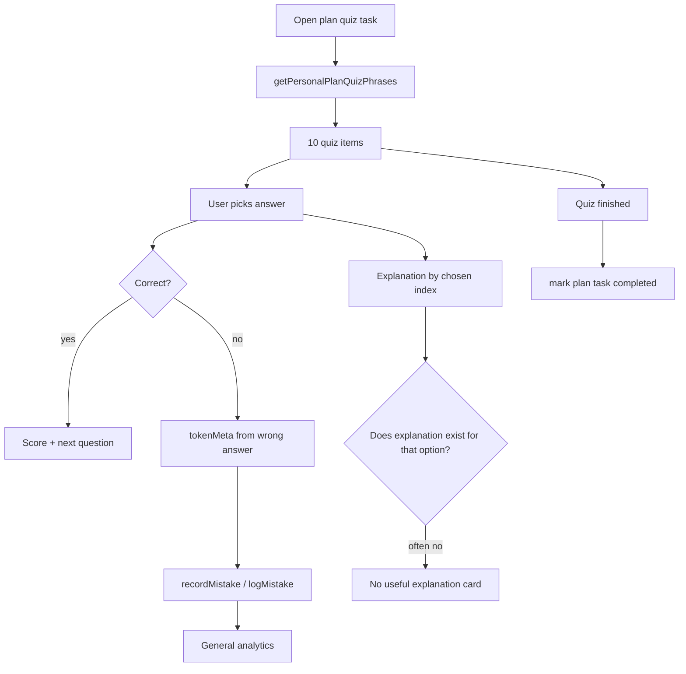
```mermaid
flowchart TD
  A[Open plan quiz task] --> B[getPersonalPlanQuizPhrases]
  B --> C[10 quiz items]
  C --> D[User picks answer]
  D --> E{Correct?}
  E -->|yes| F[Score + next question]
  E -->|no| G[tokenMeta from wrong answer]
  G --> H[recordMistake / logMistake]
  H --> I[General analytics]
  D --> J[Explanation by chosen index]
  J --> K{Does explanation exist for that option?}
  K -->|often no| L[No useful explanation card]
  C --> M[Quiz finished]
  M --> N[mark plan task completed]
```

#### Нужная схема

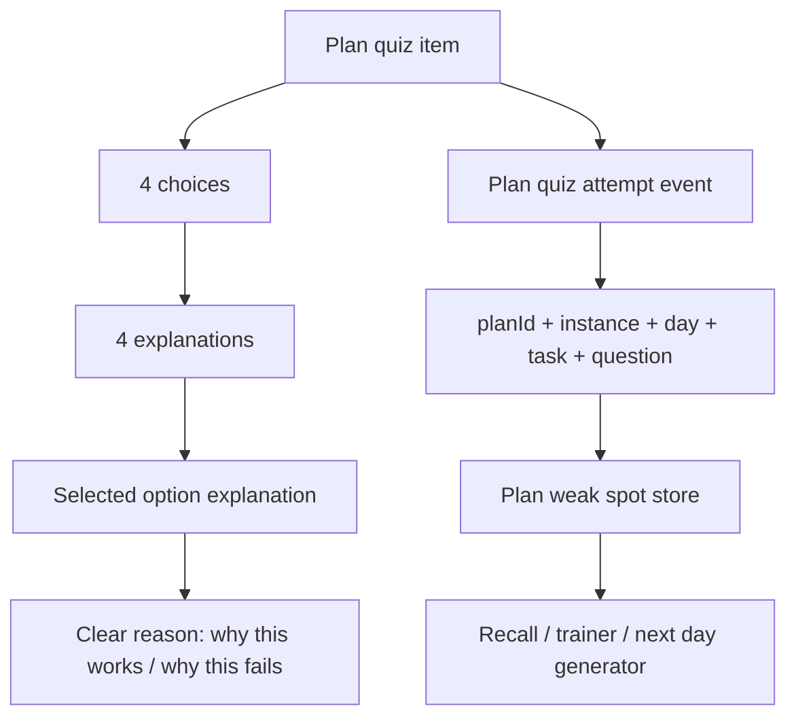
```mermaid
flowchart TD
  A[Plan quiz item] --> B[4 choices]
  B --> C[4 explanations]
  C --> D[Selected option explanation]
  D --> E[Clear reason: why this works / why this fails]
  A --> F[Plan quiz attempt event]
  F --> G[planId + instance + day + task + question]
  G --> H[Plan weak spot store]
  H --> I[Recall / trainer / next day generator]
```

#### Стандарт объяснений для планового квиза

Каждый plan quiz item должен иметь ровно столько explanations, сколько choices. Не “общий комментарий”, а разбор выбранного варианта.

Формат:

- Correct option: коротко подтвердить смысл и объяснить, почему это звучит естественно.
- Wrong option 1: назвать, что именно перепутано: `I/you/it`, `for/from`, `my/your`, `under/over`, etc.
- Wrong option 2: объяснить простым языком, какой смысл получился.
- Wrong option 3: дать нормальный ориентир, как выбрать правильно в похожей ситуации.

Запрещено:

- “просто запомни” как единственное объяснение;
- “конструкция применяется в маршруте”;
- developer-copy;
- шутки, которые могут быть поняты буквально или унизительно;
- объяснение без привязки к выбранному варианту.

#### Пример качества для одного вопроса

Вопрос: `Здравствуйте, я {{name}}.`

Choices:

- `Hi, I'm {{name}}`
- `Hi, you're {{name}}`
- `Hi, it's {{name}}`
- `Hi, we're {{name}}`

Explanations:

- `Да. Когда представляешься сам, нужен I'm: Hi, I'm Alex. Звучит коротко и нормально для стойки, офиса или записи.`
- `You're значит “вы/ты”. Так ты будто называешь имя собеседника, а не своё. Для себя нужен I'm.`
- `It's используют для “это”: время, погода, вещь, запись. Для своего имени говорим I'm.`
- `We're значит “мы”. Подходит, если представляешь группу, но не когда называешь себя.`

#### Plan quiz mistake context gap

В уроке plan phrase mistake уже получает route context. В quiz сейчас path слабее:

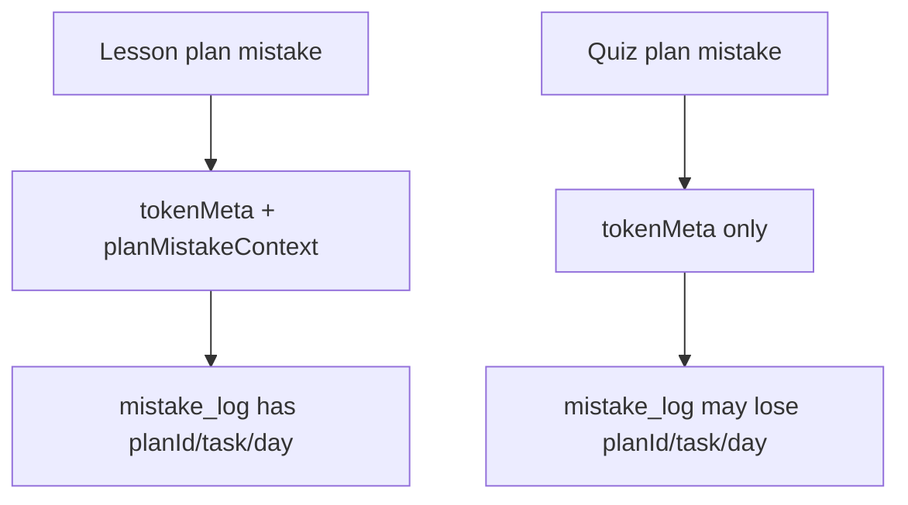
```mermaid
flowchart TD
  A[Lesson plan mistake] --> B[tokenMeta + planMistakeContext]
  B --> C[mistake_log has planId/task/day]
  D[Quiz plan mistake] --> E[tokenMeta only]
  E --> F[mistake_log may lose planId/task/day]
```

Это нужно исправлять вместе с `PlanAttemptEvent`, но даже до него можно добавить минимальный `planMistakeContext` в quiz mistake meta.

#### Backlog additions after Audit 07

| Priority | Улучшение | Почему важно | Проверка |
| --- | --- | --- | --- |
| P0 | Plan quiz explanations must match choices length | Разбор должен объяснять именно выбранный вариант | Quality gate rejects `explanations.length !== choices.length` |
| P0 | Переписать `gavan_day1_identity` explanations на 4 варианта каждый | День 1 должен стать эталоном | 10 items x 4 explanations, без developer-copy |
| P0 | Добавить plan context в quiz mistakes | Ошибка из дневного квиза должна возвращаться в маршрут | Wrong plan quiz answer stores `planId/planInstanceId/taskId/dayIndex/questionId` |
| P0 | Добавить `quizQuestionId` в mistake/attempt event | Нужна точная связь ошибки с вопросом дня | Log contains `quizQuestionId: gavan_day1_identity_03` |
| P1 | Quality gate для plan quiz copy | Не пропускать глупые или пустые тексты | Gate checks banned phrases, min/max length, no placeholders |
| P1 | Locale policy for plan quiz | Сейчас `es`/`explanationsES` могут наследовать ru content | Non-Russian locale either properly localized or intentionally falls back with known policy |
| P1 | Coverage matrix: quiz item -> lesson/plan phrase source | Квиз не должен спрашивать то, что не было открыто | Passport lists source for every quiz question |
| P2 | Per-choice explanation style snapshots | Чтобы следующие генерации не деградировали | Snapshot/audit report groups explanations by type and length |

#### Updated improvement map after Audit 07

```mermaid
flowchart TD
  A[Day content] --> B[Lesson slice coverage]
  A --> C[Plan phrase coverage]
  B --> D[Quiz item source]
  C --> D
  D --> E[4 choices]
  E --> F[4 explanations]
  F --> G[Answer feedback]
  G --> H[Plan attempt event]
  H --> I[Weak spot aggregation]
  I --> J[Next day / recall / trainer]
```

#### Decision candidate

Перед генерацией `Гавань · день 2-7` нужно довести `gavan_day1_identity` quiz до эталона: 10 вопросов, 4 варианта, 4 живых объяснения, все ошибки пишутся с plan context, каждый вопрос покрыт источником из урока или plan phrase lesson. Иначе мы размножим слабый шаблон на всю неделю.

### Audit 08 - 2026-05-31 - coverageMatrix и доказуемая честность дня

Цель: проверить, может ли текущая система доказать, что каждое задание дня и каждый вопрос квиза опираются на материал, который пользователь уже видел в этом же дне или раньше.

#### Новые локальные находки

| Область | Файл | Что найдено | Риск |
| --- | --- | --- | --- |
| Lesson destination model | `app/personal_plan_catalog.ts` | `destination.type === 'lesson'` хранит `lessonId` и `requiredPhrases`, но не хранит `requiredPhraseIds` | Нельзя доказать, какие именно фразы из урока были частью задания |
| Day 1 lesson task | `app/personal_plan_catalog.ts` | `Гавань · день 1` = lesson 1, `requiredPhrases: 6` | Это счётчик, а не плейлист фраз |
| Navigation | `app/personal_plan_navigation.ts` | В урок передаются `requiredPhrases`, `planTaskId`, `planInstanceId`, `planId`, `planDayIndex` | Маршрутный контекст есть, но списка нужных phrase ids нет |
| Lesson 1 source | `app/lesson_data_1_8_phrases_source.ts` | `lesson1_phrase_1 = I am here`, `lesson1_phrase_7 = It is important`, `lesson1_phrase_9 = You are right` | Нужные фразы есть в уроке, но текущий slice “6 фраз” не гарантирует, что пользователь дойдёт до 7 и 9 |
| Contact quiz items | `app/personal_plan_quizzes.ts` | Day 1 quiz спрашивает `It's my email`, `It's my phone number` | В lesson 1 slice и plan phrase lesson day 1 это не покрыто напрямую |
| Day passport | `app/personal_plan_quality.ts` | Passport возвращает `taskKinds`, issues и ready | Нет `coverageMatrix`, нет связки quiz item -> source phrase |
| Standards doc | `docs/personal-plans-generation-standards.md` | Требует, чтобы quiz не открывал новую грамматику | Требование есть, но автоматическая проверка пока слабая |
| Generated days | `app/personal_plan_catalog.ts` | `makeGeneratedDay` для day 2+ использует `plan_phrase_lesson: gavan_identity_day1` и quizId `${planId}_day_${dayIndex}_quiz` | Дни 2+ пока каркас, не продуктовый контент; quiz может отсутствовать |

#### Что значит coverageMatrix

`coverageMatrix` должна быть не красивым отчётом для разработчика, а паспортом честности дня:

```ts
type PlanDayCoverageMatrix = {
  planId: string;
  dayIndex: number;
  lessonCoverage: Array<{
    taskId: string;
    lessonId: number;
    requiredPhraseIds: string[];
    openedGrammarTags: string[];
    openedVocabulary: string[];
  }>;
  planPhraseCoverage: Array<{
    taskId: string;
    phraseLessonId: string;
    phraseIds: string[];
    grammarTags: string[];
    routeVocabulary: string[];
  }>;
  quizCoverage: Array<{
    quizQuestionId: string;
    answer: string;
    coveredBy: Array<{
      type: 'lesson_phrase' | 'plan_phrase' | 'previous_day' | 'allowed_variation';
      id: string;
      note: string;
    }>;
    uncoveredTokens: string[];
  }>;
};
```

#### Текущая схема

```mermaid
flowchart TD
  A[Day task: lessonId + requiredPhrases] --> B[Lesson opens]
  B --> C[User answers any required count]
  C --> D[Task completed]
  D --> E[Plan phrase lesson]
  D --> F[Daily quiz]
  F --> G{Can passport prove coverage?}
  G -->|no| H[Only loose assumption: same lesson / same grammar]
```

#### Нужная схема

```mermaid
flowchart TD
  A[Author day] --> B[requiredPhraseIds]
  A --> C[plan phrase ids]
  A --> D[quiz question ids]
  B --> E[Coverage matrix]
  C --> E
  D --> E
  E --> F{Every quiz item covered?}
  F -->|yes| G[Day ready]
  F -->|no| H[Rewrite lesson slice / plan phrase / quiz]
```

#### Gavan day 1 current coverage table

| Quiz item | Current likely source | Coverage status |
| --- | --- | --- |
| `Hi, I'm {{name}}` | plan phrase lesson `gavan_identity_day1` | covered |
| `I'm here for the viewing` | plan phrase lesson `gavan_identity_day1` | covered |
| `I'm here for my appointment` | plan phrase lesson `gavan_identity_day1` | covered |
| `It's under {{name}}` | plan phrase lesson `gavan_identity_day1` | covered |
| `It's nice to meet you` | plan phrase lesson `gavan_identity_day1` | covered |
| `I'm here` | lesson 1 phrase 1, plus plan phrase base | covered/partial |
| `You're right` | lesson 1 phrase 9 exists | not guaranteed by current 6-phrase slice |
| `It's important` | lesson 1 phrase 7 exists | not guaranteed by current 6-phrase slice |
| `It's my email` | no direct day 1 source found | uncovered |
| `It's my phone number` | no direct day 1 source found | uncovered |

#### Bigger generated-day risk

`makeGeneratedDay` currently creates many future days, but they are placeholders:

- linked lesson uses rotating lesson id + count, not a planned phrase list;
- plan phrase lesson points to `gavan_identity_day1`, even for unrelated topics;
- quiz id is generated, but matching quiz content is not present in `app/personal_plan_quizzes.ts`;
- generated copy contains some wording that previously was banned or disliked by the user, so it must not be treated as final product copy.

This is acceptable as a scaffold only if the product clearly separates:

- `certifiedDays`: authored and passport-passing;
- `generatedDraftDays`: internal/dev only;
- `lockedFutureDays`: visible as future route shells only if we have a product reason to show them.

#### Quality gate gaps

| Missing gate | Why it matters | Proposed issue code |
| --- | --- | --- |
| Lesson task lacks `requiredPhraseIds` | Count alone cannot prove coverage | `missing_required_phrase_ids` |
| Quiz item has no coverage source | User may see unexplained content | `uncovered_quiz_item` |
| Plan phrase uses grammar not opened by linked lesson | “Почему это появилось?” | `unopened_plan_phrase_grammar` |
| Generated quiz id has no data | Future day can look real but break/open empty | `missing_quiz` already exists, but should be enforced for every visible/certified day |
| Generated day reuses wrong phrase lesson | Topic says one thing, task trains another | `topic_phrase_mismatch` |
| Passport has no matrix output | We cannot review day quality quickly | `missing_coverage_matrix` |

#### Backlog additions after Audit 08

| Priority | Улучшение | Почему важно | Проверка |
| --- | --- | --- | --- |
| P0 | Add `requiredPhraseIds` to lesson destinations | Плановый урок должен быть конкретным срезом, а не счётчиком | Day 1 task stores ids like `lesson1_phrase_1`, `lesson1_phrase_7`, `lesson1_phrase_9` |
| P0 | Lesson mode counts only required phrase ids | Иначе пользователь может закрыть задачу нерелевантными фразами | Answer outside required ids does not increment plan slice |
| P0 | Add `coverageMatrix` to passport | Нужно видеть доказательство честности дня | `buildPersonalPlanDayPassport` returns lesson/plan/quiz coverage |
| P0 | Block uncovered quiz items | Квиз не должен спрашивать `email/phone`, если день это не открыл | Gate returns `uncovered_quiz_item` |
| P0 | Separate scaffold days from certified days | Дни 2+ пока нельзя показывать как готовые | Runtime/dev labels distinguish draft/certified |
| P1 | Add route skill tags | Для 18 недель лучше проверять не только phrase ids, но и skills | `routeSkillTags` exist on lesson phrases and plan phrases |
| P1 | Add coverage report command | Перед генерацией новой недели нужен быстрый отчёт | Script prints day -> tasks -> quiz coverage |
| P2 | Future-day preview policy | Не показывать пользователю сырые темы как готовый план | Only certified day details shown; future route can be high-level |

#### Updated improvement map after Audit 08

```mermaid
flowchart TD
  A[Plan day authoring] --> B[Required lesson phrase ids]
  A --> C[Plan phrase lesson ids]
  A --> D[Daily quiz ids]
  B --> E[Coverage matrix]
  C --> E
  D --> E
  E --> F[Quality gate]
  F -->|pass| G[Certified day]
  F -->|fail| H[Rewrite content]
  G --> I[Can ship / can generate next day from same standard]
  H --> A
```

#### Decision candidate

Следующий implementation-ready шаг после аудитов: сначала добавить `requiredPhraseIds` + `coverageMatrix`, потом чинить `Гавань · день 1`. Без этого мы будем вручную спорить о честности каждого дня, а система должна сама говорить: “этот quiz item покрыт”, “этот не покрыт”, “этот день ещё черновой”.

### Audit 09 - 2026-05-31 - scaffold days, certified days и риск “фальшивой готовности”

Цель: проверить, не создаёт ли текущий каталог планов ощущение, что все 12-20 недель уже продуктово готовы, хотя реальный authored-контент пока есть только для первого дня и части инфраструктуры.

#### Новые локальные находки

| Область | Файл | Что найдено | Риск |
| --- | --- | --- | --- |
| Topic lists | `app/personal_plan_catalog.ts` | У всех 5 планов есть массивы тем: `gavanTopics`, `voyazhTopics`, `mitapTopics`, `impulsTopics`, `echoTopics` | Хорошая карта направлений, но это ещё не контент дней |
| Generated days | `app/personal_plan_catalog.ts` | `generateDays(...)` заполняет весь горизонт плана: 12, 16, 18 или 20 недель | Можно случайно показать пользователю черновой календарь как готовый продукт |
| Day generator | `app/personal_plan_catalog.ts` | `makeGeneratedDay(...)` строит одинаковую структуру: lesson slice, plan phrase lesson, recall, quiz | Каркас полезный, но задания не уникальны под конкретную тему |
| Plan phrase destination | `app/personal_plan_catalog.ts` | Для generated day используется `plan_phrase_lesson` с `lessonId: 'gavan_identity_day1'` | День “банк/карта” или “аэропорт” может открыть фразы про представление и appointment |
| Generated quiz destination | `app/personal_plan_catalog.ts` | Quiz id строится как `${planId}_day_${dayIndex}_quiz` | В `app/personal_plan_quizzes.ts` таких quiz пока нет |
| Copy quality | `app/personal_plan_catalog.ts` | В generated copy встречаются формулировки вроде “конструкция дня”, “соберём”, “сцена/миссия”-подобный тон в темах | Риск старого developer/чернового вайба, против которого пользователь уже явно выступал |
| DEV calendar | `app/personal_plan_dev.tsx` | DEV показывает `Все дни плана`, строит passport на каждый day и позволяет открыть выбранный день | Для DEV нормально, но passport может создавать ложное “OK”, если gate не ловит scaffold |
| Implementation checklist | `docs/personal-plans-implementation-checklist.md` | Некоторые пункты отмечены “Готово”, хотя новые аудиты нашли пробелы по coverage/explanations/context | Нужно обновить карту после 10 аудитов, чтобы статусы стали честнее |

#### Главная проблема

Сейчас есть две разные сущности, но в модели они выглядят одинаково:

- authored/certified day: реальный день с фразами, quiz, explanations, coverage, recall и quality gate;
- scaffold/generated day: плановый каркас, который помогает представить структуру будущих недель.

Пока эти типы не разведены, система может:

- показать сырой день как готовый;
- открыть несуществующий daily quiz;
- открыть не ту plan phrase lesson;
- дать пользователю тему “банк”, но тренировать “Hi, I'm Alex”;
- пройти старый quality gate, если gate проверяет только форму, а не соответствие темы и контента.

#### Текущий поток generated day

```mermaid
flowchart TD
  A[Plan definition] --> B[topics array]
  B --> C[generateDays]
  C --> D[makeGeneratedDay]
  D --> E[linked lesson by rotating lesson id]
  D --> F[plan phrase lesson: gavan_identity_day1]
  D --> G[recall phraseIds: plan_day_previous]
  D --> H[quiz id generated by string]
  H --> I{Quiz data exists?}
  I -->|often no| J[Missing quiz content]
  F --> K{Matches topic?}
  K -->|often no| L[Topic/content mismatch]
```

#### Нужная модель статусов дня

```ts
type PlanDayContentStatus =
  | 'certified'
  | 'authored_needs_review'
  | 'scaffold'
  | 'locked_future';

type PlanDay = {
  id: string;
  dayIndex: number;
  weekIndex: number;
  title: string;
  status: PlanDayContentStatus;
  certification?: {
    passportVersion: string;
    certifiedAt: string;
    checks: string[];
  };
};
```

#### Как это должно работать в продукте

```mermaid
flowchart TD
  A[Plan has 18-week horizon] --> B[Route overview]
  B --> C[Certified days]
  B --> D[Future focus shells]
  C --> E[Can open real tasks]
  D --> F[Can show topic direction only]
  F --> G[No fake quiz / no fake lesson / no fake completion]
  C --> H[Passport + coverage + real content]
```

#### Правило для DEV и user view

| Surface | Что можно показывать | Что нельзя |
| --- | --- | --- |
| User plan screen | Сертифицированный текущий день, ближайший focus без деталей, честный прогресс | Открываемые задания scaffold-дней |
| Home card | Только активный день и progress | Список будущих задач |
| DEV calendar | Все дни, включая scaffold, но с ярким статусом и причинами fail | Называть scaffold “OK” |
| Paywall/result | План как направление и горизонт | Обещать, что каждый день уже детально готов |

#### Quality gate gaps for scaffold separation

| Missing gate | Why it matters | Proposed issue code |
| --- | --- | --- |
| Day has generated quiz id without quiz data | Open can break or show empty quiz | `missing_quiz` for any non-scaffold day |
| Day uses generic phrase lesson unrelated to topic | User loses trust immediately | `topic_phrase_mismatch` |
| Day has no explicit status | Cannot separate route shell from real content | `missing_day_status` |
| Scaffold is counted as ready | False confidence in DEV and implementation checklist | `scaffold_marked_ready` |
| Generated copy includes banned wording | Bad UX can spread across hundreds of days | `generated_copy_leak` |
| Future day is openable in user view | User can enter unfinished product | `openable_uncertified_day` |

#### Content maturity ladder

```mermaid
flowchart TD
  A[Topic idea] --> B[Scaffold day]
  B --> C[Authored phrase lesson]
  C --> D[Linked lesson phrase ids]
  D --> E[Daily quiz 10 x 4 explanations]
  E --> F[Coverage matrix pass]
  F --> G[Teaching notes pass]
  G --> H[Certified day]
```

#### Backlog additions after Audit 09

| Priority | Улучшение | Почему важно | Проверка |
| --- | --- | --- | --- |
| P0 | Add `status` to `PlanDay` | Нельзя смешивать real day и scaffold | Day 1 = `authored_needs_review` or `certified`; generated days = `scaffold` |
| P0 | Quality gate blocks scaffold from `ready` | DEV не должен давать ложный OK | Passport for scaffold returns status, not ready success |
| P0 | User screen opens only certified/current allowed content | Сырые дни не должны попасть пользователю | Attempt to open scaffold task is blocked or hidden outside DEV |
| P0 | Update implementation checklist after audit 10 | Старые “Готово” должны быть пересмотрены по новым требованиям | Checklist has new statuses: done / needs hardening / scaffold |
| P1 | Add `PlanWeekContentStatus` | Неделю можно считать эталоном только если все 7 дней certified | Week 1 readiness aggregates 7 day passports |
| P1 | Topic-to-content matcher | Ловит день “банк”, который открывает фразы “представиться” | Gate compares topic tags with phrase lesson route tags |
| P1 | Future route preview policy | Пользователь видит красивый маршрут, но без фальшивых заданий | Future days show focus only, no task buttons |
| P2 | Authoring dashboard | Быстро видно, какие дни надо писать дальше | DEV groups days by certified/authored/scaffold |

#### Updated improvement map after Audit 09

```mermaid
flowchart TD
  A[All plan days] --> B{Content status}
  B -->|scaffold| C[DEV only / route shell]
  B -->|authored_needs_review| D[Run passport + coverage]
  B -->|certified| E[User can open tasks]
  D --> F{Gate pass?}
  F -->|yes| E
  F -->|no| G[Rewrite content]
  C --> H[Do not count as product-ready]
  E --> I[Can become template for next days]
```

#### Decision candidate

После 10 аудитов нужно пересобрать implementation checklist: часть старых “Готово” честнее перевести в “needs hardening”, потому что базовая механика есть, но killer-feature качество требует новых gates: `requiredPhraseIds`, `coverageMatrix`, per-choice quiz explanations, plan attempt events и `PlanDay.status`.

### Audit 10 - 2026-05-31 - сводная карта внедрения после первой серии аудитов

Цель аудита: объединить находки Audit 01-09 в одну карту внедрения. Этот пункт не добавляет новый экран и не переписывает UX. Он фиксирует порядок работ, чтобы дальше не плодить контент, который потом придется вручную чинить.

#### Сводный диагноз

Система планов уже имеет рабочий каркас: есть плановый runtime, день 1, отдельные плановые фразы, квиз, прогресс, контекст ошибок, `planInstanceId`, DEV-календарь и связь с Premium/onboarding. Главный риск сейчас не в отсутствии идеи, а в том, что контент и проверки еще не связаны достаточно жестко. Если сразу писать много дней, можно закрепить неправильный стандарт: задания будут выглядеть готовыми, но не всегда будут честно опираться на уже пройденные конструкции, корректно считать ошибки и давать понятные объяснения.

#### Что показали первые 9 аудитов

| Аудит | Что нашли | Решение |
| --- | --- | --- |
| 01 | `LessonTeachingNote` есть, но покрытие точечное, базовые уроки почти без объяснений. | Делать единый стандарт объяснений и quality gate. |
| 02 | Старые `GRAMMAR_HINTS` конкурируют с новой моделью объяснений. | Не расширять старые hints, переводить новые объяснения в `LessonTeachingNote`. |
| 03 | `personal_plan_quality.ts` проверяет базовые вещи, но не качество объяснений. | Добавить проверки длины, тона, запрещенных фраз, correct/wrong variants. |
| 04 | День 1 частично обещает контакты, но фразы и квиз покрывают это не полностью. | Сертифицировать день 1 перед днем 2. |
| 05 | Уроковое задание считает первые N правильных ответов, а не конкретные фразы. | Ввести `requiredPhraseIds` и считать только нужные фразы. |
| 06 | Ошибки плана уже частично логируются, но персонализация еще грубая. | Добавить `PlanAttemptEvent` и `PlanWeakSpotStore`. |
| 07 | Квиз дня 1 имеет 10 вопросов, но объяснения не привязаны к каждому варианту ответа. | Для каждого вопроса нужны 4 объяснения и plan context в ошибках квиза. |
| 08 | Нет `coverageMatrix`, поэтому квиз может спрашивать то, что день не подготовил. | Валидировать покрытие: уроки + фразы дня + recall -> квиз. |
| 09 | Сгенерированные будущие дни выглядят как контент, хотя это scaffold. | Разделить `certified`, `authored_needs_review`, `scaffold`, `locked_future`. |

#### Главная цепочка качества

```mermaid
flowchart TD
  A[PlanDay.status] --> B[Только certified день виден как готовый]
  B --> C[requiredPhraseIds для уроковых заданий]
  C --> D[coverageMatrix дня]
  D --> E[Quality gate: фразы, квиз, объяснения, copy]
  E --> F[Гавань день 1 certified]
  F --> G[PlanAttemptEvent]
  G --> H[PlanWeakSpotStore]
  H --> I[Персонализация следующих заданий]
  I --> J[Гавань неделя 1 certified]
```

#### P0 карта внедрения

| Приоритет | Блок | Зачем | Проверка готовности |
| --- | --- | --- | --- |
| P0 | `PlanDay.status` | Не показывать scaffold как настоящий продукт. | DEV видит scaffold, пользовательский flow видит только certified/доступный день. |
| P0 | `requiredPhraseIds` | Уроковое задание засчитывает только нужные фразы, а не любые правильные. | Если нужная фраза не собрана правильно, плановый счетчик не растет. |
| P0 | `coverageMatrix` | Квиз не спрашивает то, что день не объяснил и не отработал. | День падает в gate, если квиз содержит uncovered item. |
| P0 | Quiz explanations v2 | Квиз объясняет не только правильный ответ, но и ошибочный выбор. | У каждого вопроса 4 варианта и 4 объяснения. |
| P0 | `LessonTeachingNote` gate | Объяснения появляются там, где человек впервые встречает конструкцию или важное слово. | Gate ловит пустые notes, плохую copy, слишком технический текст. |
| P0 | День 1 certification | День 1 становится эталоном для всех следующих дней. | Паспорт дня зеленый: фразы, квиз, notes, copy, coverage. |
| P0 | `PlanAttemptEvent` | План понимает, где именно человек ошибся. | Любой ответ в плане пишет событие с plan/task/day/phrase/token context. |
| P0 | `PlanWeakSpotStore` | Ошибки возвращаются в recall и персональные занятия. | Ошибочная фраза/слово попадает в перенос и влияет на следующие задания. |

#### Порядок внедрения

**Phase 1 - защита от ложной готовности**

Добавить `PlanDay.status`, разделить реальные и scaffold-дни, обновить passport/DEV-календарь. Пока день не certified, он не должен выглядеть как полноценный пользовательский контент.

**Phase 2 - честный уроковый прогресс**

Добавить `requiredPhraseIds` в destination урокового задания, передавать их в lesson screen и засчитывать только правильно собранные нужные фразы. Продолжение урока после выполнения дневной нормы остается добровольным и не ломает обычный урок.

**Phase 3 - паспорт покрытия дня**

Собрать `coverageMatrix`: какие конструкции и слова даны уроком, какие даны плановыми фразами, какие возвращаются через recall, какие спрашивает квиз. Gate должен блокировать uncovered quiz items.

**Phase 4 - объяснения как продуктовая система**

Расширить `LessonTeachingNote`: правильный ответ, неправильный ответ, объяснение слова/конструкции, стиль без технического языка. Для квизов добавить объяснение на каждый вариант ответа.

**Phase 5 - сертификация Гавань · день 1**

Почистить день 1: убрать вопросы, которые не покрыты днем; поправить дистракторы имени; заменить слабые формулировки; добавить объяснения для `I'm`, `my`, `to`, `the`, `viewing`, `appointment` и других слов, которые пользователь может не знать.

**Phase 6 - персональная петля**

Добавить `PlanAttemptEvent`, усилить контекст ошибок в квизах, связать plan mistakes с `PlanWeakSpotStore`, recall и персональными занятиями. Ошибки должны не просто сохраняться, а возвращаться в ближайшие дни.

**Phase 7 - Гавань · неделя 1**

После сертифицированного дня 1 писать дни 2-7 как эталон качества. Каждый день должен иметь уроковую базу, плановые фразы, recall, квиз на 10 вопросов и понятный паспорт покрытия.

#### Что нельзя делать сейчас

- Не генерировать сразу все 18 недель как готовый продукт.
- Не считать scaffold полноценным днем.
- Не добавлять квизовые вопросы без покрытия в уроке или плановых фразах.
- Не писать объяснения в стиле разработчика: “применяем конструкцию”, “в маршруте”, “проверь блок”.
- Не делать UI-полировку вместо логики качества. Красивый интерфейс важен, но он должен показывать честный учебный продукт.

#### Definition of ready для killer-feature MVP

Планы можно считать готовыми к первому серьезному MVP, когда выполнены условия:

- Гавань · день 1 имеет `certified` статус.
- Гавань · неделя 1 написана и проходит quality gate.
- Уроковые задания считают только `requiredPhraseIds`.
- Плановый квиз дня содержит 10 вопросов, все покрыты материалом дня.
- У каждого quiz option есть понятное объяснение.
- Плановые фразы имеют объяснения для новых конструкций и важных слов.
- Ошибки плана пишутся как события, попадают в weak spots и возвращаются в recall.
- Scaffold-дни не видны пользователю как готовый контент.
- DEV-режим показывает весь календарь, статусы и причины блокировки.

#### Master improvement map after Audit 10

```mermaid
flowchart TD
  A[Audit 01-09 findings] --> B[Phase 1: PlanDay.status]
  B --> C[Phase 2: requiredPhraseIds]
  C --> D[Phase 3: coverageMatrix]
  D --> E[Phase 4: explanation gates]
  E --> F[Phase 5: Gavan day 1 certified]
  F --> G[Phase 6: attempt events and weak spots]
  G --> H[Phase 7: Gavan week 1 certified]
  H --> I[Next plans use the same rules]
```

#### Объединенный вывод после 10 аудитов

Следующий правильный шаг - не писать день 2 сразу, а сначала поставить защитные рельсы: `PlanDay.status`, `requiredPhraseIds`, `coverageMatrix` и quality gate объяснений. После этого день 1 можно довести до эталона, и уже от него писать неделю 1 без риска размножить слабые места. Это самый короткий путь к планам как killer feature: сначала система честности, потом контент, потом масштабирование.

### Audit 11 - 2026-05-31 - research-backed explanation standard для планов

Цель аудита: проверить, не строим ли мы объяснения для планов как отдельный маленький механизм, хотя в проекте уже есть более сильные правила для source-locale explanations, quiz rationales, reviewer gates и source graph. Вывод: плановые объяснения должны наследовать эти контракты, иначе получится второй стандарт качества внутри одного приложения.

#### Что проверено

Локально просмотрены:

- `docs/HEISENBERG_LOCALIZATION_PIPELINE.md`
- `docs/gustav/GUSTAV_AGENT_CONTRACTS.md`
- `docs/gustav/GUSTAV_SOURCE_GRAPH_SCHEMA.md`
- `docs/gustav/GUSTAV_PHRASEMAN_MAP_AND_REBUILD_PLAN.md`
- текущие runtime-точки `LessonTeachingNote`, quiz explanations и personal plan quality gates

Внешние research refs:

- British Council LearnEnglish Grammar: grammar pages combine short explanation, examples and interactive practice.
- British Council TeachingEnglish “Mistakes”: slips and errors need different correction strategy; errors are signal about learner knowledge.
- Cambridge English teaching grammar guidance: clear corrective feedback, recasting and carefully timed intervention help learners notice form without breaking fluency.
- CEFR Companion Volume: language learning should be tied to communicative activity, mediation and real-world use, not only abstract grammar labels.

#### Главная находка

В Heisenberg/Gustav уже сформулированы правила, которые прямо подходят планам:

- explanation/source locale is separate from study target;
- English examples and placeholders must be protected;
- answer choices, correct indexes and explanation indexes must not drift;
- explanations should be rewritten for the learner, not literally translated;
- pedagogical reviewer can block unnatural examples or direct-calque explanations;
- source graph should know which lesson, phrase, quiz and practice surface owns each learning item.

Планы сейчас частично обходят этот зрелый слой: `LessonTeachingNote` и plan quiz explanations существуют отдельно, но не имеют такого же строгого reviewer contract, source graph node, locale separation policy и semantic audit.

#### Новый стандарт для объяснений планов

```ts
type PlanTeachingExplanation = {
  id: string;
  sourceLocale: 'ru' | 'uk' | 'es' | 'pt-BR' | 'vi' | 'id' | 'tr' | 'pl';
  studyTarget: 'en';
  planId: PlanType;
  dayIndex: number;
  taskId: string;
  phraseId?: string;
  quizQuestionId?: string;
  trigger: 'first_seen_structure' | 'first_seen_word' | 'wrong_answer' | 'correct_answer' | 'recall_miss';
  targetItem: string;
  learnerFacingText: string;
  protectedEnglishTerms: string[];
  linkedLessonPhraseIds: string[];
  weakSpotTags: string[];
  reviewerStatus: 'draft' | 'needs_review' | 'approved' | 'blocked';
};
```

Это не обязательно сразу новый production type. Это контракт качества: любое плановое объяснение должно иметь источник, триггер, защищенные English terms, связь с уроком/фразой/квизом и статус проверки.

#### Explanation quality rules

| Правило | Почему важно | Gate |
| --- | --- | --- |
| Объяснение появляется только когда помогает действию | Пользователь пришел выполнить задание, а не читать учебник | Max length + trigger required |
| Новое слово объясняется простым смыслом в контексте | `viewing`, `appointment`, `under`, `here for` нельзя оставлять без поддержки | `first_seen_word` required for route-critical words |
| Новая конструкция объясняется через фразу дня | Не “формула”, а “так говорят, когда...” | banned abstract wording |
| Wrong feedback объясняет ошибку без стыда | Ошибка должна кормить recall, а не ломать мотивацию | tone gate |
| Correct feedback не просто “верно” | Надо закрепить, почему ответ звучит естественно | correct rationale required for first-seen items |
| Quiz options имеют отдельные rationales | Иначе ошибка в квизе не обучает | 4 options -> 4 explanations |
| Placeholder/name slots не считаются grammar error | Имя пользователя может быть любым | slot-aware validation |
| Protected English terms сохраняются | Нельзя потерять `I'm`, `here for`, `appointment` в локализации | semantic audit rule |

#### Схема наследования правил

```mermaid
flowchart TD
  A[Heisenberg source-locale rules] --> D[PlanTeachingExplanation]
  B[Gustav source graph] --> D
  C[Quiz item rationale contract] --> D
  D --> E[LessonTeachingNote v2]
  D --> F[Plan quiz explanations v2]
  D --> G[plan_phrase_recall feedback]
  E --> H[Quality gate]
  F --> H
  G --> H
  H --> I[Certified plan day]
```

#### Где сейчас риск

| Риск | Где проявится | Что сделать |
| --- | --- | --- |
| Объяснения планов живут отдельно от source graph | День нельзя доказуемо связать с уроками и квизом | Добавить plan nodes в будущий source graph или отдельный plan graph |
| Explanation-index drift в квизах | Пользователь нажал один wrong option, а получил общий или пустой разбор | Хранить rationale per option, а не массив “как получится” |
| Source-locale смешение | RU/UK/ES объяснения начнут расходиться или fallback будет незаметным | Ввести explicit sourceLocale для плановых explanations |
| Слишком общие объяснения | “I am значит я есть” вместо живого применения | Gate на action/context wording |
| Нет reviewer roles для планового контента | Автор сам себя одобряет | Минимум 3 роли: Pedagogy, Runtime Integrity, Product Voice |

#### Минимальный reviewer board для планов

| Роль | Проверяет | Блокирует если |
| --- | --- | --- |
| Pedagogy Reviewer | Понятность, уровень, связь с уже пройденным | Объяснение учит не то, что спрашивает фраза |
| Runtime Integrity Reviewer | ids, placeholders, indexes, phrase links | Падает связь `task -> phrase -> quiz -> explanation` |
| Product Voice Reviewer | Живой русский текст, без developer copy | Есть “применяем”, “маршрутная конструкция”, странные шутки |
| Coverage Reviewer | Все quiz items покрыты уроком/фразами/recall | Квиз спрашивает непокрытую конструкцию |

#### Backlog additions after Audit 11

| Priority | Улучшение | Почему важно | Проверка |
| --- | --- | --- | --- |
| P0 | Add `PlanTeachingExplanation` contract to docs/types | Нужен единый стандарт до массового контента | Every new plan explanation maps to trigger/source/target |
| P0 | Add protected English terms to plan explanations | Нельзя терять `I'm`, `here for`, `appointment` | Gate catches missing protected term |
| P0 | Add per-option rationale shape for plan quiz | Ошибка в квизе должна обучать | 10 questions x 4 rationales pass |
| P0 | Add source-locale policy for plan explanations | RU/UK/ES и будущие локали не должны смешиваться | No silent fallback in certified day |
| P1 | Add plan explanation reviewer checklist | Контент не должен сам себя одобрять | Reviewer statuses visible in passport |
| P1 | Connect plan content to source graph/plan graph | Можно доказать, откуда взялась каждая фраза | Graph links day/task/lesson/quiz/weakSpot |
| P2 | Add semantic audit for plan explanations | Ловит mojibake, index drift, missing protected terms | `plan:semantic-audit` or shared gate reports blockers |

#### Updated improvement map after Audit 11

```mermaid
flowchart TD
  A[Audit 10 implementation map] --> B[PlanTeachingExplanation contract]
  B --> C[Protected English terms]
  C --> D[Per-option quiz rationales]
  D --> E[Source-locale policy]
  E --> F[Reviewer board for plan content]
  F --> G[Plan graph / source graph links]
  G --> H[Certified Gavan day 1]
  H --> I[Certified Gavan week 1]
```

#### Decision candidate

Перед внедрением дня 2 нужно не только `requiredPhraseIds` и `coverageMatrix`, но и единый explanation contract. Иначе мы сможем проверить, что квиз покрыт фразами, но не сможем проверить, что объяснения действительно обучают, не путают локали и не теряют protected English terms.

### Audit 12 - 2026-05-31 - lifecycle дня, переносы и честное состояние маршрута

Цель аудита: проверить, как план живет во времени: что происходит, если день не закончен, если день закончен сегодня, если наступил следующий локальный день, если дошли до конца плана, и как runtime отличает задания из уроков, практики и тренера.

#### Что проверено

Локально просмотрены:

- `app/personal_plan_state.ts`
- `tests/personal_plan_state.test.ts`
- `app/personal_plan.tsx`
- `app/personal_plan_progress.ts`
- связанные поиски по `currentDayIndex`, `currentDayStartedAt`, `completedTasks`, `planInstanceId`, `advancePersonalPlanStateForToday`

#### Что уже хорошо

| Механика | Статус | Почему это важно |
| --- | --- | --- |
| `currentDayIndex` хранится в `PersonalPlanState` | Есть | План не зависит только от текущей даты календаря. |
| `currentDayStartedAt` хранится отдельно | Есть | Можно удерживать завершенный день до завтра. |
| Незавершенные прошлые задания возвращаются первыми | Есть | Если пользователь не закончил день, прогресс не “убегает вперед”. |
| Переход на следующий день требует завершения и нового local date | Есть | День не прыгает сразу после последнего задания. |
| `planInstanceId` отделяет старые completion записи | Есть | Сброс/перезапуск плана не наследует старые галочки. |
| Home snapshot разделяет day progress и long route progress | Есть | Можно показывать 33% дня и маленький общий прогресс без конфликта. |

#### Новые риски

| Риск | Где видно | Почему плохо |
| --- | --- | --- |
| Финальный день не переводит план в `completed` | `advancePersonalPlanStateForToday`: early return при `currentDayIndex >= plan.days.length` | После последнего дня план может навсегда остаться `active`, даже если все задания выполнены. |
| Нет явного `lastCompletedDayIndex` / `completedDayKeys` | State хранит только current day | Трудно доказать, какой день был закрыт, когда, и почему следующий открыт. |
| Нет отдельного `PlanDayCompletionEvent` | Есть task completion, но нет события закрытия дня | Аналитика видит задания, но не видит важный момент “день закрыт”. |
| `duePracticeCount` на plan screen фактически берется из trainer due | `personal_plan.tsx` передает `dueCount` и в `duePracticeCount`, и в `dueTrainerCount` | Practice-задача может появиться/исчезнуть по сигналу тренера, а не по реальной “Моей практике”. |
| Нет user-facing причины, почему optional practice/trainer task скрыт | `runtimeTasksForDay` просто фильтрует | Пользователь и DEV не видят, что задание скрыто из-за нехватки материала. |
| Carryover не имеет отдельного текста/статуса в runtime | `isCarryover: true`, но нет message/reason | Можно показать старый день без понятного объяснения “сегодня добираем вчерашнее”. |
| Нет day unlock ledger | Переход вычисляется на лету при чтении snapshot/screen | Сложнее синхронизировать cloud, debug и восстановление после offline периода. |

#### Схема текущего lifecycle

```mermaid
flowchart TD
  A[Read PersonalPlanState] --> B[Read completed tasks]
  B --> C[Build runtime for currentDayIndex]
  C --> D{Есть незавершенные прошлые задачи?}
  D -->|yes| E[Show carryover previous day]
  D -->|no| F[Show current day]
  F --> G{Current day done?}
  G -->|no| H[Stay on current day]
  G -->|yes| I{Same local date?}
  I -->|yes| J[Show done state until tomorrow]
  I -->|no| K[Advance currentDayIndex + 1]
```

#### Целевая схема lifecycle

```mermaid
flowchart TD
  A[Plan runtime load] --> B[Resolve real due practice/trainer]
  B --> C[Resolve carried tasks]
  C --> D[Build visible day]
  D --> E[Compute day passport]
  E --> F{Day done?}
  F -->|no| G[Persist visible state only]
  F -->|yes| H[Write PlanDayCompletionEvent]
  H --> I{New local day?}
  I -->|no| J[Rest screen: come back tomorrow]
  I -->|yes| K{Last day?}
  K -->|no| L[Unlock next day]
  K -->|yes| M[Set plan status completed]
```

#### Нужные данные состояния

```ts
type PersonalPlanStateV2 = PersonalPlanState & {
  lastCompletedDayIndex?: number;
  lastCompletedDayAt?: string;
  unlockedDayIndex: number;
  completedDayKeys: string[];
  lastRuntimeCheckAt?: string;
};

type PlanDayCompletionEvent = {
  planId: PersonalPlanId;
  planInstanceId: string;
  dayIndex: number;
  completedAt: string;
  completedTaskIds: string[];
  requiredTaskCount: number;
  minutesPlanned: number;
  minutesCompletedEstimate: number;
  carryoverFromDayIndex?: number;
};
```

Это не обязательно точная финальная форма, но эти поля закрывают главную дыру: день должен быть событием продукта, а не только набором task ids.

#### Backlog additions after Audit 12

| Priority | Улучшение | Почему важно | Проверка |
| --- | --- | --- | --- |
| P0 | Add final-day completion behavior | План должен уметь завершаться | Last certified day done + next local date -> status `completed` |
| P0 | Add `PlanDayCompletionEvent` | Нужен факт закрытия дня для аналитики, streak, celebration и sync | Completing all required tasks emits exactly one day event |
| P0 | Split `duePracticeCount` and `dueTrainerCount` sources | Practice и Trainer - разные системы | Plan screen uses real My Practice due count for practice tasks |
| P0 | Add hidden-task reasons to runtime | DEV/passport должен видеть, почему task не попал в день | Runtime returns skipped optional tasks with reason |
| P1 | Add carryover copy contract | Пользователь должен понимать, почему видит прошлый день | Carryover state has human text, no developer wording |
| P1 | Add day unlock ledger | Offline/cloud/debug становятся объяснимыми | State records unlocked/completed day history |
| P1 | Add timezone regression tests | Переход дня зависит от local date | Tests cover late night, timezone offset, same UTC but different local day |
| P2 | Add rest-day recommendation slots | После закрытия дня экран должен быть полезным, но не давить | Done state offers optional self-study without changing plan progress |

#### Updated improvement map after Audit 12

```mermaid
flowchart TD
  A[Audit 11 explanation contract] --> B[Plan day lifecycle contract]
  B --> C[Real due sources: practice vs trainer]
  C --> D[Carryover with reason]
  D --> E[PlanDayCompletionEvent]
  E --> F[Next day unlock ledger]
  F --> G[Final day -> plan completed]
  G --> H[Cloud sync and analytics can trust plan state]
```

#### Decision candidate

Перед массовым контентом нужно закрепить lifecycle как контракт: день переносится, закрывается, отдыхает до завтра, открывает следующий день и завершает весь план предсказуемо. Иначе даже качественные задания будут ощущаться странно: пользователь выполнит все правильно, но план не сможет красиво и доказуемо сказать “день закрыт”, “завтра новый шаг”, “маршрут завершен”.

### Audit 13 - 2026-05-31 - cloud sync, restore и multi-device честность плана

Цель аудита: проверить, достаточно ли текущего cloud sync для Personal Plans. После Audit 12 стало ясно, что плану нужны day events, unlock ledger и completion events. Теперь проверяем, сможет ли это пережить вход, смену устройства, account wipe, offline и конфликт двух устройств.

#### Что проверено

Локально просмотрены:

- `app/cloud_sync.ts`
- `tests/personal_plan_cloud_sync_contract.test.ts`
- `app/personal_plan_activation.ts`
- `app/personal_plan_state.ts`
- `app/personal_plan_progress.ts`
- поиски по `PERSONAL_PLAN_STATE_KEY`, `COMPLETED_PLAN_TASKS_KEY`, `PERSONAL_PLAN_PENDING_ACTIVATION_KEY`, `restoreAndMigrateFromCloud`, `forceSyncToCloud`, `accountLocalDataKeysForToday`

#### Что уже хорошо

| Механика | Статус | Почему это важно |
| --- | --- | --- |
| `PERSONAL_PLAN_STATE_KEY` добавлен в `SYNC_KEYS` | Есть | Активный план не пропадает при обычном cloud restore. |
| `COMPLETED_PLAN_TASKS_KEY` добавлен в `SYNC_KEYS` | Есть | Выполненные задания могут восстановиться на новом устройстве. |
| Pending activation не входит в cloud progress sync | Есть | Незавершенный onboarding/paywall flow не должен случайно активироваться на другом устройстве. |
| Pending activation удаляется при account wipe | Есть | После смены аккаунта не должен остаться чужой pending plan. |
| Есть контрактный тест на presence в cloud sync | Есть | Базовая защита от случайного удаления ключей. |
| `forceSyncToCloud` использует тот же `SYNC_KEYS` | Есть | Перед сменой аккаунта active plan попадает в принудительный sync. |

#### Главная проблема

Сейчас Personal Plans синкаются как два JSON-ключа:

- `personal_plan_state_v1`
- `personal_plan_completed_tasks_v1`

Это лучше, чем отсутствие sync, но для “живого” плана этого мало. У daily tasks уже есть специальный merge (`mergeDailyTasksProgressForRestore`), который не затирает локальный прогресс устаревшим облаком. У Personal Plans такого merge нет. Значит, при конфликте устройств cloud restore может выбрать более старый JSON и потерять часть локально выполненных заданий или вернуть старый `currentDayIndex`.

#### Риски multi-device

| Риск | Сценарий | Что может случиться |
| --- | --- | --- |
| Last-write-wins для `personal_plan_state_v1` | Телефон A открыл день 2, телефон B еще на дне 1 и синкнулся позже | День может откатиться назад. |
| Completed tasks не мержатся как set | На телефоне A выполнена задача 1, на телефоне B задача 2 | Restore может оставить только один набор. |
| Нет schema version для plan sync | Добавим `completedDayKeys`, `PlanDayCompletionEvent`, `PlanAttemptEvent` | Старые данные сложно мигрировать безопасно. |
| Нет conflict policy для разных `planInstanceId` | Пользователь перезапустил план на одном устройстве | Старые completed tasks могут приехать вместе с новым state, даже если scoped keys защищают runtime. |
| Нет sync для будущих `PlanAttemptEvent` / `PlanWeakSpotStore` | Ошибки и recall стали персональными только на одном устройстве | План на другом устройстве перестает быть “личным”. |
| Нет cloud-aware day ledger | День закрыт offline, потом cloud restore | Сложно доказать, что день действительно закрыт и не надо повторять. |
| Нет теста на устаревшее облако | Cloud restore после локального выполнения задания | Можно потерять freshly completed task. |

#### Текущая схема

```mermaid
flowchart TD
  A[AsyncStorage personal_plan_state_v1] --> C[SYNC_KEYS]
  B[AsyncStorage personal_plan_completed_tasks_v1] --> C
  C --> D[users uid progress payload]
  D --> E[restoreFromCloud]
  E --> F[AsyncStorage write]
```

Эта схема простая, но она не знает, где более свежий progress, какие task ids нужно объединить, и какой `currentDayIndex` является безопасным.

#### Целевая схема

```mermaid
flowchart TD
  A[Local plan state] --> D[PlanSyncEnvelope]
  B[Local completed tasks] --> D
  C[Attempt/day events] --> D
  D --> E[Cloud progress]
  E --> F[Restore]
  F --> G[Merge plan state]
  F --> H[Union completed tasks by planInstanceId/taskId]
  F --> I[Union events by eventId]
  G --> J[Safe currentDayIndex]
  H --> J
  I --> K[Weak spots and recall rebuild]
  J --> L[Runtime snapshot]
```

#### Нужный sync envelope

```ts
type PersonalPlanSyncEnvelope = {
  schemaVersion: 'personal-plan-sync-v1';
  state: PersonalPlanState;
  completedTasks: Record<string, PersonalPlanCompletedTask>;
  dayEvents?: Record<string, PlanDayCompletionEvent>;
  attemptEvents?: Record<string, PlanAttemptEvent>;
  weakSpots?: Record<string, PlanWeakSpot>;
  updatedAt: string;
};
```

Сейчас эти данные лежат или будут лежать разными ключами. Envelope нужен не обязательно как один production key, а как merge contract: restore должен понимать, какие части объединяются как set, какие выбираются по updatedAt, а какие требуют migration.

#### Merge policy

| Данные | Как мержить | Почему |
| --- | --- | --- |
| `completedTasks` | union по `planInstanceId::taskId`, при конфликте брать более поздний `completedAt` | Выполненное задание нельзя терять. |
| `currentDayIndex` | брать max только если все предыдущие required tasks completed или есть day ledger | Нельзя открыть день 5 без доказательства дней 1-4. |
| `currentDayStartedAt` | брать дату для выбранного visible day, не просто latest timestamp | Иначе можно сломать “вернись завтра”. |
| `planInstanceId` | active state выигрывает, старые completed tasks остаются как archived history или игнорируются runtime | Перезапуск плана не должен смешиваться. |
| `PlanDayCompletionEvent` | union по deterministic event id | Закрытие дня - событие, не snapshot. |
| `PlanAttemptEvent` | append-only / union по event id | Ошибки и correct mastery нельзя перезаписывать. |
| `WeakSpotStore` | rebuild from events или merge max severity/lastSeen | Weak spots должны быть производными, а не единственным источником правды. |

#### Backlog additions after Audit 13

| Priority | Улучшение | Почему важно | Проверка |
| --- | --- | --- | --- |
| P0 | Add `mergePersonalPlanRestoreValue` | Restore не должен терять локально выполненные plan tasks | Test: cloud has task A, local has task B -> result has A+B |
| P0 | Add schema version to plan state/progress | Будущие поля можно мигрировать без угадывания | Old v1 state reads safely into v2 |
| P0 | Add conflict test for `currentDayIndex` | Нельзя откатить или перескочить день неправильно | Stale cloud state cannot move user backward after completed day |
| P0 | Add sync contract for future day/attempt events | Personalization должна жить на всех устройствах | Event keys included in sync and merge as append-only |
| P1 | Add plan sync envelope docs/types | Один контракт вместо разрозненных JSON-ключей | Docs define merge policy per field |
| P1 | Add archived-instance policy | Перезапуск плана не смешивает историю и активный runtime | Old instance tasks ignored by active runtime but available for analytics |
| P1 | Add cloud restore telemetry | Можно понять, был ли конфликт и как он решен | DEV log/report shows plan merge result |
| P2 | Add account-delete/cloud-delete coverage for plan event keys | Все будущие keys удаляются вместе с аккаунтом | `accountLocalDataKeysForToday` includes plan event stores |

#### Updated improvement map after Audit 13

```mermaid
flowchart TD
  A[Audit 12 lifecycle contract] --> B[Plan sync envelope]
  B --> C[Merge completed task set]
  C --> D[Safe currentDayIndex merge]
  D --> E[Day completion events sync]
  E --> F[Attempt events sync]
  F --> G[Weak spots rebuild/merge]
  G --> H[Cloud restore preserves living plan]
  H --> I[Multi-device Personal Plan]
```

#### Decision candidate

Перед внедрением `PlanAttemptEvent`, `PlanDayCompletionEvent` и `PlanWeakSpotStore` нужно сразу заложить sync/restore политику. Иначе мы добавим богатую персонализацию локально, но при входе на другом устройстве план снова станет обычным календарем без памяти. Следующий технический gate: Personal Plans должны иметь merge contract не слабее daily tasks.

### Audit 14 - 2026-05-31 - authoring pipeline и сертификация новых дней

Цель аудита: проверить, можно ли уже безопасно писать `Гавань · неделя 1`, или сначала нужен процесс авторинга. Вывод: писать можно только после введения явного authoring pipeline. Иначе день 2-7 будут создаваться как ручной контент без машинного доказательства, что они соответствуют эталону дня 1.

#### Что проверено

Локально просмотрены:

- `app/personal_plan_catalog.ts`
- `app/personal_plan_quality.ts`
- `tests/personal_plan_generation_standards_contract.test.ts`
- `tests/personal_plan_day_quality_gate.test.ts`
- DEV passport wiring in `app/personal_plan_dev.tsx`
- поиски по `makeGeneratedDay`, `generateDays`, `validatePersonalPlanDay`, `buildPersonalPlanDayPassport`, `requiredPhraseIds`, `coverageMatrix`, `scaffold`, `certified`

#### Что уже есть

| Слой | Статус | Польза |
| --- | --- | --- |
| `PERSONAL_PLAN_GENERATION_STANDARDS_VERSION` | Есть | Можно версионировать правила генерации. |
| `validatePersonalPlanDay` | Есть | Есть базовая проверка дня. |
| `buildPersonalPlanDayPassport` | Есть | DEV может видеть паспорт дня. |
| Contract tests для Gavan day 1 | Есть | День 1 закреплен как passing template. |
| Contract tests для плохого порядка и copy | Есть | Gate ловит часть developer-copy и неправильный task order. |
| `makeGeneratedDay` / `generateDays` | Есть | Есть каркас длинного календаря, но он должен считаться scaffold. |

#### Главный риск

`makeGeneratedDay` сейчас создает будущие дни с реальными task-кнопками, quiz id и phrase lesson destination, но это не настоящий authored content:

- plan phrase lesson для будущих дней указывает на `gavan_identity_day1`;
- quiz ids создаются шаблонно: `${planId}_day_${dayIndex}_quiz`;
- нет `requiredPhraseIds`;
- нет `coverageMatrix`;
- нет authored phrase lesson на каждый день;
- нет reviewer status;
- нет различия между “день написан” и “день прошел quality gate”.

Это нормально как route scaffold, но опасно как производственный контент.

#### Authoring pipeline, который нужен

```mermaid
flowchart TD
  A[Topic idea] --> B[Day brief]
  B --> C[Lesson slice selection]
  C --> D[requiredPhraseIds]
  D --> E[Plan phrase lesson]
  E --> F[plan_phrase_recall]
  F --> G[Daily quiz 10 questions]
  G --> H[Per-option explanations]
  H --> I[coverageMatrix]
  I --> J[Quality gate]
  J --> K[Reviewer board]
  K --> L{Approved?}
  L -->|yes| M[status: certified]
  L -->|no| N[rewrite]
  N --> C
```

#### Новые статусы authoring

```ts
type PlanDayAuthoringStatus =
  | 'scaffold'
  | 'brief_ready'
  | 'phrases_authored'
  | 'quiz_authored'
  | 'coverage_ready'
  | 'needs_review'
  | 'certified'
  | 'blocked';

type PlanDayAuthoringMeta = {
  status: PlanDayAuthoringStatus;
  owner?: string;
  standardVersion: string;
  lastReviewedAt?: string;
  reviewerVerdicts?: {
    pedagogy?: 'GO' | 'HOLD' | 'BLOCK';
    runtime?: 'GO' | 'HOLD' | 'BLOCK';
    productVoice?: 'GO' | 'HOLD' | 'BLOCK';
    coverage?: 'GO' | 'HOLD' | 'BLOCK';
  };
  knownBlockers: string[];
};
```

Статус должен жить рядом с `PlanDay`, либо в отдельной authoring registry. Главное: пользовательский runtime не должен угадывать зрелость дня по отсутствию issues. Статус должен быть явным.

#### Недостающие проверки в authoring gate

| Проверка | Сейчас | Нужно |
| --- | --- | --- |
| День имеет explicit status | Нет | `scaffold` по умолчанию, `certified` только после gate. |
| Lesson task имеет `requiredPhraseIds` | Нет | Каждый linked lesson slice должен указывать конкретные phrase ids. |
| Plan phrase lesson уникален для дня | Нет для generated days | `gavan_day2_*`, `gavan_day3_*` и т.д., не reuse day1. |
| Recall task имеет другой порядок и no hints | Частично требование есть в доке | Gate должен проверять mode/options. |
| Daily quiz реально существует | Есть минимально | Gate должен проверять 10 questions и 4 rationales на каждый question. |
| Quiz покрыт lesson/plan/recalled material | Нет | `coverageMatrix` обязателен. |
| Copy проходит product voice | Частично bad patterns | Нужна более широкая style lint: без developer words, без странных шуток, без книжности. |
| Reviewer board записан | Нет | День не может стать certified без verdicts. |
| Time budget сходится с 5/10/15/20 | Частично через `tasksForMinutes` | Нужно проверять minutes sum и task count per choice. |

#### Как писать `Гавань · неделя 1`

| День | Authoring unit | Что должно быть готово |
| --- | --- | --- |
| Day 1 | identity/contact baseline | Уже template, но нужно повторно сертифицировать после новых gates. |
| Day 2 | address + postcode | Lesson ids, plan phrases, recall, quiz, explanations, coverage. |
| Day 3 | simple form | Только конструкции, уже подготовленные Day 1-2 или linked lesson. |
| Day 4 | ask documents needed | Новые слова `document`, `need`, `bring`, `copy` должны иметь notes. |
| Day 5 | missing document | Negative form only if linked lesson already covers it. |
| Day 6 | appointment time | `appointment`, `available`, `time`, `today/tomorrow` with notes. |
| Day 7 | weekly review | Recall + quiz from week material, no new constructions. |

#### Authoring checklist для каждого нового дня

- Day brief: одна бытовая ситуация, без расплывчатой темы.
- Linked lesson slice: конкретные `requiredPhraseIds`, не просто `requiredPhrases`.
- Plan phrases: 5-8 живых фраз только на объясненных конструкциях.
- Distractors: похожие, но честные; без бессмысленных слов.
- Recall: другой порядок, без подсказок, ошибки возвращаются.
- Quiz: 10 вопросов, 4 options, 4 explanations.
- Explanation cards: correct/wrong tone, first-seen words, protected English terms.
- Time fit: 5/10/15/20 minutes дают разную нагрузку, но не ломают логику дня.
- Passport: no issues, coverageMatrix complete.
- Reviewer board: all required roles `GO`.

#### Backlog additions after Audit 14

| Priority | Улучшение | Почему важно | Проверка |
| --- | --- | --- | --- |
| P0 | Add `PlanDayAuthoringStatus` | Нельзя путать scaffold и authored content | Generated days default to `scaffold`; user runtime blocks them |
| P0 | Add authoring registry for Gavan week 1 | Нужно управлять статусом каждого дня | DEV shows day 1-7 authoring state |
| P0 | Add `requiredPhraseIds` to lesson destinations before day 2 | Без этого authoring не доказуем | Day 2 cannot be `coverage_ready` without ids |
| P0 | Add unique phrase lesson ids per authored day | Нельзя reuse `gavan_identity_day1` | Day 2 points to `gavan_address_day2` or equivalent |
| P0 | Add daily quiz authoring contract | 10 questions + 4 explanations + coverage source | Gate fails if any item lacks rationale/source |
| P1 | Add reviewer verdicts to passport | Контент не должен сам себя одобрять | Passport shows Pedagogy/Runtime/ProductVoice/Coverage |
| P1 | Add time-budget gate | Нагрузка должна соответствовать 5/10/15/20 | For each minutes choice: count and minutes within expected range |
| P1 | Add authoring report command | Быстро видеть, что писать дальше | Report groups days by scaffold/needs_review/certified |
| P2 | Add content diff view for rewrites | Видно, что изменилось после review | DEV can compare old/new day copy and blockers |

#### Updated improvement map after Audit 14

```mermaid
flowchart TD
  A[Audit 13 sync merge policy] --> B[Authoring status]
  B --> C[Day brief]
  C --> D[requiredPhraseIds]
  D --> E[Unique plan phrase lesson]
  E --> F[Daily quiz + explanations]
  F --> G[coverageMatrix]
  G --> H[Reviewer verdicts]
  H --> I[Certified day]
  I --> J[Gavan week 1 as quality template]
```

#### Decision candidate

Следующий контентный шаг должен начинаться не с написания Day 2, а с `PlanDayAuthoringStatus` и authoring registry. После этого можно писать `Гавань · день 2` как первый новый certified candidate. Это защитит все будущие планы: Вояж, Митап, Импульс и Эхо будут наследовать не просто стиль, а проверяемую фабрику качества.

### Audit 15 - 2026-05-31 - сквозной контракт задания: open, complete, return

Цель аудита: проверить, что каждое задание плана проходит полный путь: карточка в плане -> нужный экран -> честное выполнение -> запись completion -> возврат в план. После аудитов 12-14 стало ясно, что качество дня зависит не только от контента, но и от того, как задание закрывается в runtime.

#### Что проверено

Локально просмотрены:

- `app/personal_plan_navigation.ts`
- `app/lesson1.tsx`
- `app/(tabs)/quizzes.tsx`
- `app/personal_plan_progress.ts`
- `tests/personal_plan_lesson_progress_contract.test.ts`
- `tests/personal_plan_recall_contract.test.ts`
- `tests/personal_plan_screen_contract.test.ts`
- поиски по `openPersonalPlanTask`, `markPersonalPlanTaskCompleted`, `planTaskId`, `planInstanceId`, `plan_phrase_recall`, `requiredPhrases`

#### Что уже хорошо

| Слой | Статус | Почему это важно |
| --- | --- | --- |
| Lesson task получает `planTaskId`, `planInstanceId`, `planId`, `planDayIndex` | Есть | Урок может закрыть конкретное задание плана. |
| Plan phrase lesson получает `planPhraseLessonId` | Есть | Отдельные плановые фразы не смешиваются с обычным уроком. |
| `plan_phrase_recall` открывается с `planPhraseMode: 'recall'` | Есть | Закрепление технически отделено от первого прохода. |
| Recall отключает correct-answer teaching help, но оставляет wrong explanations | Есть | Закрепление строже, ошибки все еще обучают. |
| Уроковый счетчик растет только при `isRight` | Есть | Это исправляет нечестный зачет фраз. |
| Quiz task закрывается через `markPersonalPlanTaskCompleted` | Есть | Квиз становится частью дневного прогресса. |
| Completed task key включает `planInstanceId` | Есть | Повторный запуск плана не наследует старые галочки. |

#### Главные риски

| Риск | Где видно | Почему плохо |
| --- | --- | --- |
| Уроковое задание считает правильные ответы, но не конкретные phrase ids | `lesson1.tsx` считает `prev + 1` при `isRight` | Честнее, чем раньше, но все еще не доказывает, что пройдены нужные фразы дня. |
| `requiredPhrases` передается как count, не как playlist | `personal_plan_navigation.ts` | Нельзя зафиксировать route-specific lesson slice. |
| Возврат из plan lesson modal ведет в DEV | `lesson1.tsx`: `router.push('/personal_plan_dev')` | В пользовательском flow кнопка “К плану” не должна отправлять в DEV-календарь. |
| Возврат из plan quiz тоже fallback в DEV | `quizzes.tsx`: `safeRouterBack(router, (planQuizId ? '/personal_plan_dev' : '/(tabs)/home'))` | Пользователь после квиза должен возвращаться в `personal_plan`, а DEV только в DEV-контексте. |
| Practice/trainer/flashcards destinations не получают plan context | `personal_plan_navigation.ts` routes without `planTaskId` | Такие задания могут открыться, но план не узнает, что они выполнены. |
| Нет единого `PlanTaskSession` | params передаются вручную в каждый экран | Каждый новый destination может забыть plan ids, completion или return route. |
| Quiz completion не требует threshold | `done` -> mark completed | Для дневного квиза может быть нормально “пройти до конца”, но если нужен mastery threshold, сейчас его нет. |
| Quiz mistake context пока неполный | `recordMistake` / `logMistake` используют tokenMeta без plan ids | Ошибки квиза хуже связаны с планом, чем ошибки урока. |

#### Сквозной контракт задания

```ts
type PlanTaskSession = {
  planId: PersonalPlanId;
  planInstanceId: string;
  dayIndex: number;
  taskId: string;
  taskKind: PlanTaskKind;
  destinationType: PlanTaskDestination['type'];
  returnRoute: '/personal_plan' | '/personal_plan_dev';
  completionPolicy:
    | { type: 'correct_phrase_count'; requiredPhraseIds?: string[]; requiredCount: number }
    | { type: 'finish_quiz'; requiredQuestions: 10; minCorrect?: number }
    | { type: 'finish_session'; minItems?: number }
    | { type: 'external_due_item'; source: 'trainer' | 'practice' | 'flashcards' };
};
```

Это не обязательно финальный production type, но такой контракт должен существовать концептуально. Сейчас session context разбросан по route params, и поэтому легко забыть completion для одного типа задания.

#### Текущая схема

```mermaid
flowchart TD
  A[Plan task card] --> B[openPersonalPlanTask]
  B --> C{destination type}
  C -->|lesson / plan phrases / recall| D[lesson1 / lesson_menu]
  C -->|quiz| E[quizzes_screen]
  C -->|trainer / practice / flashcards| F[external screen without plan context]
  D --> G[mark task completed after count]
  E --> H[mark task completed after done]
  F --> I[no plan completion contract]
  G --> J[return route sometimes DEV]
  H --> J
```

#### Целевая схема

```mermaid
flowchart TD
  A[Plan task card] --> B[Create PlanTaskSession]
  B --> C[Open destination with session id/context]
  C --> D[Screen reports attempt events]
  D --> E{Completion policy met?}
  E -->|no| F[Keep task open / carry over]
  E -->|yes| G[markPersonalPlanTaskCompleted]
  G --> H[emit PlanTaskCompletedEvent]
  H --> I[Return to correct plan route]
  I --> J[Runtime refreshes day progress]
```

#### Destination coverage table

| Destination | Сейчас открывается | Сейчас закрывается | Нужный контракт |
| --- | --- | --- | --- |
| `lesson` | Через `/lesson_menu` -> lesson | Да, после correct count | Добавить `requiredPhraseIds`, return route, attempt events. |
| `plan_phrase_lesson` | Через `/lesson1` | Да, через тот же count path | Убедиться, что count относится к plan phrases, а не случайному fallback. |
| `plan_phrase_recall` | Через `/lesson1` + recall flag | Да, count path + replay queue | Добавить source из missed/recent weak phrases. |
| `quiz` | Через `/quizzes_screen` | Да, после done | Добавить plan-aware mistakes, per-question events, correct threshold policy if needed. |
| `trainer` | Через `/trainer_smart_session` | Нет plan completion | Нужен plan session mode или completion callback. |
| `practice` | Через `/trainer` | Нет plan completion | Нужен отдельный route/context для “Моя практика как задание плана”. |
| `flashcards` | Через `/flashcards` | Нет plan completion | Нужен deck/session count и completion callback. |
| `recall` | Есть destination type, но не отдельный clear route here | Неочевидно | Нужен единый active recall plan mode. |

#### Backlog additions after Audit 15

| Priority | Улучшение | Почему важно | Проверка |
| --- | --- | --- | --- |
| P0 | Replace DEV return fallback with plan-aware return route | Пользовательский flow не должен возвращаться в DEV | Plan task opened from `/personal_plan` returns to `/personal_plan`; DEV returns to DEV. |
| P0 | Add `requiredPhraseIds` route support | Count alone is not enough | Lesson task only counts correct answers for listed phrase ids. |
| P0 | Add `PlanTaskSession` or equivalent route contract | Все destination types получают одинаковый context | Contract test checks all routes pass plan ids and returnRoute. |
| P0 | Add completion contract for trainer/practice/flashcards | Иначе часть заданий дня невозможно честно завершить | Opening trainer/practice/flashcards from plan can mark task complete only after required work. |
| P0 | Add plan-aware quiz mistake context | Ошибки квиза должны возвращаться в маршрут | Wrong plan quiz answer stores plan/task/day/question context. |
| P1 | Add `PlanTaskCompletedEvent` | Completion должен быть событием, не только storage key | Task completion emits event with source screen and policy. |
| P1 | Add completion policy per destination | Разные задания закрываются по-разному | Passport shows completion policy for every task. |
| P1 | Add return-route tests for plan vs DEV | Убирает случайные DEV пути из production | Tests cover `/personal_plan` and `/personal_plan_dev` callers. |
| P2 | Add abandon/resume task session | Если пользователь вышел посередине, план знает где продолжить | Session draft restores task progress or carries task over. |

#### Updated improvement map after Audit 15

```mermaid
flowchart TD
  A[Audit 14 authoring pipeline] --> B[PlanTaskSession]
  B --> C[requiredPhraseIds in lesson route]
  C --> D[Completion policy per destination]
  D --> E[Plan-aware mistakes and attempts]
  E --> F[PlanTaskCompletedEvent]
  F --> G[Correct return route]
  G --> H[Runtime refreshes visible day]
  H --> I[User trusts daily task progress]
```

#### Decision candidate

Перед тем как расширять `Гавань · неделя 1`, нужно закрыть сквозной контракт задания. Иначе мы напишем хорошие дневные задания, но часть из них будет либо возвращать пользователя в DEV, либо не сможет честно завершиться, либо потеряет ошибки и попытки. План должен быть не набором ссылок, а управляемой task-сессией с понятным началом, завершением и возвратом.

### Audit 16 - 2026-05-31 - визуальная система заданий и asset-контракт планов

Цель аудита: проверить, выдержит ли текущий визуальный слой планов масштабирование на 5 планов, разные типы заданий, новые сгенерированные картинки и пользовательский режим без DEV-ощущения. Домашняя плашка на главной не трогается: пользователь уже отдельно подтвердил, что она нормальная.

#### Что проверено

Локально просмотрены:

- `docs/personal-plan-ui-design-audit.md`
- `app/personal_plan.tsx`
- `app/personal_plan_task_visuals.ts`
- `tests/personal_plan_task_visuals_contract.test.ts`
- `tests/personal_plan_screen_contract.test.ts`
- `assets/images/personal_plan_tasks/*`
- поиск по `getPersonalPlanTaskVisual`, `taskArt`, `glassTopSheen`, `buttonGlassSheen`, `PlanArtHero`, `themeMode`, `assetKey`, `artStyle`

Дополнительно прогнан локальный `ui-ux-pro-max` design-system поиск для mobile education / language learning / premium liquid glass task cards. Вывод совпадает с текущим направлением: крупные touch targets, понятная вертикальная иерархия, Liquid Glass как премиальная стилистика, но с жестким контролем контраста, производительности и отсутствия лишнего декоративного шума.

#### Что уже хорошо

| Слой | Статус | Почему это важно |
| --- | --- | --- |
| Визуальный mapping вынесен из экрана | `getPersonalPlanTaskVisual` | Экран не должен импортировать случайные картинки напрямую. |
| Есть отдельные источники задач | `core_lesson`, `route_phrase`, `recall`, `quiz`, `practice`, `trainer`, `flashcards` | Можно различать задания по смыслу, а не только по тексту. |
| Есть route-art для всех 5 планов | `gavan`, `voyazh`, `mitap`, `impuls`, `echo` | Уникальность плана уже начата именно там, где она нужнее всего: в живых фразах маршрута. |
| Карточки используют крупную картинку | `taskArtPanel` около 104px | Пользователь считывает тип задания быстрее, чем читает длинный текст. |
| Есть glass/depth слой | `glassTopSheen`, `glassBottomShade`, `artGlassSheen`, `buttonGlassSheen`, `shadowOpacity`, `elevation` | Это приближает экран к “дорогому” ощущению, а не к плоскому списку. |
| Тесты защищают структуру экрана | `personal_plan_screen_contract.test.ts` | Закреплены timeline, большие кнопки, отсутствие верхней hero-карточки и DEV-разделение. |
| Тесты защищают наличие assets | `personal_plan_task_visuals_contract.test.ts` | Нельзя добавить новый источник задания и забыть картинку. |

#### Главные риски

| Риск | Где видно | Почему плохо |
| --- | --- | --- |
| PowerShell показывает русские `label` и `intent` как mojibake | `Get-Content` выводит строки вида `Урок`, но Node UTF-8 check дал 0 hits | Это не фактическая порча файла, но риск процесса: русскую copy нельзя править через небезопасные shell-пайпы. |
| UTF-8 guard для visual copy не закреплен отдельным тестом | `tests/personal_plan_task_visuals_contract.test.ts` проверяет copy, но не отдельный encoding invariant | Если будущая правка реально испортит кодировку, это должно падать явно и быстро. |
| Asset registry сейчас минимальный | `TASK_ASSETS`, `ROUTE_ASSETS` | Нет статуса картинки: draft/approved/rejected, prompt, дата, safe-area, план, тип задания, авторская проверка. |
| Уникальность есть только у route phrase | `ROUTE_ASSETS` применяются только к `route_phrase` | Пользователь просил, чтобы разные типы заданий тоже имели выразимый стиль; сейчас lesson/quiz/recall/practice/trainer/cards общие для всех планов. |
| Нет плановых visual themes | цвета берутся из текущего theme/accent, но нет `PlanVisualTheme` | Можно случайно получить смесь “Гавань зеленая + тема приложения другая”, если не задать роли цвета и правила смешивания. |
| Нет визуального паспорта картинки | assets лежат файлами без metadata | Нельзя автоматически проверить: нет ли фейковых UI-кнопок внутри изображения, не слишком ли шумно, читается ли на 104px, не конфликтует ли с текстом. |
| DEV/user режимы защищены частично | тест ищет DEV route, но visual copy общий | Нужен явный контракт: user-mode не показывает DEV wording, dev-mode может показывать технические статусы отдельно. |
| Нет screenshot/safe-area регрессии | тесты текстовые | Можно сломать композицию на Pixel/узком экране, и unit-тесты этого не заметят. |

#### Нужный visual contract

```ts
type PlanVisualTheme = {
  planId: PersonalPlanId;
  accentRoles: {
    primary: string;
    glow: string;
    border: string;
    glass: string;
    textOnAccent: string;
  };
  atmosphere: 'travel' | 'work' | 'relocation' | 'speaking' | 'listening';
  assetSetId: string;
  forbiddenMixes: string[];
};

type PlanTaskVisualAsset = {
  id: string;
  planId: PersonalPlanId | 'shared';
  taskSource: PersonalPlanTaskVisualSource;
  file: string;
  prompt: string;
  status: 'draft' | 'approved' | 'rejected';
  safeArea: { textFreeCenter: boolean; worksAt104px: boolean; noFakeButtons: boolean };
  reviewerNotes: string[];
  generatedAt?: string;
};
```

Это не обязательно финальный production type, но такой контракт нужен концептуально. Сейчас assets существуют, но не имеют паспорта качества.

#### Правила для будущих генераций DALL-E / assets

| Правило | Зачем |
| --- | --- |
| Не рисовать фальшивые кнопки, табы, прогресс-бары и текст внутри картинки | UI должен быть настоящим React Native UI, а не картинкой интерфейса внутри интерфейса. |
| Картинка должна работать как иконка-сцена на 104px | Если смысл виден только в большом размере, карточка станет шумной. |
| У каждого плана должна быть своя атмосфера, но не отдельное приложение | Гавань, Вояж, Митап, Импульс, Эхо различаются образами, а не ломают общую тему. |
| У каждого taskSource должен быть узнаваемый силуэт | Урок, фразы дня, закрепление, квиз, тренер, практика, карточки должны считываться до чтения текста. |
| Тема приложения задает UI-акцент, план задает сюжет картинки | Так не будет случайной смеси зеленого, синего, красного и “непонятно откуда взявшегося” цвета. |
| Больше объема через material stack, меньше декоративных деталей | Стекло, тень, блик и глубина помогают, если они не спорят с текстом и кнопкой. |
| Любой новый asset проходит QA до подключения в контент | Нельзя “временно” положить картинку в production card. |

#### Плановые visual themes

| План | Атмосфера картинки | Что должно повторяться | Чего избегать |
| --- | --- | --- | --- |
| Гавань | документы, ключи, жилье, городские сервисы, спокойная навигация | ключ, папка, карта района, форма, карточка записи | “офис 1800 года”, бюрократический страх, хаос бумаг |
| Вояж | аэропорт, отель, кафе, транспорт, помощь в дороге | чемодан, посадочный экран, стойка, чек, маршрут | туристический сток, пляж без учебного смысла |
| Митап | звонки, задачи, дедлайны, короткие рабочие ответы | ноутбук, call tile, task board, письмо | корпоративный шаблон с мелкими fake UI деталями |
| Импульс | быстрый ответ, голос, реакция, восстановление после паузы | микрофон, вспышка речи, короткие реплики | агрессивный “спортзал” или перегруженные молнии |
| Эхо | слух, волна, короткая реплика, мгновенный смысл | ear/waveform, subtitle pulse, headphones | абстрактный фиолетовый шум без связи с заданием |

#### Схема asset-пайплайна

```mermaid
flowchart TD
  A[PlanVisualTheme] --> B[Task visual registry]
  B --> C[Prompt + generated asset]
  C --> D[Visual QA passport]
  D -->|approved| E[personal_plan_task_visuals mapping]
  D -->|rejected| F[Regenerate / revise prompt]
  E --> G[User task card]
  E --> H[DEV asset audit view]
  G --> I[Screenshot QA: 360 / 390 / Pixel tall]
  I --> J[Certified plan UI]
```

#### Backlog additions after Audit 16

| Priority | Улучшение | Почему важно | Проверка |
| --- | --- | --- | --- |
| P0 | Добавить UTF-8 guard для `personal_plan_task_visuals.ts` и тестов | User-facing карточки не могут содержать битую кодировку после будущих правок | Node check по реальным Unicode code points: `mojibake-like hits=0`. |
| P0 | Добавить `PlanTaskVisualAsset` metadata registry | Нужен паспорт качества для каждой картинки | Каждая картинка имеет plan/task/status/prompt/safe-area. |
| P0 | Разделить shared assets и plan-specific overrides | Сейчас уникальность в основном у route phrase | Для каждого `planId + taskSource` есть либо approved override, либо явный approved shared fallback. |
| P0 | Добавить visual gate в day/passport | День не certified, если визуальный контракт сломан | Passport показывает visual status рядом с content/runtime status. |
| P0 | Добавить правило “no fake UI inside art” | Пользователь уже отклонил фейковые кнопки/плашки в картинках | QA metadata и prompt rules запрещают UI-подделки. |
| P1 | Добавить screenshot QA для plan screen | Unit tests не ловят сломанную композицию | Скриншоты 360/390/tall не имеют overlap, мелкого текста и грязных бликов. |
| P1 | Добавить per-plan visual theme tokens | Чтобы не смешивались случайные цвета | UI берет цвет из theme roles, картинка - из plan atmosphere, не наоборот. |
| P1 | DEV asset audit screen | Быстро видеть, какие картинки draft/approved/missing | DEV показывает матрицу 5 планов x taskSource. |
| P2 | Motion/reduced-motion tokens для стекла | Анимация должна быть дорогой, но не утомлять | Reduced motion выключает движущиеся блики, UI остается понятным. |

#### Updated improvement map after Audit 16

```mermaid
flowchart TD
  A[Audit 15 PlanTaskSession] --> B[Visual asset registry]
  B --> C[UTF-8 visual copy guard]
  C --> D[PlanVisualTheme tokens]
  D --> E[Per-plan taskSource overrides]
  E --> F[Visual QA passport]
  F --> G[DEV asset audit matrix]
  G --> H[Screenshot regression]
  H --> I[Certified premium plan screen]
```

#### Decision candidate

Следующий визуальный шаг должен начинаться не с новой перерисовки экрана, а с защиты visual contract: добавить UTF-8 guard для user-facing copy в `personal_plan_task_visuals.ts`, добавить metadata registry для assets и связать это с паспортом дня. После этого можно безопасно генерировать новые картинки: каждая будет не “красивая сама по себе”, а утвержденная часть системы для конкретного плана, типа задания и темы приложения.

### Audit 17 - 2026-05-31 - единый слой объяснений после ответа

Цель аудита: проверить, где после ответа пользователь получает понятное объяснение “почему так”, где объяснения отсутствуют, и как связать уроки, плановые фразы и квизы в один стандарт. Это важно для планов: новые задания не должны просто проверять фразы, они должны обучать без ощущения “мне это не объяснили”.

#### Что проверено

Локально просмотрены:

- `app/lesson_teaching_notes.ts`
- `app/lesson1.tsx`
- `app/lesson_data_types.ts`
- `app/personal_plan_phrase_lessons.ts`
- `app/personal_plan_quality.ts`
- `app/(tabs)/quizzes.tsx`
- `app/personal_plan_quizzes.ts`
- `app/quiz_data.ts`
- `tests/personal_plan_teaching_notes_contract.test.ts`
- `tests/personal_plan_day1_quality_contract.test.ts`
- поиск по `teachingNote`, `LessonTeachingNote`, `correctRu`, `wrongRu`, `explanations`, `quizExplanationIndexForAnswer`

Быстрая проверка покрытия:

| Файл | `teachingNote` | `explanations` | Вывод |
| --- | ---: | ---: | --- |
| `app/lesson_data_1_8.ts` | 0 | 0 | Обычные ранние уроки почти не дают after-answer объяснений. |
| `app/lesson_data_9_16.ts` | 0 | 0 | Та же дыра покрытия. |
| `app/lesson_data_17_24.ts` | 0 | 0 | Та же дыра покрытия. |
| `app/lesson_data_25_32.ts` | 0 | 0 | Та же дыра покрытия. |
| `app/personal_plan_phrase_lessons.ts` | runtime helper + authored notes | 0 | Реальные `correctRu/wrongRu` есть для Гавани day 1. |
| `app/personal_plan_quizzes.ts` | 0 | 12 | Плановый квиз живет в отдельной системе объяснений. |
| `app/quiz_data.ts` | 0 | 2576 | Большая база объяснений есть, но она не подключена к сборке фраз в уроках. |

#### Что уже хорошо

| Слой | Статус | Почему это важно |
| --- | --- | --- |
| Runtime выбора заметки | `resolvePhraseTeachingNote` | Уже умеет находить объяснение по слову, nearby token и seen-state. |
| Разный тон correct/wrong | `ResolvedLessonTeachingNote.tone` | Можно давать поддержку после ошибки и спокойное подтверждение после верного ответа. |
| Recall-режим строже | `shouldShowLessonTeachingNote` | В закреплении правильные ответы не подсвечиваются объяснениями, ошибки всё еще обучают. |
| Seen-memory scoped by lesson + study target | `lessonTeachingNoteSeenStorageKey` | Верные ответы не должны показывать одно и то же объяснение бесконечно. |
| User-name slot защищён | тест `does not attach... user-name slots` | Имя пользователя не превращается в грамматическую ошибку. |
| Route vocabulary уже начали объяснять | `viewing`, `appointment`, `here`, `under` | Это ровно тот уровень, который нужен планам: объяснять слова, а не только грамматику. |
| Квизовые explanations показываются по выбранному ответу | `quizExplanationIndexForAnswer` | У квизов есть правильная идея: объяснение зависит от конкретного выбора. |

#### Главные риски

| Риск | Где видно | Почему плохо |
| --- | --- | --- |
| Обычные уроки 1-32 не имеют `teachingNote` | `lesson_data_*.ts` дают 0 | План начинается с обычного урока, но пользователь может не получить объяснение в том же стиле, что в плановых фразах. |
| `LessonTeachingNote` слишком плоский | `lesson_data_types.ts` хранит только title/correct/wrong по локалям | Нет типа заметки: grammar, vocabulary, collocation, first-use, route-word, pronunciation, politeness. |
| Quality gate проверяет наличие, но не качество заметки | `personal_plan_quality.ts` ищет phrase without note | Можно поставить одну слабую заметку на фразу и пройти gate, даже если ключевые слова остались без объяснения. |
| Нет first-use registry | runtime не знает, что слово/конструкция впервые появилась именно сегодня | Нельзя гарантировать правило: новое слово или новая форма всегда получает объяснение. |
| Квизы и уроковые карточки живут отдельно | `current.explanations` в quiz screen, `teachingNote` в lesson screen | Хороший текст из квиза не усиливает уроки, а уроковые ошибки не дают per-option rationale. |
| Старые `GRAMMAR_HINTS` всё еще отдельный слой | `lesson1.tsx` | Они объясняют до ответа и другим стилем; расширять их нельзя, иначе продукт получит два конкурирующих языка обучения. |
| UI карточки объяснения функциональный, но слабый визуально | inline style в `lesson1.tsx` | Для “killer feature” объяснение должно быть узнаваемым learning moment, а не маленьким техническим блоком под результатом. |
| Нет проверки запретной copy внутри самих заметок | текущий bad copy gate смотрит day copy | Фразы вроде “применяем конструкцию”, “обычно”, “маршрут”, “сцена” могут попасть в explanation text. |

#### Единый стандарт объяснений

```ts
type TeachingNoteKind =
  | 'grammar'
  | 'vocabulary'
  | 'collocation'
  | 'first_use'
  | 'route_word'
  | 'politeness'
  | 'mistake_pattern';

type TeachingNoteQualityMeta = {
  kind: TeachingNoteKind;
  anchors: string[];
  firstUseInPlanDay?: string;
  allowedAfterLessonIds: number[];
  bannedIfNotIntroduced: string[];
  maxTitleChars: number;
  maxBodyChars: number;
  requiredLocales: ('ru' | 'uk' | 'es')[];
};
```

Это не обязательно финальный production type, но такой уровень metadata нужен, чтобы генерация следующих дней не писала “красивый текст вообще”, а закрывала конкретную учебную причину.

#### Правила стиля для всех будущих объяснений

| Правило | Хорошо | Плохо |
| --- | --- | --- |
| Объяснять одним человеческим смыслом | `appointment` — запись на конкретное время | `appointment является существительным...` |
| Показывать, зачем слово нужно в ситуации | `viewing` — просмотр жилья перед арендой | `viewing переводится как просмотр` без контекста |
| Не говорить “применяем конструкцию” | `Здесь нужна короткая связка I'm` | `Применяем To Be в маршруте` |
| Не использовать “обычно” как костыль | `Так звучит естественно в коротком знакомстве` | `Обычно так говорят` без объяснения |
| Ошибка объясняется спокойно | `Почти. Этот вариант меняет человека: получится “ты”, а не “я”.` | `Неправильно, запомни форму` |
| Верный ответ подтверждает пользу | `Да. Так коротко представляются в живом разговоре.` | `Верно, конструкция использована корректно.` |
| Новое слово получает отдельное объяснение | `deposit` — залог, деньги, которые могут вернуть | слово появляется без подсказки |
| В закреплении объяснение только после ошибки | recall не превращается в подсказку | правильный ответ снова получает подсказку |

#### Карта единого explanation-пайплайна

```mermaid
flowchart TD
  A[Lesson / plan phrase / quiz item] --> B[Extract tokens and choices]
  B --> C[Detect first-use grammar and route words]
  C --> D[Attach TeachingNote + quality meta]
  D --> E[Runtime resolves note after answer]
  E --> F{Correct or wrong?}
  F -->|correct| G[Short confirmation, only if unseen]
  F -->|wrong| H[Targeted correction, can repeat]
  G --> I[Seen-state by lesson scope]
  H --> J[Mistake analytics + weak spot]
  I --> K[Day passport explanation coverage]
  J --> K
```

#### Где карточки должны появляться

| Контекст | Правило показа | Почему |
| --- | --- | --- |
| Обычный урок | После ответа, если слово/форма имеет `teachingNote` и ещё не объяснялась при correct | Базовый урок должен готовить к плану. |
| Плановые фразы | После ответа; correct один раз, wrong повторяемо | Плановые фразы должны учить живой контекст, а не только засчитывать фразу. |
| `plan_phrase_recall` | Только после ошибки | Закрепление проверяет память без подсказок. |
| Квиз дня | После выбора; объяснение привязано к выбранному варианту | Пользователь должен понимать, почему именно этот вариант не подошёл. |
| “Моя практика” / тренер | После ошибки и в итоговом разборе | Эти ошибки должны попадать в weak spots и следующие дни. |

#### Backlog additions after Audit 17

| Priority | Улучшение | Почему важно | Проверка |
| --- | --- | --- | --- |
| P0 | Добавить `TeachingNoteKind` и quality meta | Нельзя управлять first-use словами и типами объяснений plain string-ами | Notes имеют kind/anchors/limits/allowedAfterLessonIds. |
| P0 | Расширить gate качества заметок | Наличие заметки недостаточно | Gate проверяет title/body length, banned copy, required locales, anchors. |
| P0 | Сделать first-use registry для Гавани week 1 | Новые слова вроде `deposit`, `landlord`, `postcode` обязаны объясняться | Day passport показывает first-use coverage. |
| P0 | Добавить coverage для обычного lesson slice | План начинается с урока, значит уроковые фразы тоже должны объяснять новую базу | Урок 1 имеет required notes для `I'm`, `you're`, `it's`, `here` where relevant. |
| P0 | Запретить рост `GRAMMAR_HINTS` | Старый слой не должен конкурировать с after-answer notes | Contract test: keys allowlisted, новые hints не добавляются без миграции. |
| P1 | Унифицировать quiz explanations с TeachingNote meta | Квизовые ошибки должны питать аналитику и повтор | Плановый quiz item имеет explanation anchors and mistake category. |
| P1 | Визуально усилить карточку объяснения | Объяснение должно ощущаться как часть premium learning loop | Snapshot/contract на result screen: note card не теряется под answer blocks. |
| P1 | Добавить authoring prompt для “лингвиста” | Все следующие генерации должны писать в одном стиле | Prompt/rules file требует kind, anchors, correct/wrong tone, forbidden copy. |
| P2 | Сводный explanation dashboard в DEV | Быстро видно, где дырки покрытия | DEV показывает missing/weak notes by lesson/day/word. |

#### Updated improvement map after Audit 17

```mermaid
flowchart TD
  A[Audit 16 visual contract] --> B[TeachingNoteKind + meta]
  B --> C[First-use registry]
  C --> D[Lesson slice explanation coverage]
  D --> E[Plan phrase explanation coverage]
  E --> F[Quiz explanation anchors]
  F --> G[Mistake analytics connection]
  G --> H[Day passport explanation gate]
  H --> I[Certified content generation for Gavan week 1]
```

#### Decision candidate

Перед генерацией новых дней Гавани нужно закрепить единый explanation contract. День может быть красивым, иметь задания и квиз, но если новое слово или форма не объяснены простым языком после ответа, пользователь почувствует разрыв. Следующий практический шаг: добавить metadata/quality gate для `LessonTeachingNote`, затем описать first-use registry для Гавани week 1 и только после этого писать дни 2-7 как эталон.

### Audit 18 - 2026-05-31 - нагрузка дня и 4 варианта времени

Цель аудита: проверить, как Personal Plans используют выбранное в онбординге время и выдерживает ли runtime обещание “нагрузка подстраивается под выбранное время”. Пользователь отдельно уточнил: в онбординге только 4 варианта времени, нельзя придумывать 30 или 60 минут.

#### Что проверено

Локально просмотрены:

- `app/personal_plan_catalog.ts`
- `app/personal_plan_state.ts`
- `app/personal_plan.tsx`
- `app/personal_plan_dev.tsx`
- `app/personal_plan_activation.ts`
- `app/types/user_profile.ts`
- `tests/personal_plan_state.test.ts`
- `tests/personal_plan_premium_activation_contract.test.ts`
- `tests/personal_plan_generation_standards_contract.test.ts`
- `docs/personal-plans-generation-standards.md`
- поиск по `PlanMinutesChoice`, `minutesPerDay`, `tasksForMinutes`, `requiredFor`, `estimatedMinutes`, `30`, `60`

#### Что уже хорошо

| Слой | Статус | Почему это важно |
| --- | --- | --- |
| В Personal Plans задано ровно 4 выбора | `PlanMinutesChoice = 5 | 10 | 15 | 20` | Это совпадает с текущим онбордингом и не обещает 30/60. |
| Pending activation валидирует минуты | `VALID_MINUTES = [5, 10, 15, 20]` | Нельзя активировать pending plan с произвольным временем. |
| DEV-календарь показывает 4 выбора | `minuteChoices: [5, 10, 15, 20]` | Можно быстро смотреть день при разной нагрузке. |
| Каждая задача имеет `minutes` и `requiredFor` | `PlanDailyTask` | Есть база для честного load passport. |
| Runtime использует выбранные минуты | `buildTodayPlanRuntime` -> `tasksForMinutes` | День реально меняет набор задач при 5/10/15/20. |
| Прогресс считается от выбранной нагрузки | `tasksForProgress(plan, minutes)` | Длинный прогресс не сравнивает 5-минутного пользователя с 20-минутным напрямую. |
| Тесты покрывают часть runtime | `personal_plan_state.test.ts` | Есть проверка 15 минут, carryover, next day, planInstanceId. |

#### Главные риски

| Риск | Где видно | Почему плохо |
| --- | --- | --- |
| Выбор минут сейчас фактически означает “количество задач”, а не точный бюджет минут | `MINUTES_BY_SLOT: 5->1, 10->2, 15->3, 20->4` | Сумма `task.minutes` может быть больше выбранного времени. |
| 10 минут дают около 11 минут в day 1 и generated days | 5 + 6 = 11, 6 + 5 = 11 | UI пишет “около”, но quality gate должен знать допустимый коридор. |
| 5 минут в generated content может быть 6 минут | main task в `makeGeneratedDay` имеет 6 минут | Это маленькое превышение, но для пользователя, выбравшего минимум, ощущается как нарушение обещания. |
| Нет `PlanLoadProfile` / `LoadPassport` | только `requiredFor` и `minutes` | Нельзя объяснить, почему задача попала или не попала в день. |
| Нет теста на все 4 нагрузки по всем планам | `personal_plan_state.test.ts` проверяет 15/20 частично | 5/10/15/20 должны проходить контракт на count, order, minutes sum и required tasks. |
| Optional material фильтруется молча | `taskHasAvailableMaterial` убирает practice/trainer | Если задача скрыта из-за нехватки “Моей практики” или тренера, паспорт должен сохранить причину. |
| Типы задач есть, но generator почти не использует real adaptive tasks | `personal_practice_seeded`, `trainer_weak_spot`, `flashcards_plan_review` объявлены, но generated day в основном `active_recall` | План пока выглядит как статический календарь, а не как система, связанная с практикой/тренером/карточками. |
| Старый `UserProfile` всё еще знает 30/60 минут | `app/types/user_profile.ts`: `5 | 15 | 30 | 60` | При связке со старым профилем можно случайно вернуть запрещенные варианты времени. |
| `normalizePlanMinutes` неизвестное значение превращает в 20 | `normalizePlanMinutes` | Если старый 30/60 попадёт в Personal Plans, он станет 20 без явного предупреждения. Лучше миграция/guard. |

#### Текущая модель нагрузки

```mermaid
flowchart TD
  A[Onboarding minutes: 5/10/15/20] --> B[PersonalPlanState.minutesPerDay]
  B --> C[tasksForMinutes]
  C --> D[Filter by requiredFor]
  D --> E[Slice by MINUTES_BY_SLOT]
  E --> F[Filter unavailable practice/trainer]
  F --> G[Runtime tasks]
  G --> H[Day progress by task count]
```

Главная проблема схемы: `slice by slot count` происходит без проверки итоговой суммы минут и без объяснения скрытых задач.

#### Целевая модель нагрузки

```mermaid
flowchart TD
  A[Onboarding minutes: 5/10/15/20] --> B[PlanLoadProfile]
  B --> C[Required core task]
  C --> D[Add route phrase task if budget allows]
  D --> E[Add recall / quiz / adaptive task by priority]
  E --> F[Check total estimated minutes corridor]
  F --> G[Record skipped task reasons]
  G --> H[LoadPassport in day passport]
  H --> I[Runtime tasks + honest UI copy]
```

#### Нужный контракт нагрузки

```ts
type PlanLoadProfile = {
  minutes: PlanMinutesChoice;
  minTasks: number;
  maxTasks: number;
  targetMinutes: number;
  allowedOverrunMinutes: number;
  requiredKinds: PlanTaskKind[];
  optionalKinds: PlanTaskKind[];
};

type PlanLoadPassport = {
  planId: PersonalPlanId;
  dayIndex: number;
  minutes: PlanMinutesChoice;
  taskCount: number;
  estimatedMinutes: number;
  withinBudget: boolean;
  skippedTasks: Array<{
    taskId: string;
    reason: 'not_in_minutes_choice' | 'no_practice_material' | 'no_trainer_due' | 'not_unlocked_yet';
  }>;
};
```

#### Рекомендуемые правила нагрузки

| Выбор | Что должен получать пользователь | Коридор |
| --- | --- | --- |
| 5 минут | 1 главный учебный шаг, без quiz, без recall, без “ещё чуть-чуть” | 4-6 минут |
| 10 минут | главный урок + короткая плановая отработка | 8-11 минут |
| 15 минут | урок + плановые фразы + закрепление или weak spot | 13-16 минут |
| 20 минут | полный день: урок + плановые фразы + recall + quiz/adaptive task | 18-21 минут |

Коридор лучше честнее, чем абсолютная минута-в-минуту точность. В интерфейсе можно писать “около 15 минут”, но в паспорте день должен доказывать, что он попадает в допустимый диапазон.

#### Что нужно закрепить в генерации контента

| Правило | Почему |
| --- | --- |
| Первое задание дня всегда доступно при любом выборе времени | Даже 5 минут должны двигать план вперед. |
| 5 минут не должны требовать quiz на 10 вопросов | Иначе минимальный режим станет нечестным. |
| 10 минут не должны превращаться в “почти 15” | Малое превышение допустимо, но не системно. |
| 15 минут — базовый эталон дня | Это главный UX-ритм: достаточно пользы, но без перегруза. |
| 20 минут добавляют не просто больше, а умнее | Дополнительная задача должна быть quiz, recall, weak spot, карточки или тренер, а не случайная повторялка. |
| Если “Моя практика”/тренер/карточки недоступны, задача скрывается с причиной | DEV и passport должны видеть, что она не забыта, а недоступна из-за материала. |
| Прогресс дня считается по видимым обязательным задачам выбранной нагрузки | Пользователь не должен получать 50% только потому, что выбрал короткий режим. |
| Длинный прогресс плана должен учитывать выбранную нагрузку и общий app progress | Иначе 5-минутный пользователь будет казаться “медленным” относительно 20-минутного. |

#### Backlog additions after Audit 18

| Priority | Улучшение | Почему важно | Проверка |
| --- | --- | --- | --- |
| P0 | Добавить `PlanLoadProfile` | Нужен явный контракт для 5/10/15/20 | Для каждого выбора есть min/max tasks и allowed overrun. |
| P0 | Добавить `PlanLoadPassport` в day passport | День должен сам доказывать честную нагрузку | Passport показывает estimatedMinutes, withinBudget, skippedTasks. |
| P0 | Тест всех 4 нагрузок для Гавани day 1 | Day 1 должен быть эталоном | 5/10/15/20 дают ожидаемые task kinds и minutes corridor. |
| P0 | Тест всех 4 нагрузок для generated/scaffold days | Нельзя масштабировать слабый шаблон | Каждый scaffold/generated day либо marked scaffold, либо проходит load gate. |
| P0 | Миграция/guard от старых 30/60 минут | Нельзя случайно вернуть старую модель времени | `UserProfile` 30/60 не попадает в Personal Plans без явной миграции. |
| P1 | Причины скрытия optional/adaptive tasks | DEV должен видеть, почему practice/trainer/card task нет в дне | Runtime возвращает `skippedTasks`, не просто фильтрует. |
| P1 | Load-aware adaptive task picker | 20 минут должны добавлять умную работу, а не просто четвертую карточку | При наличии due trainer/practice/cards extra task выбирается из реальных слабых мест. |
| P1 | UI copy для нагрузки | Текст должен быть короткий и честный | `около 15 минут`, без “нагрузка подстраивается” если passport false. |
| P2 | Персональная коррекция нагрузки по фактическому времени | Если пользователь стабильно тратит больше/меньше, план подстраивается | Analytics compares estimated vs actual session duration. |

#### Updated improvement map after Audit 18

```mermaid
flowchart TD
  A[Audit 17 explanation contract] --> B[PlanLoadProfile]
  B --> C[LoadPassport]
  C --> D[Minutes corridor tests]
  D --> E[Skipped optional task reasons]
  E --> F[Adaptive task picker]
  F --> G[Plan day passport]
  G --> H[Certified Gavan week 1 content]
```

#### Decision candidate

Перед написанием Гавани day 2-7 нужно добавить хотя бы минимальный load passport. Иначе мы можем написать хорошие задания, но 5-минутный режим будет перегружен, 10-минутный будет регулярно выходить за обещание, а 20-минутный будет добавлять “ещё одну задачу” вместо персонально полезной работы. Для killer-feature качества время должно быть не текстом в UI, а проверяемым контрактом дня.
### Audit 19 - 2026-05-31 - real personalization routing и потеря сигналов

#### Scope

Проверка, как реальные сигналы пользователя уже собираются для персонального плана и где они пока не превращаются в конкретные задания дня:

- ошибки из уроков, квизов и плановых фраз;
- `TrainerStore` и due-тренировки;
- карточки;
- квизы;
- прогресс уроков;
- resolved personal trainings;
- активность/streak;
- перенос незавершенных заданий и плановый `planInstanceId`.

Код приложения не менялся. Это аудит для общей карты улучшений.

#### Local research

Команды/источники:

- `rg -n "derivePlanPersonalization|buildPlanGeneratorInput|shouldAddCardReview|shouldAddTrainerTask|shouldAddMistakeReview|weakSpots|loadHint" app tests docs`
- `rg -n "plan.*trainer|trainer.*plan|plan.*practice|practice.*plan|plan.*flashcard|flashcard.*plan|plan.*quiz|quiz.*plan|mistakeReview|cardReview|shouldAdd" app tests`
- `app/personal_plan_generator.ts`
- `app/personal_plan_mistake_context.ts`
- `app/personal_plan_state.ts`
- `app/personal_plan_navigation.ts`
- `tests/personal_plan_generator_input_contract.test.ts`
- `tests/personal_plan_mistake_analytics_contract.test.ts`

#### What already exists

| Area | Evidence | Status |
| --- | --- | --- |
| Input builder | `buildPlanGeneratorInput` reads lessons, quiz counters, cards, resolved trainings, daily stats, mistake log and trainer dashboard | Good base |
| Weak spot derivation | `derivePlanPersonalization` returns `weakSpots`, `shouldAddCardReview`, `shouldAddTrainerTask`, `shouldAddMistakeReview`, `lessonReadiness`, `loadHint` | Good pure decision layer |
| Mistake context | `PersonalPlanMistakeContext` carries `planId`, `planInstanceId`, `planTaskId`, `planDayIndex`, `planPhraseLessonId` | Good event context |
| Name flexibility | `isFlexiblePlanNameAnswer` accepts any reasonable user name and skips name-only grammar analytics | Correct for user-name tasks |
| Trainer carryover | test proves plan mistake context can enter trainer queue | Good signal preservation |
| Day carryover | `buildTodayPlanRuntime` keeps previous unfinished tasks visible | Good product rule |
| Instance isolation | completion key uses `planInstanceId::taskId` | Good reset/restart protection |

#### Main gap

Personalization is currently a prepared brain, not yet the daily route dispatcher.

`derivePlanPersonalization` is only covered by contract tests and earlier audit notes. Product runtime builds visible tasks through:

```mermaid
flowchart TD
  A[PersonalPlanState] --> B[getPlanById]
  B --> C[Catalog day]
  C --> D[tasksForMinutes]
  D --> E[filter by duePractice/dueTrainer availability]
  E --> F[visible daily tasks]
```

But the richer personalization path is mostly separate:

```mermaid
flowchart TD
  A[AsyncStorage lesson progress] --> G[buildPlanGeneratorInput]
  B[quiz counters] --> G
  C[mistake_log] --> G
  D[flashcards] --> G
  E[resolved trainings] --> G
  F[trainer dashboard] --> G
  G --> H[derivePlanPersonalization]
  H --> I[weakSpots and task flags]
  I -. not yet governing daily catalog .-> J[PlanDay tasks]
```

So the app can already know “у тебя есть слабое место / карточки / тренер due”, but the canonical day still mostly comes from static catalog tasks and a simple availability filter.

#### Why this matters

For the plan to feel like a killer feature, the day must not only list fixed tasks. It must explain why today's load changed:

- “Сегодня вернем эту фразу, потому что вчера она сбилась два раза.”
- “Карточки появятся только если есть что повторять.”
- “Тренер встал в маршрут, потому что накопились due-фразы.”
- “Квиз взял не случайные вопросы, а проверяет сегодняшние фразы и старые слабые места.”

Right now the data sources exist, but the day UI cannot reliably say that because the day selection does not consume the full personalization result.

#### Specific findings

| Finding | Risk | Fix direction |
| --- | --- | --- |
| `derivePlanPersonalization` is not part of `buildTodayPlanRuntime` | Plan looks static even when app knows user weaknesses | Add a `PlanPersonalizationSnapshot` input to runtime |
| `duePracticeCount` and `dueTrainerCount` are collapsed to one `dueCount` in `personal_plan.tsx` | Practice and trainer may look equivalent even though they need different rules | Load separate practice/trainer sources |
| `shouldAddCardReview` has no visible task routing contract | User with saved cards may not see useful card review in plan | Introduce optional `flashcards_plan_review` injection with deck reason |
| `shouldAddMistakeReview` does not select exact plan phrases | Mistake review can become generic | Store phrase ids/category ids in `PlanWeakSpot` or adjacent evidence |
| `loadHint` is derived but not used by day composition | Heavy users and new users may get the same route shape | Map `light/steady/push` to optional task count and task mix |
| `activity.streakDays` is always `0` in `buildPlanGeneratorInput` | Progress copy cannot honestly mention streak discipline | Read real streak source or remove from decisions |
| `lessonReadiness` knows completed/repeated lessons, but catalog generated days choose lesson by modulo | A plan can route to a lesson that is not pedagogically right for the user's current knowledge | Add prerequisite-aware lesson selector |
| Practice tasks only check `duePracticeCount >= 3` | Good threshold, but no detail about what exactly is due | Use IDs/tags, not just count |
| Trainer tasks open `/trainer_smart_session` without plan params | Completion and analytics can lose plan/task context after leaving the route | Pass `planId`, `planInstanceId`, `planTaskId`, `planDayIndex` to trainer/practice/flashcards too |

#### Target architecture

```mermaid
flowchart TD
  A[buildPlanGeneratorInput] --> B[derivePlanPersonalization]
  B --> C[PlanPersonalizationSnapshot]
  C --> D[buildTodayPlanRuntime]
  E[Static certified day] --> D
  F[Minutes choice 5/10/15/20] --> D
  G[Completed tasks + carryover] --> D
  D --> H[Daily task list]
  H --> I[Task reason labels]
  H --> J[Plan-aware routes]
  J --> K[Lessons / plan phrases / recall / quiz / trainer / cards]
  K --> L[PlanAttemptEvent]
  L --> A
```

#### Proposed data contract

```ts
type PlanPersonalizationSnapshot = {
  generatedAt: string;
  weakSpots: PlanWeakSpot[];
  taskFlags: {
    cardReview: boolean;
    trainer: boolean;
    mistakeReview: boolean;
  };
  evidence: {
    mistakePhraseIds: string[];
    dueTrainerItemIds: string[];
    duePracticeTrainingIds: string[];
    savedCardCount: number;
    completedLessonIds: number[];
    repeatedLessonIds: number[];
  };
  loadHint: 'light' | 'steady' | 'push';
};
```

Important: this snapshot should be computed from real sources, then passed into runtime. Runtime should not read random stores directly; otherwise day composition becomes hard to test.

#### Daily task composer rule

Every task in a plan day should have one source type:

| Source | When allowed | UI reason |
| --- | --- | --- |
| `certified_day` | Always, if day content is certified | Main route for the day |
| `carryover` | Previous required task is incomplete | “Продолжаем с того места, где остановились.” |
| `mistake_recall` | At least one plan/lesson phrase mistake has due evidence | “Вернем фразу, которая вчера сбилась.” |
| `trainer_due` | Trainer due count > 0 and task ids are available | “Тренер держит слабое место рядом.” |
| `card_review` | Saved cards >= threshold and due deck exists | “Карточки есть что повторить.” |
| `quiz_check` | Dedicated quiz exists and passes quality gate | “Проверка сегодняшних фраз.” |

No task should be inserted only because a generic flag is true. It needs evidence ids or an explicit reason.

#### Quality gate additions

Add checks that can run in tests and in DEV audit screen:

- If a day includes `trainer_weak_spot`, route params must include `planId`, `planInstanceId`, `planTaskId`, `planDayIndex`.
- If a day includes `flashcards_plan_review`, there must be a real deck/card source and a minimum review count.
- If a day includes `personal_practice_seeded`, there must be due training IDs, not only a number.
- If a day includes `active_recall` from mistakes, at least one source phrase id/category must exist.
- If `loadHint` changes task count, the total planned minutes must still fit the 5/10/15/20 minute corridor.
- If personalization adds a task, UI copy must include a user-facing reason, not a developer label.

#### Updated improvement map after Audit 19

| Priority | Improvement | Why it matters | Acceptance check |
| --- | --- | --- | --- |
| P0 | Introduce `PlanPersonalizationSnapshot` | Connects real app progress to plan tasks | Runtime test shows different tasks for no mistakes vs due mistakes |
| P0 | Pass plan context to trainer/practice/flashcards routes | Prevents analytics/completion loss | Contract test checks route params for every plan-aware destination |
| P0 | Add evidence IDs to personalized tasks | Stops fake personalization | Quality gate fails if personalized task has no evidence |
| P1 | Split practice due and trainer due loaders | Avoids one vague count controlling different features | `personal_plan.tsx` loads separate values |
| P1 | Use `loadHint` in composer, not only result object | Makes workload adaptive | 5/10/15/20 snapshots stay within minute corridors |
| P1 | Add task reason copy | Makes plan feel smart and understandable | UI renders one short reason per personalized task |
| P2 | Add streak/activity truth source | Avoids fake motivation copy | `streakDays` is real or removed from decisions |

#### Implementation order for this lane

1. Add `PlanPersonalizationSnapshot` type and pure `composePersonalizedDayTasks` function.
2. Create tests with three fixtures: new user, user with due trainer, user with repeated plan mistakes.
3. Wire `buildPlanGeneratorInput -> derivePlanPersonalization -> snapshot` into plan runtime.
4. Pass plan route params into trainer/practice/flashcards destinations.
5. Extend quality gate for evidence-backed personalized tasks.
6. Only after that, write UI copy for personalized reasons.
### Audit 20 - 2026-05-31 - test matrix, quality gates и риск ложной защиты

#### Scope

Проверка текущей тестовой защиты Personal Plans:

- какие продуктовые правила уже закрыты тестами;
- какие тесты проверяют реальное поведение, а какие только наличие строк в source;
- где quality gate может пропустить плохой день;
- где тесты сами могут закреплять битую copy или технические формулировки.

Код приложения не менялся. Это аудитный слой для общей карты улучшений перед генерацией следующих дней.

#### Local research

Команды/источники:

- `rg --files tests | rg "personal_plan"`
- `Get-ChildItem tests -Filter 'personal_plan*.test.ts' | Select-String ...`
- `app/personal_plan_quality.ts`
- `docs/personal-plans-generation-standards.md`
- `tests/personal_plan_day_quality_gate.test.ts`
- `tests/personal_plan_day1_quality_contract.test.ts`
- `tests/personal_plan_state.test.ts`
- `tests/personal_plan_lesson_progress_contract.test.ts`
- `tests/personal_plan_recall_contract.test.ts`
- `tests/personal_plan_teaching_notes_contract.test.ts`
- `tests/personal_plan_generator_input_contract.test.ts`
- `tests/personal_plan_premium_activation_contract.test.ts`
- `tests/personal_plan_cloud_sync_contract.test.ts`
- `tests/personal_plan_task_visuals_contract.test.ts`

#### Current test inventory

There are 16 `personal_plan*` test files:

| Test file | Main protection | Strength |
| --- | --- | --- |
| `personal_plan_state.test.ts` | Runtime state, carryover, progress, day advance, `planInstanceId` isolation | Strong behavioral tests |
| `personal_plan_day_quality_gate.test.ts` | Day passport, task order, missing quiz/phrase lesson, bad copy | Good base, needs wider checks |
| `personal_plan_day1_quality_contract.test.ts` | Gavan day 1 quiz, name distractors, copy ban, teaching notes | Strong for day 1 only |
| `personal_plan_teaching_notes_contract.test.ts` | Correct/wrong notes, key vocabulary, seen-note memory, UI wiring | Strong mixed behavior/source |
| `personal_plan_recall_contract.test.ts` | Recall mode, no hints, error replay queue | Medium: many source-string checks |
| `personal_plan_lesson_progress_contract.test.ts` | Correct-only counting | Medium: source-order check, not runtime simulation |
| `personal_plan_generator_input_contract.test.ts` | Personalization derives flags from fake input and imports real sources | Medium: pure derivation is tested, runtime wiring is not |
| `personal_plan_mistake_analytics_contract.test.ts` | Mistake context enters log/trainer; name slot flexible | Strong behavioral tests |
| `personal_plan_premium_activation_contract.test.ts` | Pending plan, activation after Premium, onboarding/paywall wiring | Mixed: activation strong, UI routing mostly source checks |
| `personal_plan_cloud_sync_contract.test.ts` | Sync keys include state/completed tasks and exclude pending | Source-string guard |
| `personal_plan_screen_contract.test.ts` | Plan screen route, task rendering, removed hero, large buttons | Mostly source-string guard |
| `personal_plan_home_route_card_layout.test.ts` | Home route card constraints | Source-string/layout guard |
| `personal_plan_premium_ui_contract.test.ts` | Locked/free/Premium UI expectations | Source-string guard |
| `personal_plan_quiz_screen_contract.test.ts` | Plan quiz instruction exists | Source-string guard |
| `personal_plan_task_visuals_contract.test.ts` | Visual source mapping and assets | Good pure contract |
| `personal_plan_generation_standards_contract.test.ts` | Standards doc + day 1 passport | Useful but currently vulnerable to mojibake copy |

#### What is already well protected

```mermaid
flowchart TD
  A[State and carryover] --> B[Behavior tests]
  C[Day 1 content] --> D[Passport + quiz + notes tests]
  E[Mistake context] --> F[AsyncStorage/log/trainer tests]
  G[Visual source mapping] --> H[Pure asset contract]
  I[Premium pending activation] --> J[AsyncStorage activation tests]
```

Strongest areas:

- `personal_plan_state.test.ts` actually calls pure runtime functions and verifies output.
- `personal_plan_mistake_analytics_contract.test.ts` actually writes mistakes and trainer queue state.
- `personal_plan_day1_quality_contract.test.ts` checks real Gavan day 1 data and quiz data.
- `personal_plan_task_visuals_contract.test.ts` checks visual mapping without depending on UI screenshots.

#### Main weakness

Many tests are source-string sentinels:

```mermaid
flowchart TD
  A[Test reads source file] --> B[expect source contains a string]
  B --> C[Passes if symbol exists]
  C -. does not prove .-> D[User can complete flow]
  C -. does not prove .-> E[Route params survive]
  C -. does not prove .-> F[UI renders readable copy]
```

These tests are useful as smoke alarms, but they should not be the final gate for a killer feature. A string can exist while the flow is broken, unreachable, behind a wrong branch, or visually unreadable.

#### Quality gate findings

| Area | Current state | Risk | Upgrade |
| --- | --- | --- | --- |
| Day order | Checks first task is lesson except weekly review | Good | Add prerequisite IDs, not only task kind |
| Bad copy | Regex ban exists | Good intent, but patterns currently include mojibake-like literals | Store forbidden phrases in UTF-8 and test the checker with real Russian strings |
| Phrase lesson existence | Checks lesson exists and has enough phrases | Good | Also check phrase ids are unique and linked to day/task |
| Teaching notes | Requires at least one non-name note per required phrase and key vocab notes | Good | Add quality checks for note length, tone, banned wording, and protected English terms |
| Quiz | Checks dedicated quiz exists and has 10 questions | Good | Add per-question explanation coverage and source phrase mapping |
| Grammar gating | Blocks question grammar before lesson 2 | Good day 1 rule | Generalize to prerequisite grammar registry |
| Personalized tasks | Not part of day passport yet | Major gap | Require evidence ids for trainer/practice/cards/mistake recall |
| Time load | Not in current day passport | Gap from Audit 18 | Passport should include total minutes and corridor result |
| Visual assets | Separate test exists | Good | Passport can also expose visual source for every task |
| Cloud/premium/onboarding | Mostly source checks | Medium risk | Add flow-level tests around pending plan -> Premium -> thank-you/auth |

#### Mojibake/encoding risk

Several source and test outputs show strings like `Ð...` in places that are supposed to be Russian text. Some of this can be console display, but at least the test expectations and standards doc currently appear to contain mojibake-looking literals.

This matters because a copy quality gate can become backwards:

```mermaid
flowchart LR
  A[Bad Russian phrase] --> B[Encoded/decoded incorrectly]
  B --> C[Test stores mojibake literal]
  C --> D[Test passes when broken text exists]
  D --> E[Product copy quality is not protected]
```

Rule for future implementation:

- Forbidden copy patterns must be authored as normal UTF-8 Russian.
- A small encoding guard should scan target Personal Plan files for `U+00D0`, `U+00D1`, `U+FFFD`, `Â`, and `â`.
- If a file intentionally has legacy mojibake, it must be listed in an explicit allowlist with a cleanup ticket.
- New Russian copy must be edited with `apply_patch`, not PowerShell/Node write pipelines.

#### Missing tests before Gavan week 1 generation

| Missing guard | Why it matters | Acceptance check |
| --- | --- | --- |
| `validatePersonalPlanWeek` | Day-level checks do not prove a week has progression | Week 1 has coherent lesson prerequisites, repetition spacing, and increasing load |
| `validatePlanLoadPassport` | User chose 5/10/15/20 minutes | Total required minutes stays inside chosen corridor |
| `validatePersonalizedTaskEvidence` | Prevents fake “smart” tasks | Personalized task fails if no evidence ids/reason |
| `validatePlanPhrasePrerequisites` | Prevents unexplained constructions | Every plan phrase maps to a known lesson/teaching point already opened |
| `validatePlanQuizExplanations` | Quiz needs clear feedback | 10 quiz items each have explanation/rationale |
| `validateCopyUtf8AndBannedWords` | Prevents broken or developer copy | Real Russian banned strings are tested, mojibake rejected |
| `validateTaskRouteCompletionPolicy` | Each task must know how it completes | lesson/quiz/recall/trainer/cards/practice all have completion rules |
| E2E smoke for one plan day | Source checks cannot prove user flow | Open day, complete one task, return, progress changes |

#### Proposed gate hierarchy

```mermaid
flowchart TD
  A[Author writes/generates day] --> B[Static day passport]
  B --> C[Phrase/quiz/content passport]
  C --> D[Load passport]
  D --> E[Personalization evidence passport]
  E --> F[Route/completion passport]
  F --> G[Visual/copy passport]
  G --> H[DEV calendar shows ready]
  H --> I[Only then day is certified]
```

#### Test strategy upgrade

Replace fragile source checks gradually:

| Current style | Better style |
| --- | --- |
| `expect(source).toContain("pathname: '/lesson1'")` | Mock router, call `openPersonalPlanTask`, assert pushed route object |
| `expect(source).toContain('markPersonalPlanTaskCompleted')` | Simulate correct/wrong answer handler or extract pure completion function |
| `expect(source).toContain('testID="..."')` | Component render test with visible text and state |
| `expect(onboarding).toContain('queuePending...')` | Flow test: select plan -> pending state -> paywall context event |
| `expect(standards).toContain(mojibake text)` | UTF-8 standards parser with real Russian phrases |

#### Updated improvement map after Audit 20

| Priority | Improvement | Why it matters | Acceptance check |
| --- | --- | --- | --- |
| P0 | Add UTF-8 copy guard for Personal Plans | Stops tests from protecting broken Russian | Guard fails on mojibake-like literals in plan copy/tests/docs |
| P0 | Add `validatePersonalizedTaskEvidence` | Stops fake personalization | Trainer/cards/practice/mistake tasks require evidence ids |
| P0 | Add `validatePlanLoadPassport` | Keeps 5/10/15/20 minute promise honest | Every day snapshot reports expected vs actual minutes |
| P0 | Convert `openPersonalPlanTask` tests from source strings to route-object tests | Proves routes really carry plan context | Mock router receives correct params for every task type |
| P1 | Add `validatePersonalPlanWeek` | Week 1 becomes a real curriculum, not 7 isolated days | Gavan week 1 progression table passes |
| P1 | Add quiz explanation coverage to quality gate | User gets feedback after quiz answers | Every plan quiz item has explanation/rationale |
| P1 | Convert Premium/onboarding source checks into flow tests | Prevents regression in the paid plan activation path | Pending -> Premium -> activated -> thank-you/auth simulated |
| P2 | Add visual QA metadata to passport | DEV screen can show why a day is visually ready | Every task has source, asset key, short label and no fake UI art |

#### Next best audit

Audit 21 should inspect Gavan week 1 content architecture before writing days 2-7:

- what lesson prerequisites each day can rely on;
- which constructions are allowed per day;
- which plan phrases are needed;
- which quiz questions are allowed;
- what active recall spacing should repeat from day 1 into days 2, 3, 5, and 7.
### Audit 21 - 2026-05-31 - Гавань week 1 curriculum map before days 2-7

#### Scope

Проверка архитектуры первой недели `Гавани` перед тем, как писать дни 2-7:

- какие уроки реально открывают какие конструкции;
- какие бытовые темы можно вводить без преждевременной грамматики;
- где сейчас generated days создают ложную готовность;
- как должны повторяться day 1 фразы через active recall;
- какой должна быть карта недели, чтобы будущий контент был не набором случайных ситуаций, а учебным маршрутом с честными prerequisites.

Код приложения не менялся. Это аудит и проектная карта для документа.

#### Local research

Команды/источники:

- `rg -n "gavan|gavanDay1|gavanTopics|generateDays|makeGeneratedDay|gavan_identity_day1" app tests docs`
- `app/personal_plan_catalog.ts`
- `app/personal_plan_phrase_lessons.ts`
- `app/lesson_data_1_8_phrases_source.ts`
- `app/lesson_intro_screens_lesson1_v2.ts`
- `app/lesson_intro_screens_lesson2_v2.ts`
- extracted first phrases from lessons 1-7 through Node read-only scan.

#### Existing state

`Гавань` has one authored day and generated placeholders after it:

```mermaid
flowchart TD
  A[gavanDay1 authored] --> B[generateDays gavan 18 weeks]
  B --> C[makeGeneratedDay day 2+]
  C --> D[linked lesson by modulo]
  C --> E[plan_phrase_lesson: gavan_identity_day1]
  C --> F[quiz id: gavan_day_N_quiz]
```

This is useful as a scaffold, but unsafe as product content. Day 2+ can appear as if it is ready while still reusing day 1 phrase lesson and generic generated copy.

#### Lesson prerequisite ladder found locally

From `lesson_data_1_8_phrases_source.ts` and intro screens:

| Lesson | Opens | Example phrases found | What Gavan can safely use after it |
| --- | --- | --- | --- |
| 1 | To Be statements: `I am / you are / it is` | `I am here`, `You are ready`, `It is important` | identify yourself, say you are here, simple status/location, booking under name |
| 2 | To Be negative and questions | `I am not hungry`, `Are you sure?`, `Is it expensive?` | ask/answer simple checks: is it correct/open/free, say something is not ready/available |
| 3 | Present Simple statements | `I work here`, `She speaks English`, `We buy food` | say what you do/live/work/use in simple present |
| 4 | Present Simple negative | `You do not know the address`, `I do not remember the number`, `It does not work` | say you do not know/have/remember/use something; report “it does not work” |
| 5 | Do/Does yes-no questions | `Do you drink coffee?`, `Does it cost much?`, `Do they sell tickets?` | ask simple service questions: do I need, do you accept, does it include |
| 6 | WH questions | `Where do you live?`, `How much does it cost?`, `Where do they buy tickets?` | ask where/what/when/why/how much questions |
| 7 | have/has | `I have insurance`, `We have free time`, `Do they have a reservation?`, `I have cash` | documents/cards/reservation/appointment ownership and availability |

#### Week 1 design rule

Week 1 should not start with “врач, банк, школа” too early. It should build a relocation survival base:

```mermaid
flowchart TD
  D1[Day 1: who I am / why I am here] --> D2[Day 2: address and contact]
  D2 --> D3[Day 3: simple form]
  D3 --> D4[Day 4: document missing / not ready]
  D4 --> D5[Day 5: ask what is needed]
  D5 --> D6[Day 6: viewing or appointment check]
  D6 --> D7[Day 7: review and mini-mission]
```

Each day should begin with a normal lesson slice, then use only the constructions that lesson has already opened.

#### Proposed Gavan week 1 curriculum map

This is not final content text. It is the curriculum skeleton that future generated/authored content must follow.

| Day | Main user outcome | Lesson base | Allowed constructions | Plan phrase lesson id | Recall source |
| --- | --- | --- | --- | --- | --- |
| 1 | Introduce yourself and say why you are here | Lesson 1 | `I'm`, `It's`, `I'm here for`, `It's under` | `gavan_identity_day1` | none |
| 2 | Give address/contact without panic | Lesson 2 or targeted lesson 1 continuation if questions are not used | To Be statements + safe contact nouns; questions only if lesson 2 slice is completed first | `gavan_address_day2` | day 1: `I'm here for...`, `It's under...` |
| 3 | Fill a short form | Lesson 3 | `I live`, `I work`, `I speak`, `I use`; no do/does questions yet | `gavan_form_day3` | day 1+2 names/contact |
| 4 | Say something is missing or not working | Lesson 4 | `I do not know`, `I do not have`, `I do not remember`, `It does not work` | `gavan_missing_day4` | day 2 address/contact |
| 5 | Ask what they need from you | Lesson 5 | `Do I need...?`, `Do you accept...?`, `Does it include...?` | `gavan_requirements_day5` | day 4 negative forms |
| 6 | Handle a viewing or appointment check | Lesson 6 | `Where do I...?`, `When do we...?`, `How much does it cost?` | `gavan_viewing_questions_day6` | day 1 viewing/appointment + day 5 questions |
| 7 | Weekly review and small relocation mission | Lessons 1-6 only | mixed recall, no new grammar | `gavan_week1_review` or no new phrase lesson, only recall/quiz | active recall from days 1-6 |

#### Important correction to current topic order

Current `gavanTopics` starts with:

1. full address;
2. postcode and apartment number;
3. simple form;
4. ask which documents are needed;
5. say document is missing;
6. set appointment;
7. reschedule.

The first three are good for week 1, but the order should be adjusted by grammar readiness:

- “ask which documents are needed” requires question grammar and probably WH/Do questions;
- “say document is missing” can happen earlier after Lesson 4 negative forms;
- “set appointment / reschedule” needs time/preposition/possibly modal language and should not be full-featured in week 1 unless phrased very simply.

Recommended order:

```mermaid
flowchart LR
  A[Identity] --> B[Address/contact]
  B --> C[Simple form]
  C --> D[Missing/not working]
  D --> E[What do I need?]
  E --> F[Viewing/appointment basics]
  F --> G[Review mission]
```

#### Day 2 allowed content

Day 2 should probably be the first authored follow-up:

Goal: give address, phone/email, postcode, apartment number.

Allowed if only Lesson 1 is complete:

- `My address is ...` is not covered by Lesson 1 unless possessive/noun phrase is already explained elsewhere. Better only after a lesson slice that includes possessives or explicit note.
- `It's ...` can be used for “It's apartment 12” or “It's under Alex” style, but should not overload.
- `I'm at ...` introduces `at`; needs teaching note.

Safer Day 2 if lesson 2 is included first:

- short checks: `Is this the right address?`
- correction: `It is not apartment 12.`
- confirmation: `Yes, that's right.` only if `that is`/contraction is explained.

Day 2 must have its own phrase lesson, not reuse `gavan_identity_day1`.

#### Day 3 allowed content

After Lesson 3:

- `I live in Dublin.`
- `I work nearby.`
- `I speak a little English.`
- `I use this email.`
- `I need help` should wait unless `need` is already part of an explained lesson slice.

This day should teach forms as a real-life task, not bureaucratic phrasing. The UI copy should say clearly what the user can do by the end: fill name/city/email/address fields and answer one simple follow-up.

#### Day 4 allowed content

After Lesson 4:

- `I do not know the address.`
- `I do not remember the number.`
- `It does not work.`
- `I do not have the document.` only if `have` is either already introduced or explicitly taught in the day slice. Since full have/has is lesson 7, use carefully or move document ownership to day 7.

This is a good day for active recall from day 2 because address/number/email are likely weak spots.

#### Day 5 allowed content

After Lesson 5:

- `Do I need a document?`
- `Do you accept card?`
- `Does it cost much?`
- `Do I write my full name?`

This day can finally ask yes/no service questions. It should not introduce WH questions like `where/when/how much` unless Lesson 6 is already included.

#### Day 6 allowed content

After Lesson 6:

- `Where do I sign?`
- `When do we meet?`
- `How much does it cost?`
- `Where do I wait?`

This is the first day where “where/when/how much” can be central. It fits viewing/appointment basics and should reuse day 1 `viewing/appointment` vocabulary.

#### Day 7 review design

Day 7 should not be a normal new content day. It should certify the week:

- no new grammar;
- active recall from days 1-6;
- 10-question dedicated quiz;
- short mixed mission: introduce yourself, give contact/address, say one thing is missing/not working, ask one simple question.

Day 7 can include optional trainer/practice only if evidence exists. If not, it should stay as review/quiz/recall.

#### Active recall spacing proposal

```mermaid
flowchart TD
  D1[Day 1 identity phrases] --> D2R[Day 2 short recall: name + appointment/viewing]
  D1 --> D3R[Day 3 recall: under name + nice to meet you]
  D2[Day 2 address/contact] --> D4R[Day 4 recall: address/contact correction]
  D3[Day 3 form] --> D5R[Day 5 recall: form fields]
  D4[Day 4 missing/not working] --> D6R[Day 6 recall: not/does not]
  D1 --> D7R[Day 7 mixed recall]
  D2 --> D7R
  D3 --> D7R
  D4 --> D7R
  D5 --> D7R
  D6 --> D7R
```

This also matches the product rule: unfinished tasks carry over, and mistakes should return through recall rather than disappearing.

#### Required data model upgrade for week authoring

For week 1 to be certifiable, each day needs:

```ts
type PlanDayCurriculumPassport = {
  planId: 'gavan';
  weekIndex: 1;
  dayIndex: number;
  lessonPrerequisites: number[];
  allowedGrammarTags: string[];
  newGrammarTags: string[];
  reusedGrammarTags: string[];
  planPhraseLessonId?: string;
  recallPhraseLessonIds: string[];
  quizId: string;
  requiredLessonPhraseIds: string[];
  blockedGrammarTags: string[];
};
```

Without this, a day can look nice but still teach something unexplained.

#### Week 1 quality gate additions

| Gate | Rule | Fails when |
| --- | --- | --- |
| `validateWeekProgression` | Day N may use only grammar opened by its lesson prerequisites | Day 3 uses WH question before Lesson 6 |
| `validateUniquePlanPhraseLessons` | Authored days cannot reuse `gavan_identity_day1` except recall | Day 2 phrase task points to day 1 lesson |
| `validateRecallSpacing` | Day 1 phrases recur on days 2/3/7; mistakes recur sooner | No scheduled recall for day 1 |
| `validateRequiredLessonPhraseIds` | Linked lesson task names exact source phrases | Only `lessonId + requiredPhrases` exists |
| `validateWeekQuizCoverage` | Day 7 quiz covers days 1-6, not future grammar | Quiz uses `have/has` if lesson 7 was not included |
| `validateWeekLoad` | Day totals fit 5/10/15/20 choices | 5-minute user gets 6+ minutes as required |

#### Updated improvement map after Audit 21

| Priority | Improvement | Why it matters | Acceptance check |
| --- | --- | --- | --- |
| P0 | Replace generated Gavan days 2-7 with authored/certified days | Generated days reuse wrong phrase lesson and generic copy | Day 2-7 each has unique phrase lesson or explicit review mode |
| P0 | Add `PlanDayCurriculumPassport` | Prevents unexplained constructions | Gate fails if grammar tag is not opened by prerequisites |
| P0 | Add `requiredPhraseIds` to linked lesson task | Plan lesson slice must be exact | Day 1/2 tasks name exact lesson phrase ids |
| P0 | Add week-level recall map | Active recall becomes intentional, not random | Day 1 phrases appear again on day 2/3/7 |
| P1 | Author Gavan day 2 first | It is the safest next content unit | Day 2 passes day passport + curriculum passport |
| P1 | Add day 7 as weekly certification | Week needs a satisfying checkpoint | Dedicated week quiz has 10 questions and no new grammar |
| P2 | Move appointment reschedule later | It needs more time/preposition/modal support | Week 1 does not overpromise rescheduling fluency |

#### Next best audit

Audit 22 should inspect the actual phrase generation style for `Гавань` day 2:

- exact live English phrases for address/contact;
- which words need teaching notes;
- which distractors are allowed;
- what day 2 quiz can ask;
- how to keep copy friendly without weird metaphors or developer wording.

### Audit 22 - 2026-05-31 - оценка логики и смысла Personal Plans

#### Scope

This audit evaluates whether the Personal Plans idea is logically strong as a learning
system, not just visually attractive. The question: does the route actually help a user
learn and return, or does it only repackage existing lessons?

#### Research basis

External research used for direction:

- Cambridge Core, `The timing of corrective feedback in second language learning`:
  corrective feedback is most useful when learners can practice after feedback.
- Nature Reviews Psychology, `The science of effective learning with spacing and retrieval practice`:
  spaced retrieval and active recall are strong learning strategies.
- Springer Educational Psychology Review, `Retrieval Practice Consistently Benefits Student Learning`:
  retrieval practice improves learning across many formats and age groups.
- TeachingEnglish/British Council, `A task-based approach`:
  language practice works better when it is tied to a real communicative task.
- Annual Reviews, `Learning from Errors`:
  mistakes become useful when feedback explains the cause and the system uses them.

Product translation: a plan day must create a loop:

```mermaid
flowchart TD
  A[Real-life need] --> B[Opened lesson grammar]
  B --> C[Plan-specific phrase practice]
  C --> D[Immediate explanation after answer]
  D --> E[Quiz or recall]
  E --> F[Mistake and progress signals]
  F --> G[Next day adapts or repeats]
  G --> A
```

If any link is fake, the plan becomes a nice calendar instead of a learning product.

#### Logic scorecard

| Layer | Current logic | Score | Why |
| --- | --- | --- | --- |
| User goal | Strong | 8/10 | Five plans map to real motivations: travel, work, relocation, speaking, listening. |
| Day structure | Promising | 7/10 | Lesson first, then plan phrase, recall, quiz is the right learning order. |
| Grammar safety | Partial | 5/10 | The idea is right, but needs curriculum passport and exact lesson phrase ids. |
| Active recall | Partial | 5/10 | Recall mode exists, but schedule and mistake routing need stricter gates. |
| Daily load | Partial | 6/10 | Four onboarding times are respected structurally, but minutes must be audited by sum, not task count only. |
| Personalization | Early | 4/10 | Signals exist, but day generation still does not truly adapt to mistakes/cards/quizzes/practice. |
| Content depth | Early | 3/10 | Day 1 exists; days 2+ are scaffolds. This is the biggest product gap. |
| Feedback/explanations | Promising | 6/10 | Teaching notes exist for day 1; general lessons and future days need coverage. |
| Quiz logic | Partial | 5/10 | Dedicated quiz exists for day 1, but per-choice explanations and future quiz ids need gates. |
| Premium value | Strong concept | 7/10 | The feature can justify Premium if it becomes a real adaptive route, not a button collection. |

#### What already makes sense

The central product logic is good:

- User chooses a real goal, not an abstract grammar course.
- The day starts with an existing lesson, so plan phrases do not introduce grammar from nowhere.
- Plan phrases can be unique to each route, which creates real Premium value.
- Recall and quiz can turn the plan from “I saw phrases once” into “I can retrieve them”.
- Mistakes can feed analytics, personal practice, trainer tasks, and future plan days.

This is the correct direction for a killer feature.

#### Where the logic is still weak

The dangerous gap is between the promise and the current certified content.

```mermaid
flowchart TD
  A[Premium promise: personal route] --> B{Does every day have authored content?}
  B -->|Day 1 only| C[Promise is stronger than current content]
  B -->|Days 2-126 certified| D[Feature becomes durable]
  C --> E[Need staged rollout: week 1 first]
```

Weak points:

- Generated days are not meaningful content yet.
- Future days can reuse `gavan_identity_day1`, which breaks the sense of a route.
- The plan can show progress even if the educational unit is not truly certified.
- Lesson slice selection by count is not enough; plan must choose exact phrases.
- Quiz data must be tied to the exact day, not generic grammar.
- Explanations must cover new words, not only grammar.
- Personalization must affect task choice, not only appear as a future intention.

#### Meaning check: what the user should feel

For the user, the plan should not feel like:

- “I opened another lesson.”
- “The app gave me random tasks.”
- “Why am I learning this phrase?”
- “This phrase has words nobody explained.”
- “I made a mistake and nothing changed.”

The plan should feel like:

- “Today I learned one useful thing for my life.”
- “The app knows why this phrase matters.”
- “When I made a mistake, it came back later.”
- “The lesson and the route match each other.”
- “I can stop after today’s load, but I know what I finished.”

#### Core product rule

Every plan day must pass this sentence:

`Today I can do one small real thing in English that I could not do as calmly yesterday.`

If a day cannot pass that sentence, it is not ready.

#### Killer-feature logic standard

Each day should have five contracts:

| Contract | Meaning | Gate |
| --- | --- | --- |
| Life contract | The day solves a common real situation | Day has a specific real-world outcome |
| Grammar contract | Nothing appears before it is opened | Curriculum passport passes |
| Memory contract | Old phrases return by schedule | Recall map passes |
| Feedback contract | New words and mistakes are explained | Teaching note coverage passes |
| Personal contract | User mistakes/practice can change future tasks | Evidence routing is recorded |

#### Updated improvement map after Audit 22

| Priority | Improvement | Why it matters | Acceptance check |
| --- | --- | --- | --- |
| P0 | Mark scaffold days as not certified | Avoids fake readiness | Future generated days cannot be presented as finished product content |
| P0 | Add `PlanDayCurriculumPassport` | Keeps grammar and meaning honest | Day fails if phrase uses unopened construction |
| P0 | Add exact `requiredPhraseIds` for linked lessons | Prevents random lesson slices | Plan day lists exact lesson phrase ids |
| P0 | Add life-outcome field to each day | Protects meaning | Day has one user-facing outcome, not only topic name |
| P0 | Add recall schedule field | Makes active recall intentional | Day 2/3/7 list which earlier phrase ids return |
| P1 | Add explanation coverage gate for first-use words | Prevents silent vocabulary jumps | New route words have `teachingNote` |
| P1 | Add per-choice quiz explanation gate | Mistakes become teachable | Every quiz option has its own explanation |
| P1 | Add personalization evidence field | Makes adaptation real | Task says which mistake/card/practice signal caused it |
| P2 | Add weekly meaning review | Week has a satisfying checkpoint | Day 7 proves days 1-6 without new grammar |

#### Decision

The logic is strong enough to continue, but only if we treat the plan as a curriculum
engine, not a UI feature. The next implementation work should not be visual polish.
It should be certification infrastructure plus `Гавань · week 1` authored content.

#### Next best audit

Audit 23 should evaluate exact lesson-slice logic:

- how current lesson tasks choose phrase count;
- how to force exact phrase ids for plan days;
- how to count only correct answers;
- how unfinished plan tasks carry over;
- how mistakes from plan phrases enter active recall, analytics, and personal practice.
