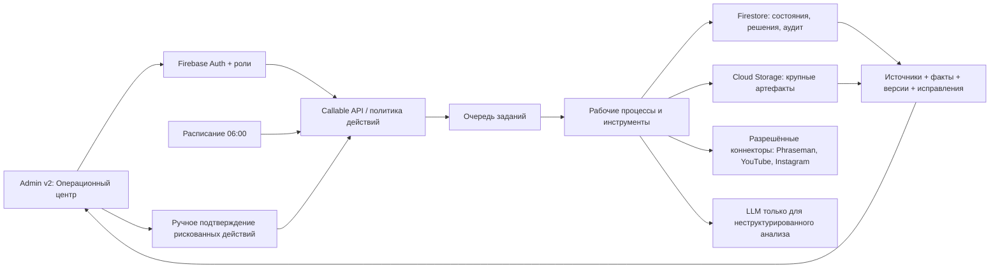

# Система операционных AI-процессов для Phraseman

Дата исследования: 13 июля 2026 года  
Исходное видео: `C:\Users\badlo\Downloads\Telegram Desktop\IMG_0850.MP4`  
Длительность: 01:23; 880×1920; 60 fps  
Статус документа: исследование и оценка, без внедрения и без развёртывания

## Короткий ответ

Рекомендация: строить первую версию **внутри существующей Admin v2**, как модуль «Операционный центр», а вычислительную часть оставить отдельным серверным модулем за текущими Firebase callable-функциями. Не нужно сейчас создавать отдельное приложение и не нужно буквально копировать шесть «персонажей-агентов» из ролика.

Полезный производственный MVP для Phraseman:

- утренний отчёт и список приоритетов;
- аналитик продукта и контента;
- исследователь и контент-стратег, которые создают только черновики;
- общая доказательная база: источники, метрики, решения, исправления и артефакты;
- очередь согласований, журнал действий, лимиты расходов и аварийное отключение;
- никаких публикаций, сообщений, изменений пользователей или конфигурации без явного подтверждения администратора.

Оценка при использовании уже созданного ядра Phraseman:

| Уровень | Срок одним основным разработчиком с проверкой | Эквивалент внешней разработки, ожидаемо | Резерв P90 |
|---|---:|---:|---:|
| Проверочный пилот, только чтение | 3–4 недели | около €14 500 | до €31 500 |
| Рекомендуемый производственный MVP в Admin v2 | 7–10 недель | около €34 000 | до €73 000 |
| Полный объём, сопоставимый с роликом | 14–20 недель | около €68 000 | до €141 000 |
| Тот же полный объём как отдельное приложение | 18–26 недель | около €89 000 | до €186 000 |

Это эквивалент рыночной стоимости труда, а не обязательный денежный платёж. При разработке текущей командой с Codex прямые расходы могут быть намного ниже, но останутся время команды, проверка качества, сопровождение и риск интеграций. Ожидаемые технические расходы небольшого MVP — ориентировочно **€30–150 в месяц**, а сопровождение — ещё **€700–1 400 в месяц** при резерве 1–2 инженерных дней. Все суммы без НДС.

## Что именно показано в видео

Я проверил ролик покадрово и сделал локальную расшифровку без использования проектного OpenAI API.

| Таймкод | Что заявляет диктор | Что видно в интерфейсе | Статус доказательства |
|---|---|---|---|
| 00:00–00:09 | Несколько агентов, одна общая память, без ручного управления задачами | Карта ролей и навигация Agentic OS | Подтверждён только показ интерфейса и заявление автора |
| 00:09–00:20 | CEO каждое утро анализирует вчерашний день, ставит приоритеты и раздаёт работу | Command Center, задачи и расписание | Реальная автоматическая работа не продемонстрирована |
| 00:20–00:32 | CMO изучает успешный контент, конкурентов и готовит сценарии | Content Analytics, победители, библиотека контента | Показан ожидаемый результат, но не источники и не методика |
| 00:32–00:40 | Sales Rep отслеживает входящие лиды, напоминания и этапы воронки | Lead Pipeline | Не показана интеграция с CRM, почтой или мессенджерами |
| 00:40–00:50 | Researcher собирает рыночный и конкурентный контекст | Экран исследовательского агента | Не показаны проверяемость, цитаты и ограничения источников |
| 00:50–00:57 | Data Analyst ранжирует важные сигналы | Дашборд и телеметрия | Не показаны формулы, качество данных и защита от ложных выводов |
| 00:57–01:18 | Все агенты читают общую память друг друга | Knowledge Vault, граф из 53 узлов и 226 связей | Видна визуализация; устройство памяти и качество поиска не доказаны |
| 01:18–01:23 | Призыв запросить разбор системы | Финальный CTA | Маркетинговая часть |

В интерфейсе присутствуют разделы Command Center, Agents, Tasks, Schedule, Tools, Lead Pipeline, Content Analytics, Content и Knowledge Vault. Также показаны роли CEO/Orchestrator, Researcher, CMO, Sales Rep, Dev и Data Analyst.

### Чего видео не доказывает

Ролик не показывает:

- настоящий серверный оркестратор, очередь и восстановление после сбоев;
- откуда берутся данные конкурентов и разрешён ли такой сбор правилами платформ;
- реальную связь с Instagram, YouTube, CRM, аналитикой и почтой;
- защиту от повторной отправки, ошибочной публикации и превышения бюджета;
- качество результатов на тестовом наборе и долю ручных исправлений;
- права доступа, журнал изменений, хранение секретов и удаление данных;
- стоимость модели, внешнего поиска, интеграций и поддержки.

Публичной технической документации именно для показанного «Sureflow Agentic OS», которая позволила бы проверить эти утверждения, в ходе поиска не обнаружено. Поэтому ролик следует воспринимать как хороший образ интерфейса и бизнес-сценариев, но не как доказанную архитектуру.

## Что уже есть в Phraseman

Текущий Phraseman находится гораздо ближе к такой системе, чем может показаться по ролику. Сильнее всего готов контур генерации и проверки контента; слабее — внешние бизнес-интеграции.

### Уже реализованное ядро

По текущему коду и [финальному отчёту R8–R12](./admin-content-factory-r8-r12-final-evidence-2026-07-13.md) уже есть:

- Admin v2 с Firebase Auth и ролями `owner`, `admin`, `support`, `content_editor`, `moderator`, `analyst`, `developer`;
- серверные callable-функции вместо прямого доступа админки к служебным коллекциям;
- задания, стадии, зависимости, конкурентное выполнение, аренда задания и контроль зависших процессов;
- идемпотентность: повторный запуск не должен создавать повторное действие;
- пауза, продолжение, отмена и безопасное восстановление;
- неизменяемые версии результатов, предпросмотр отличий и ручное согласование;
- QA-квитанции, лимиты запросов и расходов, переключатели аварийного отключения;
- журнал аудита с исполнителем, причиной, состоянием до/после и ссылкой для отката;
- Content Studio для уроков, викторин, испытаний, карточек и Arena;
- реестр источников, исправления, метрики развёртывания и теневое сравнение результатов.

Архитектурный план уже определяет правильный путь: запрос → план/DAG → неизменяемые черновики → QA → ручное утверждение → существующий выпуск. Это зафиксировано в [плане платформы генерации](../superpowers/plans/2026-07-12-admin-v2-content-generation-platform.md).

Важно: эта новая платформа проверена локально, но, согласно финальному отчёту, **ещё не развёрнута в production**. Смета ниже включает доведение связанного контура до управляемого запуска, но не предполагает его переписывание с нуля.

### Что готово частично

- «Общая память»: есть артефакты, источники, исправления и версии, но пока нет единого операционного контекста для продукта, контента, маркетинга и продаж.
- Аналитика: в админке уже есть продуктовые и диагностические данные, но нет общей модели сигналов, доказательств и ежедневных приоритетов.
- Контентные агенты: существует специализированный пайплайн и [спецификация агентов](../content-agents-spec.md), но он не является универсальной системой операционного управления.
- Управление заданиями: ядро есть, но ещё нет каталога инструментов с классификацией риска и общей очереди согласований для любых внешних действий.

### Чего нет для полного повторения ролика

- OAuth-коннекторов YouTube и Instagram с обновлением токенов;
- CRM и достоверного источника лидов;
- планировщика ежедневного операционного отчёта как продуктовой функции;
- доказательной «памяти» между доменами;
- безопасных инструментов публикации, писем и изменения внешних систем;
- оценочных наборов для исследований, приоритетов и маркетинговых рекомендаций;
- отдельного многопользовательского SaaS-контейнера — он сейчас и не нужен.

## Какую систему стоит построить

### 1. Не персонажи, а проверяемые рабочие процессы

Название «агент» удобно для интерфейса, но единицей управления должен быть **запуск рабочего процесса** с входными данными, версиями, источниками, статусом, стоимостью и результатом. Это защищает от ситуации, когда красивый чат скрывает неизвестное действие.

Для первой версии достаточно четырёх ролей:

1. **Операционный координатор** — собирает уже вычисленные показатели, выделяет изменения, предлагает 3–5 приоритетов и создаёт черновик плана дня.
2. **Аналитик продукта** — объясняет изменения в активации, обучении, удержании, оплатах, ошибках и качестве контента.
3. **Исследователь контента** — собирает разрешённые внешние и внутренние сигналы, сохраняет источник и дату каждого факта.
4. **Контент-стратег** — превращает утверждённые исследования в черновики сценариев и заданий существующего Content Studio.

Роль «Sales Rep» стоит добавлять только после появления реального CRM-процесса и входящих лидов. «Dev agent» не должен сам менять код или развёртывать приложение: максимум — формировать задачу, диагностический пакет или черновик изменения для отдельной человеческой проверки.

### 2. Рекомендуемая архитектура

Основные решения:

- **Firebase остаётся системой контроля.** Не создавать второй параллельный журнал задач и прав.
- **Cloud Scheduler** запускает утренний процесс; **Cloud Tasks** доставляет отдельные этапы с повторными попытками.
- Детерминированный код считает метрики, проверяет ограничения и выполняет разрешённые операции. Модель используется для классификации, объяснения, исследования и черновиков — там, где правила действительно не справляются.
- Каждый вывод хранит `sourceId`, время получения, диапазон данных, формулу или запрос и уровень уверенности.
- Любое внешнее действие получает `idempotencyKey`, уровень риска и правило подтверждения.
- Большие ответы, отчёты и исходные выгрузки хранятся в Storage; в Firestore — только состояние, индекс и краткое содержание.
- Сначала достаточно обычного поиска по структурированным фактам и артефактам. Векторную базу и граф знаний нужно добавлять только после измеренного провала поиска, а не ради экрана как в ролике.

Официальное руководство OpenAI также рекомендует использовать агентов для неоднозначных процессов, сложных решений и неструктурированных данных, а при достаточности правил оставлять детерминированное решение. Оно отдельно подчёркивает сочетание ограничителей с обычной авторизацией, строгими правами и стандартной безопасностью: [Practical guide to building agents](https://openai.com/business/guides-and-resources/a-practical-guide-to-building-ai-agents/).

### 3. Модель общей памяти

«Общая память» должна быть не бесконечной перепиской агентов, а пятью проверяемыми слоями:

| Слой | Пример | Правило |
|---|---|---|
| Источник | ответ API, внутренняя метрика, документ | неизменяемая ссылка, владелец, время и срок хранения |
| Факт | «удержание D7 изменилось на …» | значение, формула, период и источник |
| Решение | «проверить новый onboarding» | автор/процесс, основания, статус и срок пересмотра |
| Артефакт | отчёт, сценарий, план, набор контента | версия, QA, согласование и связь с источниками |
| Исправление | администратор исправил вывод или текст | исходный результат, исправление и правило для будущих запусков |

Для каждой записи нужны область доступа, срок хранения, происхождение, версия схемы и возможность удалить или переиндексировать данные. Короткое резюме не заменяет исходный источник.

### 4. Состояния и безопасность действий

Минимальный автомат состояний:

`draft → planned → queued → running → waiting_approval → approved → executing → succeeded`

Отдельные финалы: `failed`, `cancelled`, `expired`. Повторное выполнение допускается только с тем же ключом идемпотентности либо как новая явная версия.

Классы инструментов:

- **R0 — чтение:** получить внутреннюю метрику или разрешённую аналитику; можно выполнять автоматически.
- **R1 — обратимая запись:** создать внутренний черновик или задачу; автоматизация допустима с аудитом.
- **R2 — внешняя запись:** запланировать публикацию, ответить лиду, изменить Remote Config; требуется предпросмотр и ручное подтверждение.
- **R3 — необратимое/финансовое:** публикация в production, массовое сообщение, удаление, платёж; двойное подтверждение, узкая роль, лимит и отдельный журнал.

Секреты коннекторов должны находиться только на сервере. Инструменты получают белый список методов и доменов, ограниченный объём ответа и защиту от инструкций, спрятанных во внешнем контенте. Модель никогда не получает универсальный токен администратора.

## Как это должно выглядеть в админке

Согласно [Admin UI Bible](../design/ADMIN_UI_BIBLE.md), не стоит добавлять восемь новых пунктов меню и декоративную карту «живых» агентов.

Предлагаемое размещение:

- **Overview → Операционный центр:** сегодняшние приоритеты, отклонения, ожидающие подтверждения и последние запуски;
- **Content → Content Studio:** исследования, контентные черновики и текущие стадии производства;
- **Diagnostics → Выполнения и расходы:** журнал, ошибки, повторы, стоимость, лимиты и аварийное отключение.

Первый экран должен отвечать на один вопрос: **«Что сегодня требует моего решения?»** Главная кнопка — «Проверить план дня». У каждой рекомендации открываются данные, источник, объяснение, стоимость и предполагаемое действие. Никаких зелёных «всё хорошо» без проверяемой метрики и никаких статусов `online`, если система просто ждёт расписания.

## Интеграции: что реально доступно

### YouTube

YouTube Analytics API может отдавать принадлежащему каналу просмотры, вовлечённые просмотры, время просмотра, среднюю длительность, лайки, комментарии, подписки и источники трафика; требуется OAuth 2.0 и авторизация владельца канала: [официальные отчёты канала](https://developers.google.com/youtube/analytics/channel_reports). YouTube Data API выдаёт проекту стандартную квоту 10 000 единиц в день и рекомендует кеширование/ETag: [официальный обзор квот](https://developers.google.com/youtube/v3/getting-started).

Вывод: собственный YouTube-канал можно подключить в первом этапе только на чтение. Автопубликацию следует вынести в отдельный поздний этап и оставить с подтверждением.

### Instagram

Официальная коллекция Meta описывает аналитику только для профессиональных аккаунтов, OAuth-токены, необходимые разрешения и отдельные уровни доступа. Для чужих управляемых аккаунтов требуется Advanced Access; часть метрик недоступна для аккаунтов менее 100 подписчиков, а пользовательские метрики хранятся до 90 дней: [Meta Instagram Insights](https://www.postman.com/meta/instagram/folder/23987686-f659d7d1-d74c-44e4-9192-9b1e8694c511).

Вывод: начать с собственного профессионального аккаунта и чтения Insights. Закладывать отдельное время на Meta Login, токены, webhook и проверку разрешений; не обещать универсальный анализ всех конкурентов, потому что API его не предоставляет.

### Лиды и CRM

В ролике нет доказанного источника лидов. Для Phraseman сначала нужно определить, что является лидом: письмо партнёра, заявка школы, форма инфлюенсера, обращение поддержки или покупатель. До этого «Sales Agent» будет производить красивую, но бесполезную воронку. На пилоте правильнее оставить эту область вне объёма.

## Admin v2, отдельное приложение или n8n

| Вариант | Плюсы | Минусы | Решение |
|---|---|---|---|
| Нативно в Admin v2 | Повторное использование Auth, ролей, аудита, callables, Content Studio и текущего развёртывания | Нужно аккуратно сохранить модульные границы | **Рекомендуется сейчас** |
| Отдельное приложение | Независимый выпуск, отдельная команда, проще превратить в SaaS для внешних клиентов | Дублирование входа, ролей, журналов, навигации, окружений и поддержки | Только при внешних пользователях, отдельной тарификации или отдельной границе безопасности |
| n8n как гибрид | Быстро собирать прототипы коннекторов и визуальные цепочки | Второй центр управления, секреты и аудит, дополнительное обслуживание и зависимость от тарифа | Допустим как лаборатория коннекторов, не как источник истины и не как контур подтверждений |

Текущая официальная цена n8n при годовой оплате: Starter €20/мес. за 2 500 выполнений, Pro €50/мес. за 10 000, Business €667/мес. за 40 000 и функции вроде SSO/окружений/Git; Community Edition можно размещать самостоятельно: [n8n pricing](https://n8n.io/pricing/). Эти суммы не включают модель, Firebase и инженерное сопровождение.

## Этапы реализации

### Этап 0. Зафиксировать ценность — 3–5 дней

- выбрать 2 процесса, которые сейчас реально отнимают время;
- зафиксировать сегодняшние затраты времени и качество;
- определить данные, владельца решения и запрещённые действия;
- подготовить 20–30 исторических примеров для оценки качества.

Критерий выхода: можно однозначно измерить экономию времени, точность и стоимость принятого результата.

### Этап 1. Пилот только на чтение — 2–3 недели

- утренний отчёт по существующим данным Phraseman;
- подключение YouTube Analytics только на чтение;
- доказательные карточки: значение, изменение, источник, период;
- координатор предлагает приоритеты, но ничего не выполняет;
- все запуски имеют стоимость, версии и журнал.

Критерии приёмки:

- не менее 95% запланированных отчётов готовы к установленному времени;
- каждое числовое утверждение открывает источник и период;
- повторный триггер не создаёт дубликат;
- ни одного внешнего изменения;
- администратор оценивает полезность каждого приоритета, а система собирает исправления.

### Этап 2. Производственный MVP — 4–6 недель

- общий каталог инструментов и уровни риска;
- Researcher и Content Strategist;
- очередь согласований и единый экран «что требует решения»;
- Instagram Insights только на чтение после проверки доступа;
- оценки качества, проверки на инъекцию из внешнего контента и тесты восстановления;
- бюджетные лимиты, уведомления и аварийное отключение.

Критерий выхода: система экономит измеримое время, а стоимость принятого результата и процент исправлений видны на панели.

### Этап 3. Управляемые внешние действия — ещё 4–8 недель

- подготовка публикаций и сообщений как черновиков;
- подтверждение, идемпотентность и быстрый откат там, где он возможен;
- только после реального процесса — CRM и работа с лидами;
- отдельные права и лимиты на каждый коннектор.

Автономные публикации или сообщения без человека не входят в рекомендуемый первый релиз.

## Подробная стоимость

### Допущения

- оценка на 13 июля 2026 года, без НДС;
- рабочий день — 8 часов;
- ожидаемая смешанная ставка €700/день, резерв P90 — €900/день;
- ожидаемая смета включает 15% резерва, P90 — 25%;
- используется существующее ядро Phraseman, но учитывается его безопасный запуск;
- P90 — правдоподобный плохой сценарий, а не абсолютный максимум;
- для перевода долларовых тарифов использован справочный курс ECB на 13 июля 2026 года: €1 = $1.1424, [ECB reference rates](https://www.ecb.europa.eu/stats/policy_and_exchange_rates/euro_reference_exchange_rates/html/index.en.html).

### Одноразовая разработка

| Сценарий | Ожидаемые человеко-дни | Расчёт ожидаемой цены | P90 человеко-дни | Расчёт P90 |
|---|---:|---:|---:|---:|
| Пилот только на чтение | 18 | 18 × €700 × 1.15 = **€14 490** | 28 | 28 × €900 × 1.25 = **€31 500** |
| Производственный MVP в Admin v2 | 42 | 42 × €700 × 1.15 = **€33 810** | 65 | 65 × €900 × 1.25 = **€73 125** |
| Полный объём ролика в Admin v2 | 85 | 85 × €700 × 1.15 = **€68 425** | 125 | 125 × €900 × 1.25 = **€140 625** |
| Полный объём в отдельном приложении | 110 | 110 × €700 × 1.15 = **€88 550** | 165 | 165 × €900 × 1.25 = **€185 625** |

Отдельное приложение добавляет примерно 25–40% из-за собственного каркаса, авторизации, ролей, журналов, окружений, навигации, деплоя и сквозных тестов. Если затем появится внешний SaaS-продукт, этот расход станет оправданным; для внутреннего инструмента сейчас — нет.

### Модель

Текущий серверный контур Phraseman настроен на GPT-4.1 mini. Официальный тариф: $0.40 за 1 млн входных токенов, $0.10 за кешированный вход и $1.60 за 1 млн выходных токенов: [GPT-4.1 mini pricing](https://developers.openai.com/api/docs/models/gpt-4.1-mini).

Примерная формула для одного типа вызова:

`стоимость = число вызовов × (входные токены × $0.40 / 1 000 000 + выходные токены × $1.60 / 1 000 000) × 1.25 на повторы`

При среднем вызове 8 000 входных и 2 000 выходных токенов:

| Объём | Вызовы/месяц | Модель с резервом повторов | Примерно в евро |
|---|---:|---:|---:|
| Пилот | 300 | $2.40 | €2.10 |
| Рабочий MVP | 3 000 | $24 | €21 |
| Высокая нагрузка | 30 000 | $240 | €210 |

Это не полный счёт: более сильные модели, длинные контексты, платный web search и сторонние инструменты могут стоить заметно дороже. Поэтому нужен фактический счётчик токенов и стоимости на каждом запуске. Codex не использовал проектный OpenAI API при подготовке этого отчёта; указанные вызовы относятся только к будущей production-системе.

### Firebase и очередь

Официальные бесплатные квоты Firebase включают 50 000 чтений и 20 000 записей Firestore в день, 1 GiB хранения, 10 GiB исходящего трафика и 2 млн вызовов Cloud Functions в месяц; после этого действует тарификация использования: [Firebase pricing](https://firebase.google.com/pricing). Первые 1 млн операций Cloud Tasks в месяц бесплатны, затем $0.40 за миллион: [Cloud Tasks pricing](https://cloud.google.com/tasks/pricing). Задание Cloud Scheduler стоит $0.10 в месяц, первые три задания на аккаунт бесплатны: [Firebase scheduled functions](https://firebase.google.com/docs/functions/schedule-functions).

Ожидаемая добавочная инфраструктура:

| Нагрузка | Модель | Firebase/очередь/хранение | Прочий резерв | Общий технический бюджет |
|---|---:|---:|---:|---:|
| Пилот | ~€2 | €0–10 | €0–10 | **€2–20/мес.** |
| Рабочий MVP | ~€21 | €10–60 | €0–70 | **€30–150/мес.** |
| Высокая | ~€210 | €60–300 | €0–290 | **€270–800/мес.** |

Бесплатные квоты общие с остальным приложением, поэтому нельзя обещать нулевой счёт. Нельзя строить «живую» карту агентов на постоянных Firestore listeners: каждое обновление создаёт чтения, шум и противоречит Admin UI Bible.

### Сопровождение и 12-месячная стоимость

| Система | Сопровождение | Ожидаемая стоимость за 12 месяцев вместе с разработкой |
|---|---:|---:|
| Производственный MVP | 1–2 инженерных дня/мес., €700–1 400 | примерно **€43 000–53 000** |
| Полный объём ролика | 2–4 инженерных дня/мес., €1 400–2 800 | примерно **€89 000–112 000** |

В годовую оценку включены ожидаемая разработка, указанный резерв сопровождения и верхняя граница соответствующего технического бюджета. Не включены платные данные конкурентов, коммерческий CRM, юридическая проверка условий внешних платформ и производство маркетинговых материалов.

## Главные риски и способы их ограничить

| Риск | Почему важен | Ограничение |
|---|---|---|
| Красивые, но неверные приоритеты | Модель убедительно объясняет шум | Сначала детерминированные метрики, затем объяснение; источник у каждого вывода; исторические оценки |
| Инъекция из сайта или документа | Внешний текст может пытаться управлять агентом | Внешний контент считается данными, а не инструкцией; белый список инструментов; запрет секретов в контексте |
| Повторная публикация/сообщение | Повторы очереди — нормальное явление | Ключ идемпотентности, журнал действия, подтверждение и проверка состояния назначения |
| Утечка токена платформы | Даёт доступ к аккаунту бренда | Secret Manager, минимальные scopes, обновление и отзыв, отсутствие токена в браузере и логах |
| Рост расходов | Циклы, длинная память и повторы | Лимит на запуск/день/коннектор, максимальные шаги, предупреждение 70/90%, kill switch |
| Потеря доверия команды | Непонятно, почему система решила | Доказательная карточка, diff, версия инструкции, исправление и оценка полезности |
| Зависимость от одного провайдера | Модель или API меняются | Типизированный адаптер, структурированный контракт, золотой набор тестов и возможность отключить стадию |
| Ограничения Meta/YouTube | Не все конкурентные данные доступны | Собственные аккаунты и официальные API сначала; не обещать недоступные данные; кеш и квоты |

## Решение о запуске

Я рекомендую утвердить **только пилот внутри Admin v2** со следующими границами:

- два процесса: утренний операционный отчёт и аналитика собственного контента;
- данные Phraseman + YouTube, Instagram только после отдельной проверки доступа;
- система лишь читает данные и создаёт внутренние черновики;
- 20–30 исторических примеров для оценки;
- срок 3–4 недели;
- ожидаемый рыночный эквивалент €14 500, P90 €31 500;
- технический потолок пилота €25/месяц;
- после четырёх недель принять решение по фактической экономии времени, точности и проценту принятых рекомендаций.

Расширять до публикаций, CRM и «полного набора агентов» стоит только при доказанной пользе пилота. Отдельное приложение сейчас не окупает добавочную сложность.

## Источники

- [OpenAI — Practical guide to building agents](https://openai.com/business/guides-and-resources/a-practical-guide-to-building-ai-agents/)
- [OpenAI — GPT-4.1 mini: возможности и цена](https://developers.openai.com/api/docs/models/gpt-4.1-mini)
- [Firebase — тарифы и бесплатные квоты](https://firebase.google.com/pricing)
- [Firebase — биллинг Firestore](https://firebase.google.com/docs/firestore/pricing)
- [Firebase — scheduled functions](https://firebase.google.com/docs/functions/schedule-functions)
- [Google Cloud — Cloud Tasks pricing](https://cloud.google.com/tasks/pricing)
- [Google — YouTube Analytics channel reports](https://developers.google.com/youtube/analytics/channel_reports)
- [Google — YouTube Data API quotas](https://developers.google.com/youtube/v3/getting-started)
- [Meta — Instagram Insights collection](https://www.postman.com/meta/instagram/folder/23987686-f659d7d1-d74c-44e4-9192-9b1e8694c511)
- [n8n — plans and pricing](https://n8n.io/pricing/)
- [ECB — reference exchange rates](https://www.ecb.europa.eu/stats/policy_and_exchange_rates/euro_reference_exchange_rates/html/index.en.html)
- [Phraseman — Admin UI Bible](../design/ADMIN_UI_BIBLE.md)
- [Phraseman — Admin Content Factory R8–R12 evidence](./admin-content-factory-r8-r12-final-evidence-2026-07-13.md)
- [Phraseman — Admin v2 content generation platform plan](../superpowers/plans/2026-07-12-admin-v2-content-generation-platform.md)

## Находки и предложения

- Самая ценная часть ролика — не шесть агентов, а единый цикл «сигнал → решение → задача → результат → память». Именно его стоит перенести.
- Phraseman уже имеет сильное ядро надёжности для контента; сначала его нужно безопасно довести до production, а затем расширять общими операционными процессами.
- Первая общая память должна быть доказательной и версионируемой. Граф и векторный поиск пока не нужны.
- До подключения Sales Agent нужно отдельно определить источник и жизненный цикл настоящего лида.
- Перед разработкой полезно выбрать два ежедневных решения, которые сейчас отнимают больше всего времени: это позволит заменить маркетинговую идею измеримым продуктом.
