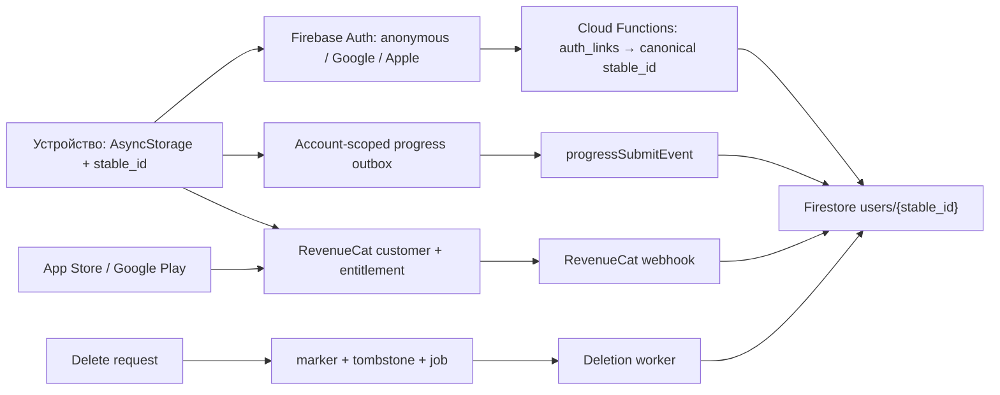

# Аудит аккаунтов, Firebase, прогресса и Premium

Дата: 18 июля 2026. Объект: текущее состояние рабочего дерева `C:\appsprojects\phraseman` (оно уже содержало незакоммиченные изменения пользователя). Аудит был только на чтение: исходный код, Firebase, покупки и деплой не изменялись.

## Короткий вердикт

**HOLD: выпускать текущую account-систему как «безошибочную» нельзя.** P0 не найдено, но подтверждены критичные P1-гонки, способные смешать аккаунты, потерять прогресс, выдать Premium не тому локальному профилю или воскресить удалённые данные.

Из 100 сценариев: **48 PASS, 16 RISK, 31 FAIL, 5 UNKNOWN**.

- PASS — код закрывает сценарий.
- RISK — основной путь работает, но остаётся окно потери/ошибки либо нет device-подтверждения.
- FAIL — требуемое поведение детерминированно нарушается текущим кодом.
- UNKNOWN — результат зависит от недоступной production-конфигурации или реального магазина/устройства.

P0: 0. P1: 14 групп проблем. P2: 7 групп проблем. Обязательные тестовые гейты не зелёные.

## Рекомендуемая продуктовая политика

Пользователь не зафиксировал желаемое правило переноса Premium, поэтому аудит использует следующую рекомендуемую модель:

1. Прогресс, VIP/web-доступ и store Premium принадлежат **подтверждённому аккаунту Phraseman** (`canonical stable_id`), а не телефону.
2. Один Phraseman-аккаунт получает доступ на iOS и Android, если оба приложения находятся в одном RevenueCat project и используют один `stable_id`.
3. Другой Phraseman-аккаунт на том же телефоне не должен автоматически наследовать покупку A.
4. Перенос покупки между двумя Phraseman-аккаунтами — только явная операция после повторной аутентификации, с отзывом у старого владельца и журналом.
5. Удаление Phraseman-аккаунта не отменяет магазинную подписку; это уже объяснено в UI. Оно должно удалить/обезличить RevenueCat customer и дать безопасный явный путь восстановления покупки.

При этой политике Apple-покупка **должна быть доступна на Android** в том же Phraseman-аккаунте. Текущий online-flow это поддерживает условно, но гарантия невозможна до проверки RevenueCat Dashboard.

## Архитектура и границы доверия

Границы доверия:

- Ненадёжные: устройство, AsyncStorage, сеть, входные поля callable, subscriber attributes RevenueCat, порядок webhook-событий.
- Доверенные только после проверки: Firebase ID token, App Check token, серверный `auth_links`, store receipt/RevenueCat entitlement, deletion marker внутри той же транзакции.
- Критичные активы: стабильная идентичность, прогресс/XP/streak/owned-наборы, Premium/VIP, Firebase Auth-сессия, данные удаления и журналы покупок.

## Подтверждённые P1-дыры

| ID | Дыра и фактический результат | Код | Как закрыть |
|---|---|---|---|
| AUTH-01 | `Firebase signOut()` ловит ошибку и возвращает успех. Switch/delete продолжают wipe и создают новый `stable_id`, хотя старый provider остаётся активен. | `app/auth_provider.ts:1421-1470`, `1514-1582`, `1651-1683` | Возвращать подтверждённый logout-result; проверять `currentUser === null`; без этого не стирать и не активировать новый аккаунт. |
| AUTH-02 | 45-секундный `Promise.race` меняет UI, но не отменяет Firebase mutation. Поздний task способен незаметно переключить аккаунт. | `components/RegistrationPromptModal.tsx:280-285`, `app/auth_provider.ts:854-864` | Единая неотменяемая identity-секция: после deadline запрещены storage/stable mutations либо UI ждёт её финального исхода. |
| AUTH-03 | Native Apple iOS идёт без nonce, снижая защиту от replay. Android Apple nonce/state реализованы. | `app/auth_provider.ts:661-681`, `701-791` | Random raw nonce → SHA-256 в Apple request → raw nonce в Firebase credential; тест mismatch/replay. |
| AUTH-04 | Merge/link проверяет deletion marker до транзакции; удаление может вклиниться и поздняя Admin-запись воскресит профиль. | `functions/src/auth_identity.ts:45-61,868-920,980-983`, `functions/src/auth_merge.ts:500-551` | Читать marker/tombstone в той же транзакции, которая пишет user/link/canonical pointers. |
| SYNC-01 | Два параллельных progress event делают unlocked read-modify-write одной очереди; последний write удаляет другой event. | `app/progress_events_client.ts:416-445` | Per-account mutex для всех queue mutations либо один AsyncStorage-record на event. |
| SYNC-02 | При merge/swap очередь старого stable ID не flush/rekey. Offline XP остаётся навсегда под старым ключом. | `app/progress_events_client.ts:265-313`, `app/auth_provider.ts:1154-1195` | До swap атомарно перенести очередь в canonical UID с сохранением event IDs или подтвердить flush. |
| SYNC-03 | Restore делает max/union, но исходящий обычный/forced sync снова пишет stale value целиком. Третье устройство получает потерянный counter/owned item. | `app/cloud_sync.ts:1200-1293,1924-1968,2729-2744` | Server-side max/union/domain transactions; не загружать эти поля общим last-write patch. |
| SYNC-04 | Emergency backup один на все аккаунты, восстанавливает только отсутствующие ключи и имеет TOCTOU перед `multiSet`. | `app/cloud_sync.ts:668,2766-2777`, `app/account_switch_backup_restore.ts:77-102` | Backup по stable UID; merge по типу данных; restore+wipe под одним transition lock. |
| SYNC-05 | `doSyncToCloud()` снимает `pendingSync` до сети и не возвращает его при ошибке. Изменение может больше не повториться. | `app/cloud_sync.ts:1873-1880,1990-1992` | Durable pending-intent; re-arm на каждом early return/error; bounded backoff + connectivity/AppState retry. |
| DEL-01 | In-flight `progressSubmitEvent` после удаления может вновь создать `users/{stable}` и subcollections. | `app/auth_provider.ts:1528-1553`, `functions/src/progress_events.ts:873-979`, `functions/src/account_delete.ts:382-389` | Marker/tombstone внутри progress transaction; drain/cancel progress submits; post-delete sweep. |
| DEL-02 | Pending-delete guard — один scalar, перезаписывается удалением B и исчезает через 7 дней без server completion. | `app/auth_provider.ts:357-414,1552-1566` | Durable account-scoped ledger; удалять запись только после server `completed`. |
| DEL-03 | После 8 ошибок deletion job становится terminal `failed`, worker больше его не подбирает. | `functions/src/account_delete_job.ts:46-49,178-185`, `functions/src/account_delete_worker.ts:53-57` | Dead-letter alert, административный requeue/repair, compliance dashboard и периодический audit sweep. |
| PREM-01 | Switch/delete не перепривязывает RevenueCat до чтения CustomerInfo. Новый профиль B может временно получить локальный Premium A. | `app/auth_provider.ts:1421-1582,1651-1683`, `app/premium_guard.ts:143` | В начале transition обнулить effective store access; перед любым RC read требовать `getAppUserID() === canonical stable_id`. |
| PREM-02 | Webhook предпочитает `phraseman_uid` из subscriber attributes. Старый A + фактический `app_user_id=B` отправляет покупку A. | `app/revenuecat_init.ts:189-218`, `functions/src/revenuecat_shards.ts:145-151,221-241,283-370` | Неанонимный `event.app_user_id` — первичный владелец; attributes только проверенный fallback. |
| PREM-03 | Webhook не сравнивает порядок событий. Поздний `EXPIRATION` старого monthly способен снять новый yearly/lifetime. | `functions/src/revenuecat_shards.ts:268-370` | Монотонная проекция по event time + original transaction/product chain; при конфликте запросить актуальный subscriber у RevenueCat. |
| PREM-04 | Manage-screen игнорирует `false` identity sync и покупает напрямую без account-generation barrier. | `app/manage_subscription.tsx:163,207-233` | Переиспользовать paywall barrier: exact RC identity + generation token + product confirmation. |
| PREM-05 | Удаляются Firestore-журналы RC, но не сам RevenueCat customer. | `functions/src/account_delete.ts:125-128` | Идемпотентный RevenueCat deletion outbox с secret, retry и audit result; подписку не отменять молча. |

Дополнительные P2: recurring plan без expiry становится бессрочным (`functions/src/premium_status.ts:78-93`); экран управления открывает магазин текущего устройства, а не покупки (`app/manage_subscription.tsx:105,249`); hidden alias может воскресить lifetime (`functions/src/premium_status.ts:336-365`); Android deferred upgrade преждевременно пишет yearly (`app/manage_subscription.tsx:229-233`); первый snapshot migration — first-writer-wins (`functions/src/progress_events.ts:1006-1028`); повреждённая outbox JSON молча становится пустой (`app/progress_events_client.ts:269-275`); вся Android RKStorage попадает в backup/transfer (`android/app/src/main/res/xml/backup_rules.xml`, `data_extraction_rules.xml`).

## 100 сценариев: результат текущего кода

| ID | Сценарий | Статус | Что произойдёт сейчас | Основной код |
|---|---|---|---|---|
| I01 | Первый запуск online | PASS | Создаётся stable ID и anonymous Firebase session. | `app/stable_id.ts:91-185`; `app/cloud_sync.ts:1507-1545` |
| I02 | Первый запуск offline | RISK | Локальная работа возможна; Firebase identity/cloud появятся только после сети. | `app/cloud_sync.ts:1507-1545` |
| I03 | iOS reinstall, Keychain сохранил stable ID | RISK | ID вернётся, но Firebase identity может потребовать provider recovery; пустой overwrite защищён restore-first. | `app/stable_id.ts:64-185`; `app/auth_provider.ts:1314-1345` |
| I04 | Android reinstall с Auto Backup | RISK | Восстанавливается весь RKStorage, не только stable ID; возможны stale local/account данные. | `android/app/src/main/res/xml/backup_rules.xml` |
| I05 | Android «очистить данные» без backup | PASS | Создаётся новый local identity; старый cloud доступен после provider sign-in. | `app/stable_id.ts:91-185` |
| I06 | Android device transfer на новый телефон | RISK | Переносится весь AsyncStorage DB; нужна обязательная identity revalidation до показа/записи. | `android/app/src/main/res/xml/data_extraction_rules.xml` |
| I07 | Новый iPhone/iPad восстановил Keychain item | RISK | Stable ID может приехать без соответствующей живой Firebase-сессии. | `app/stable_id.ts:64-185` |
| I08 | Expo Go / cloud disabled | PASS | Dev-only путь работает локально и не обещает production sync. | `app/config.ts`; `app/cloud_sync.ts:2680-2684` |
| I09 | Firebase SDK недоступен на boot | RISK | UI не обязан падать, но sync intent может потеряться из-за раннего return. | `app/cloud_sync.ts:1873-1880` |
| I10 | Параллельные get/set/clear stable ID | PASS | Mutation epoch/barrier защищает от поздней in-process записи. | `app/stable_id.ts:91-301` |
| G01 | Новый Google на текущем anonymous профиле | PASS | Anonymous UID связывается через `linkWithCredential`, затем server anchor. | `app/auth_provider.ts:930-1015` |
| G02 | Повторный Google, тот же телефон | PASS | `auth_links`/callable возвращает canonical stable ID. | `app/auth_provider.ts:1060-1160` |
| G03 | Тот же Google на новом устройстве | PASS | Remote anchor выигрывает над новым local stable ID. | `app/auth_provider.ts:1125-1225` |
| G04 | Два одинаковых Google sign-in одновременно | PASS | Один in-flight task переиспользуется. | `app/auth_provider.ts:837-878` |
| G05 | Google и Apple sign-in одновременно | PASS | Второй provider получает `auth_signin_in_progress`. | `app/auth_provider.ts:837-878` |
| G06 | Пользователь отменил Google picker | PASS | Возвращается `cancelled`, identity не меняется. | `app/auth_provider.ts:590-650` |
| G07 | Нет/устарели Play Services | PASS | Явная ожидаемая ошибка, storage не меняется. | `app/auth_provider.ts:585-610` |
| G08 | Google credential already in use | PASS | Fallback sign-in + server merge при доказанном ownership. | `app/auth_provider.ts:970-1030`; `functions/src/auth_merge.ts:492-551` |
| G09 | Native Google picker завис >30 секунд | RISK | UI получает timeout, но native task остаётся жив и переиспользуется. | `app/auth_provider.ts:558-635` |
| G10 | Вход завершился после общего UI-timeout 45 секунд | FAIL | Поздний task способен сменить stable ID/данные после сообщения об ошибке. | `components/RegistrationPromptModal.tsx:280-285`; `app/auth_provider.ts:854-864` |
| A01 | Apple native iOS, существующий аккаунт | RISK | Вход функционален, но идёт без nonce. | `app/auth_provider.ts:661-681` |
| A02 | Apple native iOS, новый аккаунт | RISK | Создаётся новый anchor, но та же replay-resistance дыра. | `app/auth_provider.ts:661-681,930-1160` |
| A03 | Пользователь отменил Apple iOS | PASS | Возвращается `cancelled`, local identity сохранена. | `app/auth_provider.ts:669-675` |
| A04 | Apple login на Android, production env задан | PASS | OAuth code/id_token flow предусмотрен; EAS-переменные присутствуют. | `app/auth_provider.ts:701-791` |
| A05 | Apple Android без Services ID | PASS | Кнопка/flow дают понятную config error. | `app/auth_provider.ts:200-305`; `components/RegistrationPromptModal.tsx:343-360` |
| A06 | Apple Android state mismatch | PASS | Ответ отклоняется до Firebase sign-in. | `app/auth_provider.ts:747-770` |
| A07 | Apple Android nonce | PASS | Raw/hash nonce и OAuth state используются. | `app/auth_provider.ts:701-791` |
| A08 | Один человек: Google + Apple Hide My Email | FAIL | Получатся два Phraseman-аккаунта; автоматического безопасного link flow нет. | `app/auth_provider.ts:930-1160` |
| A09 | Google и Apple дают тот же email, Firebase конфликтует | FAIL | Пользователь увидит общую Firebase-ошибку; guided linking отсутствует. | `app/auth_provider.ts:1000-1060` |
| A10 | Apple credential revoked, альтернативный provider не привязан | RISK | Вход падает ожидаемо, но самовосстановления аккаунта нет. | `app/auth_provider.ts:800-830,1000-1060` |
| M01 | Два устройства, последовательный client-owned progress | PASS | Restore-first и diff sync обычно сохраняют последнее состояние. | `app/cloud_sync.ts:1918-1984,2524-2565` |
| M02 | Три устройства одновременно отправляют XP events | PASS | Firestore transaction сериализует ledger/counter/user. | `functions/src/progress_events.ts:888-979` |
| M03 | Два progress events одновременно enqueue на одном телефоне | FAIL | Unlocked RMW теряет один event навсегда. | `app/progress_events_client.ts:440-445` |
| M04 | Offline XP в A, затем merge выбирает stable B | FAIL | Queue остаётся под A; B её больше не читает. | `app/progress_events_client.ts:265-313`; `app/auth_provider.ts:1154-1195` |
| M05 | Offline XP, app restart, тот же stable ID | PASS | Account-scoped queue остаётся и может flush после сети. | `app/progress_events_client.ts:278-313,582-622` |
| M06 | Три устройства, stale lower monotonic counter пишет последним | FAIL | Cloud counter понижается; свежий третий телефон получает меньшее значение. | `app/cloud_sync.ts:1924-1968` |
| M07 | Три устройства приобрели разные owned items | FAIL | Последний map replacement способен убрать items другого устройства. | `app/cloud_sync.ts:1200-1293,1924-1968` |
| M08 | Два устройства меняют обычную настройку | RISK | Побеждает последний sync; версии/конфликтного UI нет. | `app/cloud_sync.ts:1918-1984` |
| M09 | Restore завершается после смены account generation | PASS | Generation guards блокируют применение к новому аккаунту. | `app/cloud_sync.ts:2000-2442`; `app/account_generation.ts` |
| M10 | Cloud sync A в полёте при switch на B | PASS | Generation checks не применяют A локально к B; запись адресована doc A. | `app/cloud_sync.ts:1873-2000` |
| S01 | Switch после успешного force sync | PASS | A отправляется в cloud, затем wipe и новый anonymous identity. | `app/auth_provider.ts:1421-1470` |
| S02 | Switch, force sync упал, пользователь не подтвердил loss | PASS | Switch отменяется, local A остаётся. | `app/auth_provider.ts:1442-1456` |
| S03 | Пользователь принудительно переключился offline | RISK | Создаётся best-effort emergency backup, но гарантий нет. | `app/auth_provider.ts:1442-1465`; `app/cloud_sync.ts:2766-2777` |
| S04 | Возврат в A, cloud-ключ отсутствует | PASS | Backup заполняет отсутствующий ключ. | `app/account_switch_backup_restore.ts:92-102` |
| S05 | Возврат в A, cloud хранит старое ненулевое значение | FAIL | Backup считает ключ существующим и выбрасывает более новое local значение. | `app/account_switch_backup_restore.ts:92-102` |
| S06 | Offline switch A, затем offline switch B | FAIL | Единственный `latest` backup B перезаписывает A. | `app/cloud_sync.ts:668,2766-2777` |
| S07 | Backup restore прошёл check, затем начался switch | FAIL | Неотменяемый `multiSet` A может завершиться уже внутри B. | `app/account_switch_backup_restore.ts:92-101`; `app/auth_provider.ts:1457-1465` |
| S08 | Firebase signOut падает во время switch | FAIL | Код продолжает wipe/rotation при живом provider A. | `app/auth_provider.ts:1463-1470,1651-1683` |
| S09 | A paid → switch → новый anonymous B | FAIL | RevenueCat остаётся на A; B может прочитать/закэшировать Premium A. | `app/auth_provider.ts:1421-1470`; `app/premium_guard.ts:143` |
| S10 | Switch при pending progress outbox | FAIL | Force sync outbox не flush; queue старого stable ID остаётся сиротой. | `app/auth_provider.ts:1442-1465`; `app/progress_events_client.ts:265-313` |
| P01 | Apple subscription → Android, тот же Phraseman account | PASS | Доступ должен прийти по одинаковому RC App User ID; dashboard-условия обязательны. | `app/revenuecat_init.ts:159-218` |
| P02 | Apple lifetime → Android, тот же аккаунт | PASS | Тот же cross-platform identity path; lifetime распознаётся отдельно. | `app/revenuecat_init.ts:36-58`; `app/premium_revenuecat_state.ts` |
| P03 | Google Play subscription → iOS, тот же аккаунт | PASS | Работает по той же модели RevenueCat project/entitlement. | `app/revenuecat_init.ts:159-218` |
| P04 | Другой Phraseman account на том же устройстве | FAIL | До точной RC rebind локально может наследовать доступ предыдущего аккаунта. | `app/auth_provider.ts:1421-1582`; `app/premium_guard.ts:143` |
| P05 | Paywall purchase при неготовой RC identity | PASS | Покупка блокируется понятной connection error. | `app/paywall_purchase.ts:400-450` |
| P06 | Restore purchase при неготовой RC identity | PASS | Restore не выполняется на неверном App User ID. | `app/paywall_purchase.ts:600-650` |
| P07 | Purchase response пришёл после account switch | PASS | Captured account generation запрещает local activation. | `app/paywall_purchase.ts:390-530` |
| P08 | RC listener пришёл после account switch | PASS | Listener сверяет generation и exact current App User ID. | `app/revenuecat_init.ts:232-271,296-330` |
| P09 | RevenueCat недоступен меньше 72 часов | PASS | Bounded grace сохраняет недавно подтверждённый доступ. | `app/premium_guard.ts` |
| P10 | Monthly/yearly mirror без RC expiry | FAIL | Server resolver способен считать recurring plan активным бессрочно. | `functions/src/premium_status.ts:78-93` |
| W01 | CustomerInfo содержит активный entitlement `premium` | PASS | Доступ активируется. | `app/revenuecat_premium_access.ts:8-23` |
| W02 | CustomerInfo содержит только чужой entitlement | PASS | Доступ не активируется. | `app/revenuecat_premium_access.ts:8-23` |
| W03 | `CANCELLATION` до конца оплаченного периода | PASS | Premium остаётся активным до expiry. | `functions/src/revenuecat_shards.ts:300-329` |
| W04 | `REFUND` lifetime | PASS | Логика снимает lifetime; backend test сейчас не запускается. | `functions/src/revenuecat_shards.ts:190-204,329-338` |
| W05 | Ложный `EXPIRATION` lifetime | RISK | Логика сохраняет lifetime, но обязательный Functions-test заблокирован зависимостями. | `functions/src/revenuecat_shards.ts:190-204` |
| W06 | Старый attribute A + текущий `app_user_id=B` | FAIL | Первый существующий кандидат A получает событие B. | `functions/src/revenuecat_shards.ts:145-151,221-241` |
| W07 | Поздний expiration старого monthly после нового yearly | FAIL | Старое событие может очистить новый план. | `functions/src/revenuecat_shards.ts:268-370` |
| W08 | Поздний refund старого SKU после lifetime | FAIL | Нет transaction-chain/order guard; lifetime может быть снят. | `functions/src/revenuecat_shards.ts:268-370` |
| W09 | Один webhook event доставлен повторно | PASS | `processedRef`/transaction дедуплицирует event ID. | `functions/src/revenuecat_shards.ts:274-290` |
| W10 | Sandbox webhook попал в production endpoint | PASS | Явный SANDBOX игнорируется и не выдаёт production access. | `functions/src/revenuecat_shards.ts:206-218,770-781` |
| F01 | Клиент напрямую выдаёт себе Premium/VIP | PASS | Firestore Rules блокируют entitlement keys. | `firestore.rules:153-209` |
| F02 | Клиент напрямую пишет server-owned XP/streak | PASS | Rules и client filter блокируют этот путь. | `firestore.rules`; `app/cloud_sync.ts:947-975` |
| F03 | Клиент читает чужой `auth_links` | PASS | Read ограничен владельцем/admin. | `firestore.rules:1650-1685` |
| F04 | Deletion marker уже существует до нового запроса | PASS | Rules/callable блокируют доступ и link. | `firestore.rules:6-65`; `functions/src/auth_identity.ts:45-61` |
| F05 | App Check на реальном store-device | PASS | Play Integrity и App Attest/DeviceCheck реализованы; unit-test зелёный. | `app/app_check_init.ts`; `tests/app_check_init.test.ts` |
| F06 | App Check не инициализировался | RISK | Progress outbox остаётся local, cloud submit останавливается до следующего trigger. | `app/app_check_init.ts`; `app/progress_events_client.ts:558-575` |
| F07 | `ENFORCE_APP_CHECK` в deployed Functions | UNKNOWN | Код по умолчанию `false`; production env без gcloud credentials не проверен. | `functions/src/callable_options.ts` |
| F08 | Sensitive deletion App Check enforcement | UNKNOWN | Отдельная env-настройка недоступна для проверки. | `functions/src/account_delete.ts`; `functions/src/callable_options.ts` |
| F09 | Google/Apple providers и redirect в Firebase Console | UNKNOWN | Local/EAS values присутствуют, фактические provider/dashboard настройки не читались. | `app.json`; `app/auth_provider.ts:200-305` |
| F10 | Текущий Firestore Rules contract gate | FAIL | 6 assertion failures: Arena/catch-all contracts расходятся с rules. | `tests/firestore_rules_security.test.ts`; `firestore.rules` |
| D01 | Online account delete, enqueue успешен | PASS | Marker+tombstone+job создаются, worker чистит данные. | `functions/src/account_delete.ts:760-820`; `account_delete_job.ts` |
| D02 | Account delete offline | FAIL | UI ждёт enqueue до local exit; затем может стереть local без server ack. | `app/auth_provider.ts:1514-1582` |
| D03 | Firebase signOut падает во время delete | FAIL | Local data/stable ID удаляются, но provider session может остаться активной. | `app/auth_provider.ts:1537-1582,1651-1683` |
| D04 | Merge/link одновременно с deletion | FAIL | Проверка marker вне общей transaction допускает resurrection. | `functions/src/auth_identity.ts:868-983`; `functions/src/auth_merge.ts:500-551` |
| D05 | In-flight progress event одновременно с deletion | FAIL | Поздняя transaction вновь создаёт user/progress tree. | `functions/src/progress_events.ts:873-979`; `functions/src/account_delete.ts:382-389` |
| D06 | Удаление A на телефоне 1, телефон 2 online | PASS | Remote deletion marker monitor вызывает local wipe/sign-out. | `app/remote_account_deletion_monitor.ts`; `app/auth_provider.ts:1590-1635` |
| D07 | Телефон 2 был offline во время удаления | RISK | При возврате marker должен сработать, но реальный emulator flow не проверен. | `app/remote_account_deletion_monitor.ts` |
| D08 | Failed deletion A, затем deletion B | FAIL | Scalar guard B заменяет A; повторный login A может воскресить cloud. | `app/auth_provider.ts:357-414,1552-1566` |
| D09 | Deletion не завершилась за 7 дней | FAIL | Local guard удаляется по TTL без server completion. | `app/auth_provider.ts:412-414` |
| D10 | Worker 8 раз получает постоянную ошибку | FAIL | Job навсегда terminal `failed`, автоматического repair нет. | `functions/src/account_delete_job.ts:46-49,178-185` |
| R01 | Повторный вход тем же provider при pending deletion | PASS | Local guard повторяет enqueue; server marker также блокирует. | `app/auth_provider.ts:1024-1055`; `functions/src/auth_identity.ts:45-61` |
| R02 | Deletion server status `completed`, затем новый вход | PASS | Guard очищается, создаётся новый аккаунт. | `app/auth_provider.ts:1035-1050` |
| R03 | Удаление профиля при активной подписке | RISK | Биллинг продолжается; modal предупреждает отменить в магазине. | `components/DeleteAccountConfirmModal.tsx:342` |
| R04 | Delete/recreate и «Восстановить покупки» | UNKNOWN | Результат зависит от RevenueCat restore/transfer behavior Dashboard. | `app/paywall_purchase.ts:600-720` |
| R05 | Account deletion удаляет RevenueCat customer | FAIL | В коде нет RevenueCat subscriber deletion outbox/API. | `functions/src/account_delete.ts:125-128` |
| R06 | Apple subscription: управление на Android | FAIL | Открывается Google Play текущего устройства вместо Apple management URL. | `app/manage_subscription.tsx:105,249` |
| R07 | Google Play subscription: управление на iOS | FAIL | Открывается App Store текущего устройства вместо Play. | `app/manage_subscription.tsx:105,249` |
| R08 | Web/admin/Telegram VIP открыл manage-screen | FAIL | Немагазинный доступ получает вводящую в заблуждение store-cancel кнопку. | `app/manage_subscription.tsx:192,332` |
| R09 | Upgrade monthly→yearly при stale/wrong RC identity | FAIL | `false` sync игнорируется; purchase может привязаться к прежнему RC user. | `app/manage_subscription.tsx:163,207-233` |
| R10 | Реальные 3 устройства + Apple/Google stores end-to-end | UNKNOWN | Не выполнялось: нет доступных store test accounts/dashboard evidence в этой сессии. | Release/device checklist отсутствует |

## Проверка и воспроизводимость

Запускались только read-only узкие гейты; полные логи сохранены в `.codex-tmp/auth-firebase-audit/`.

| Гейт | Результат |
|---|---|
| Auth/rules/delete: 9 suites | 7 PASS, 2 FAIL; 151 tests PASS, 6 FAIL. Rules — 6 assertions; startup recovery не компилируется из-за `app/daily_tasks.ts:2077` (`task` possibly undefined). |
| Premium/RevenueCat: 8 suites | 5 PASS, 3 FAIL; 28 PASS, 5 FAIL. Все 5 `revenuecat_init_identity` падают; lifetime suite заблокирован Functions dependency; ещё один suite — тем же `daily_tasks.ts` blocker. |
| Progress/App Check: 8 suites | 4 PASS, 4 compile-blocked; 55/55 загруженных tests PASS. Blockers: `daily_tasks.ts:2077` и отсутствующий `firebase-functions`. |
| Backend Functions | Полная проверка невозможна: `functions/node_modules` не содержит объявленный `firebase-functions`; связанные suites не компилируются. |
| Production EAS presence | Apple Android callback/redirect/service ID, Google web client ID, RC Android/iOS public keys присутствуют; значения в отчёт не вынесены. |
| Production Functions env | UNKNOWN: активной gcloud-сессии нет, поэтому `ENFORCE_APP_CHECK*` не подтверждены. |

Что проверено статически: Firebase Auth/stable ID/auth_links, Google/Apple flows, Firestore Rules, App Check client, progress sync/outbox/restore, RevenueCat client/webhook, Premium/VIP resolver, account switch, deletion worker/remote monitor.

Что не проверено: Firebase Console provider flags, реальные App Attest/Play Integrity verdicts, RevenueCat project/product/entitlement/restore settings, webhook secret deployment, реальные покупки и 3 физических устройства.

## Целевое исправление по порядку

1. **Закрыть resurrection и смешение аккаунтов:** marker/tombstone во всех identity/progress transactions; подтверждённый Firebase logout; один transition lock.
2. **Сделать progress-loss невозможным:** атомарная outbox, rekey при merge, server max/union, account-scoped backups, durable retry intent.
3. **Изолировать деньги:** exact RC identity перед read/purchase, очистка effective access при transition, monotonic webhook projection, `app_user_id` первичен.
4. **Довести deletion:** non-blocking local exit, durable per-account guard, RevenueCat deletion outbox, repair terminal jobs.
5. **Улучшить recovery UX:** безопасный link Google↔Apple после recent-auth; никогда не auto-merge по email; source-aware subscription management.
6. **Release gate:** восстановить Functions dependencies, исправить `daily_tasks.ts`, сделать все обязательные suites зелёными, затем прогнать device matrix iOS/Android/3 devices/offline/delete/recreate.

Невозможно обещать, что внешние сервисы никогда не ошибутся. Реалистичная гарантия: пользователь не видит raw Firebase error, не теряет данные, получает понятный recoverable state (`Сохранено на устройстве`, `Нужен прежний аккаунт`, `Повторим автоматически`) и всегда имеет безопасный повтор/поддержку с correlation ID.

## Находки и предложения

- Сначала исправлять DEL-01, AUTH-01/02/04, SYNC-01/02 и PREM-01/02/03; это прямые сценарии потери, смешения или resurrection.
- Не выпускать обещание Apple↔Android до dashboard checklist с доказательством одного RevenueCat project и общего entitlement `premium`.
- Добавить автоматический release-report: App Check enforcement, provider configuration, webhook health, deletion dead letters и 100 сценариев как обязательные контракты.
