# Турниры — финальная спецификация режима

**Проект:** Phraseman · **Статус:** утверждено владельцем (визуал и решения) · **Дата:** 2026-07-21
**Прототип:** 24 состояния, скриншоты в [`../design/tournaments/shots/`](../design/tournaments/shots/) (контакт-лист: `contact-sheet.png`)
**Контекст проекта:** RN/Expo, Firestore + Cloud Functions, канон UI_STANDARD_V5, тема DARK (Deep Forest Green). Архивная спека Codex «Knowledge Rift» (`docs/superpowers/specs/2026-06-29-...`) — используем из неё только серверную архитектуру комнат, экономику резервирования и cost-контролы. Сам режим «Разлом» НЕ делаем.

---

## 1. Концепция

Ежедневные live-турниры на 16 игроков. Вход по билету. 4 раунда заданий из Learning v2 (все режимы, включая голосовые). Между раундами — анимированная турнирная таблица горизонтальными плашками. Недельный сезон с рейтингом, банк недели, воскресный VIP-турнир. Режим — киллер-фича и виральный двигатель приложения.

Название: **«Турниры»**. Вход — 5-я иконка (кубок 🏆, line-стиль) в центре таббара, с LIVE-точкой во время турнира. Никакого «Битва фраз».

## 2. Расписание и время

- **3 слота в день по локальному времени игрока: 12:00 / 19:00 / 21:00.** Жёсткое время старта (ритуал + пуш «через 10 минут старт»).
- Длительность турнира: **12–15 минут**: 4 раунда × ~2 минуты + таблица 10–12 сек между раундами + лобби.
- Лобби открывается за 5 минут до старта.
- Таймеры — единый форматтер: `<1ч → MM:SS`, `<24ч → H:MM:SS`, `≥24ч → бейдж «3д» + H:MM`, tabular-nums, без наложений (уже в прототипе: `TimeLeft`).
- Не пришёл к старту — **билет сгорает**. Компенсация жёсткости: 1 бесплатный вход в неделю.
- Турнир отменяется (не набралось минимум) — **полный возврат билета + 3 💎 «за ожидание»**.

## 3. Участники

- **16 игроков в комнате.** Минимум для старта — **8 живых**; остальные — боты.
- **Боты полностью незаметны.** Каждый бот — постоянный «персонаж» из коллекции `botProfiles`: имя, аватар, ранг, титулы, винрейт, серия. Карточка кликабельна и выглядит как у живого игрока. Кнопка «Добавить в друзья» есть, но заявка остаётся без ответа. Боты НЕ попадают в сезонный рейтинг и НЕ занимают призовые места (призы сдвигаются к живым). Скорость/точность ботов — из реальных распределений игроков того же уровня. В лобби заходят постепенно, как люди.
- Одинаковые задания для всех в комнате — честное соревнование.

## 4. Билеты и экономика

Получение билетов:
- подарок за повышение уровня (новый подарок «Турнирный билет» + иконка в стиле приложения через нано-банану);
- награда за стрик 7 дней;
- выигрыш в рулетке/бонусах;
- покупка за гемы.

Правила:
- 1 бесплатный вход в неделю для всех.
- **VIP-турнир: воскресенье, вход 5 билетов, играется банк недели.**
- Валюта «дорогая»: малые числа (призы 50/25/10 💎, банк в сотнях). При переезде на монеты меняется только курс/иконка.
- **App Store policy (из спеки Codex):** никакого трансфера покупной валюты между игроками. Все призы — фиксированные системные выплаты. Банк формируется системой, не «проигрышами».

## 5. Структура турнира

- 4 раунда. Раунд = один режим заданий, **чередование**: раунды 1 и 3 — одиночный режим, раунды 2 и 4 — микс. Тип и количество заданий на раунд фиксированы конфигом турнира (рандом выбора режимов из пула при создании комнаты).
- Режимы: **все режимы Learning v2, включая голосовые**. Голосовые задания: базовые очки ×1.5 (компенсация времени ответа). Отдельный «голосовой раунд» с увеличенным таймером — фаза 2.
- Скоринг: **база + бонус скорости (до +40%) + стрик-множитель (×1.5 / ×2 за серию без ошибок)**.
- Между раундами — **таблица 10–12 сек**: 16 горизонтальных плашек (аватар, имя, цвет, заливка пропорционально очкам), FLIP-перестановки, бейдж «обгон! ⚡», своя строка подсвечена, авто-переход.
- Общий зачёт (без выбывания) — все играют все 4 раунда. Финальный раунд топ-8 с двойными очками — фаза 2.

## 6. Задания: пул и админка

- Новый раздел админки **«Турниры»**: генератор заданий (как генератор карточек), ручной ревью, публикация в пул `tournamentTasks` с тегами {режим, сложность, тема, язык}.
- При создании комнаты Cloud Function вытягивает сет из пула: **детерминированный seeded random** (`seed = roomId + roundNo`), сервер может верифицировать ответы по тому же seed (из спеки Codex).
- Настройки расписания, призов, банка, ботов — в админке, через Remote Config гейты.

## 7. Призы (ежедневный турнир)

| Место | Награда |
|---|---|
| 🥇 1 | билет обратно + **50 💎** + титул «Чемпион дня» + рамка аватара на 24ч |
| 🥈 2 | билет обратно + **25 💎** |
| 🥉 3 | **10 💎** |
| 4–16 | XP-кэшбэк (стрик не ломается) |

Плюс: эксклюзивная косметика только за турниры (рамки, значки, скины билетов — не продаётся), титулы в профиле со счётчиком 🏆×N.

## 8. Сезон

- **Недельный сезон**, очки за места (1-е ≈ 25, топ-3 ≈ 15/10, участие ≈ 2 — тюнится), лидерборд, **сброс каждую неделю** (красный таймер «сезон кончается» за 3 часа).
- Тиры наград по итогам: топ-1 / топ-5 / топ-20 / участник (рамки + 💎).
- «Зал славы» (вечные чемпионы сезонов) — фаза 2.
- Сезон — отдельный экран (НЕ таб в таббаре), вход из тизера на экране Турниров и с результатов.

## 9. Киллер-фичи (утверждено)

- **КФ-4 Банк недели 🏦** — в MVP. 20% стоимости каждого потраченного билета (в 💎) капает в банк; счётчик с пульсом на главном экране. Разыгрывается в воскресном VIP: **топ-3 делят 50/30/20**. Вход 5 билетов.
- **КФ-5 Шер-карточка 📸** — в MVP. Красивая карточка победы («Я обыграл 15 игроков» + аватар + титул) с кнопкой «Поделиться» и реферальной ссылкой «Сможешь меня победить?». **Друг, скачавший по ссылке, и пригласивший получают по 1 билету.**
- **КФ-7 Горячая серия 🔥** — в MVP. Серия побед считается через дни, живёт до первого проигрыша. Эскалация: 3🔥 — огненная рамка на неделю; 5🔥 — титул «Неудержимый»; 10🔥 — легендарный анимированный значок + бонус к банку. Огонёк 🔥×N виден на карточке в лобби.
- **КФ-3 Реванш ⚔️** — в MVP (есть в утверждённых макетах): после турнира топ-2 могут сыграть мгновенную дуэль 3 мин (переиспользуем арена-код).
- **КФ-8 Трансляция VIP 📺** — фаза 2. Зрители видят таблицу live + ход раундов; реакции-эмодзи летящие; **прогноз «кто победит» за 5 💎, выплата ×3**; пуш всем не играющим: «VIP-турнир начался, банк N 💎 — смотри live».
- **КФ-6 Кланы 🛡️** — фаза 3, создаём с нуля: клан (название, тег, эмблема, 5–20 чел.), очки клана = сумма очков топ-5 членов в обычных турнирах (отдельный расписной режим не нужен), клановая рамка чемпиона на неделю. Чат и клановый уровень — позже. Стандарт: «максимально топ» — экраны и анимации уровня выше Duolingo.

## 10. UI/дизайн-канон (утверждённый визуал)

- Тема DARK: bg `#030604`, контейнеры `#101710 / #17241A / #1D2E22`, акцент `#47C870`, золото `#FFC800`, danger `#FF5B6C`; радиусы 26/18/12.
- **Контейнеры строго без обводок** — только тональные заливки + мягкий верхний блик.
- **Типографика крупная**: hero 52–64px/900, заголовки 28px/900, тело ≥15px. Микро-текст запрещён.
- Самоочевидность: один герой на экран, ноль пояснительных абзацев.
- Эталон креатива — новая Лига (`codex/league-hub-redesign-20260719`): подиум gold/silver/bronze, корона 👑 spring'ом, конфетти/shard-burst — и выше.
- Анимации ≤200ms UI, spring для pop-in/подиума, FLIP для таблицы. Лучше, чем у Duolingo.
- Таббар: 4 реальных иконки (icon-only, пилюля) + кубок по центру с LIVE-точкой.
- 24 состояния сверстаны и утверждены (см. [`../design/tournaments/shots/`](../design/tournaments/shots/)): home (отсчёт/LIVE/нет билетов/подтверждение/банк), лобби (заполнение/полное/профиль), раунд (idle/верно/«Почти!»/×2/красный таймер), таблица (r1/обгон/финал), результаты (победа/приз/без приза/шер), сезон (обычный/топ-5/конец), отмена турнира.

## 11. Серверная архитектура (Firestore + Cloud Functions)

Коллекции:
- `tournamentSchedule` — слоты/конфиг (редактируется из админки);
- `tournamentRooms/{roomId}` — компактный документ комнаты: `slotId, seed, state, startsAt, players[16] (uid|botId, score, streak, color), rounds[4] {mode, taskIds, results}, version`;
- `tournamentTasks/{taskId}` — пул заданий {mode, difficulty, payload, tags, verified};
- `tournamentSeasons/{weekId}/entries/{uid}` — сезонные очки;
- `tournamentBank/{weekId}` — банк недели {total, contributions};
- `botProfiles/{botId}` — персонажи ботов;
- `users/{uid}/inventory` — билеты; `reward_claims` — идемпотентные награды.

Cloud Functions (callable + scheduler):
- `tournamentCreateRooms` (scheduler: за 10 мин до слота, по регионам);
- `tournamentJoin` (транзакция: списание билета, запись в комнату);
- `tournamentFillBots` (за 30 сек до старта добивка до 16);
- `tournamentAdvanceRound` / `tournamentSubmitAnswers` (server-authoritative, верификация по seed);
- `tournamentFinalize` (места, призы, сезонные очки, банк, стрики, шер-карточка);
- `tournamentClaimReward`.

Cost-контролы (из спеки Codex): один listener на комнату, одна CF-операция на раунд на игрока, без записей per-question, лидерборд пишется только в конце, TTL на комнаты.

Стейт-машина комнаты: `scheduled → lobby → round1 → table1 → … → round4 → final → results → rewards → closed`.

## 12. Пуши

«Турнир через 10 минут» · «Ты №1 в сезоне, тебя догоняют» · «Твой билет сгорит завтра» · «VIP начался, банк N 💎 — live» · «Серия 3🔥! Ещё 2 победы до титула».

## 13. Роадмап (фулл объём утверждён)

- **Фаза 1 (MVP):** слоты 3×/день, комнаты 16, боты-персонажи, 4 раунда (все режимы v2, голосовые ×1.5), таблица-плашки, билеты (все источники + 1 free/нед), призы 50/25/10, сезон недельный, КФ-4 банк, КФ-5 шер, КФ-7 серии, КФ-3 реванш, админ-пул заданий, пуши. Remote Config гейт + внутренний QA + cost-логирование.
- **Фаза 2:** VIP-турнир с банком на публику + КФ-8 трансляция (реакции + прогнозы ×3), голосовой раунд, финал топ-8 ×2, «Зал славы», ставки зрителей.
- **Фаза 3:** КФ-6 кланы с нуля (5–20 чел., сумма очков топ-5, клановые награды), клановые турниры, лиги по уровням (бронза/серебро/золото).

## 14. Метрики успеха

D1/D7 retention игроков турнира vs обычных · доля дошедших до конца турнира · виральный K (переходы по шер-карточкам) · конверсия free→билетный вход · заполняемость комнат живыми (цель ≥8 без ботов в прайм-тайм).

## Приложение А. Утверждённые макеты (24 состояния)

Все состояния: [contact-sheet.png](../design/tournaments/shots/contact-sheet.png)

### 01-home-countdown

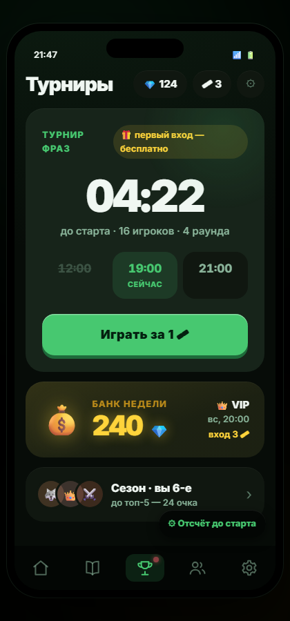

### 02-home-live

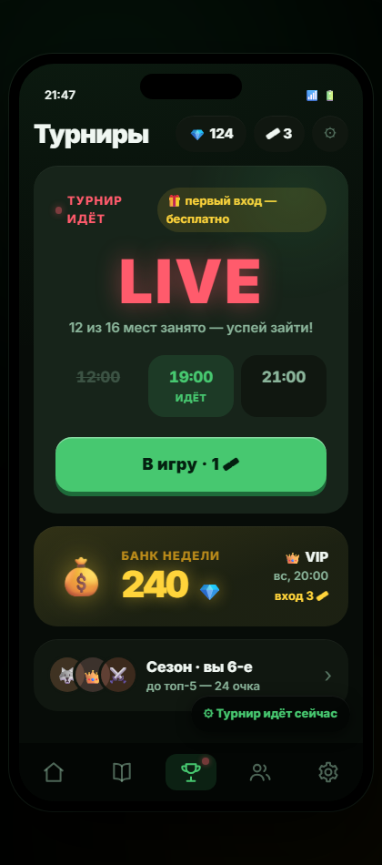

### 03-home-no-tickets

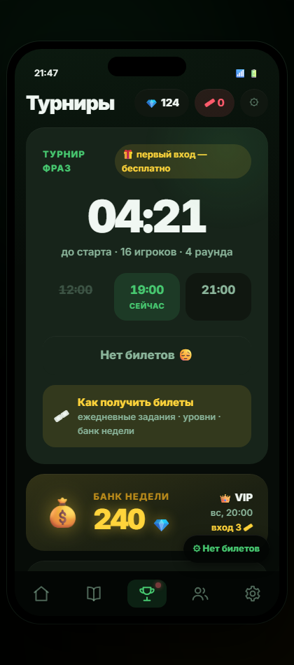

### 04-home-confirm

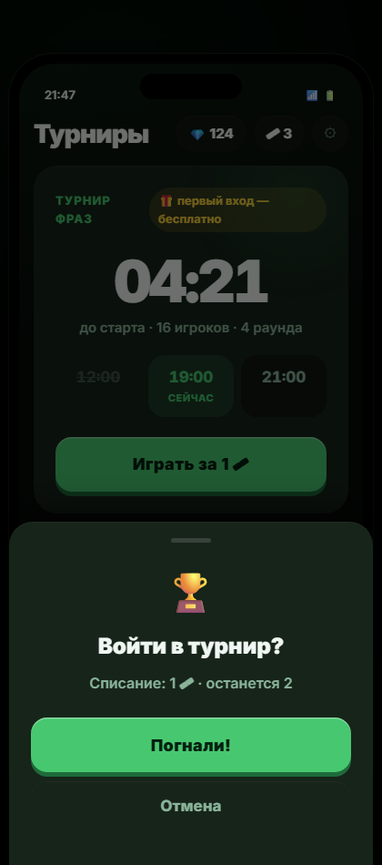

### 05-home-bank

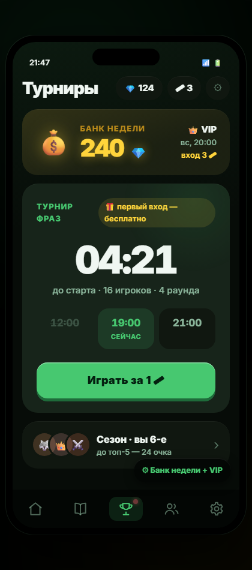

### 06-lobby-filling

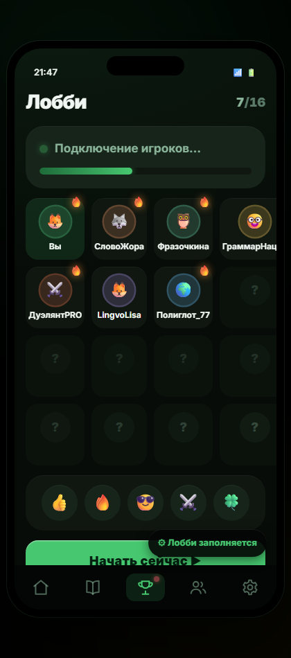

### 07-lobby-full

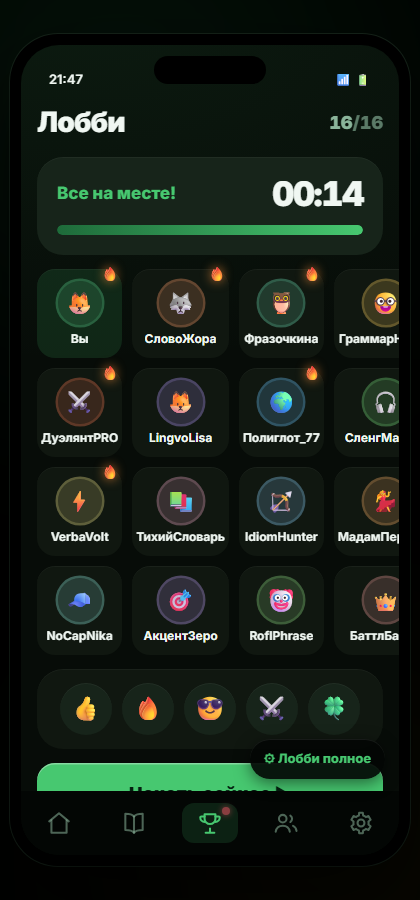

### 08-lobby-profile

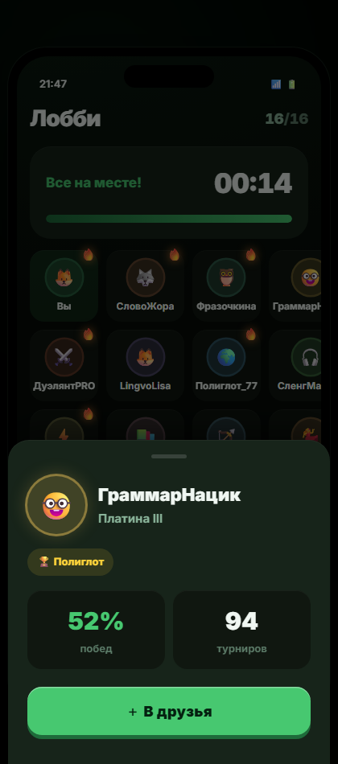

### 09-round-idle

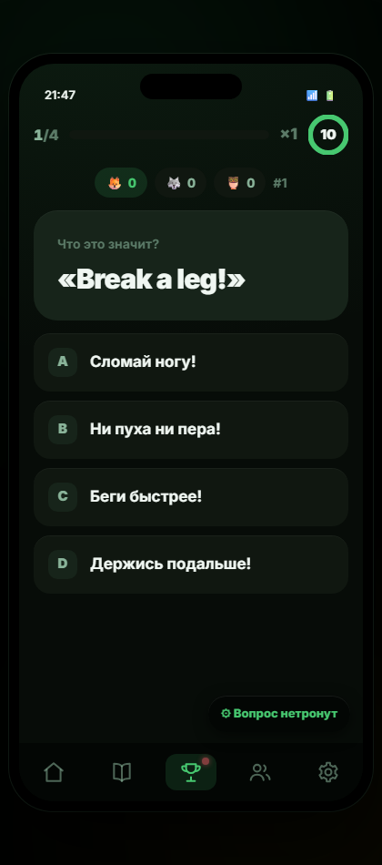

### 10-round-correct

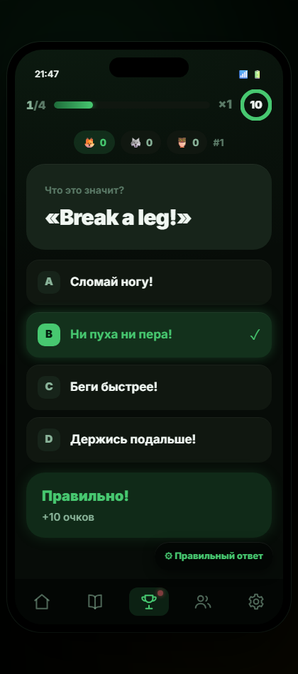

### 11-round-wrong

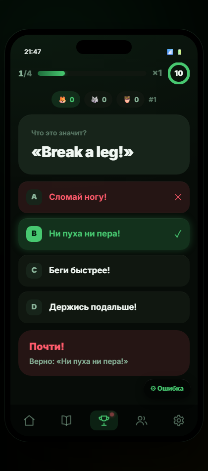

### 12-round-multiplier

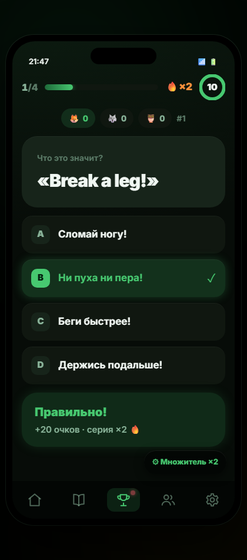

### 13-round-timer-low

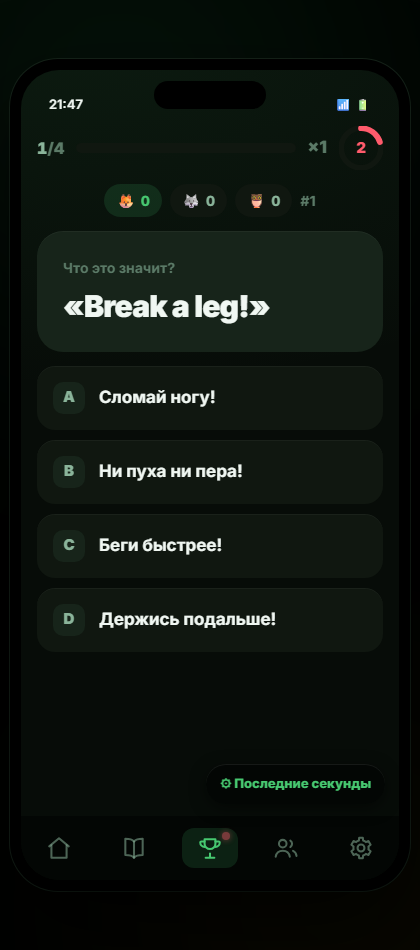

### 14-table-round1

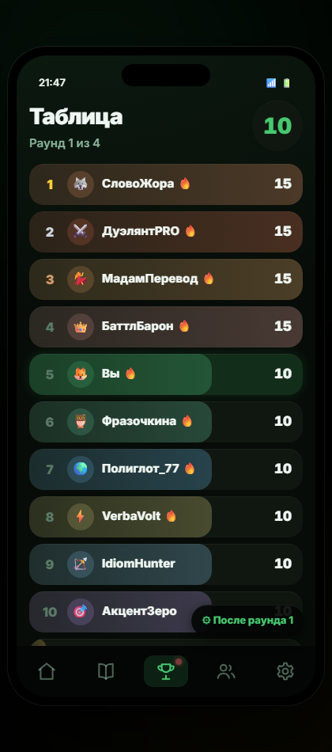

### 15-table-overtake

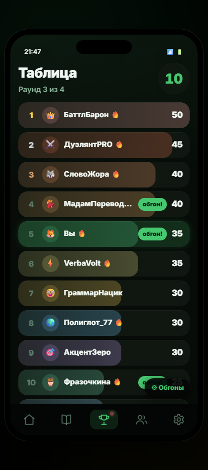

### 16-table-final

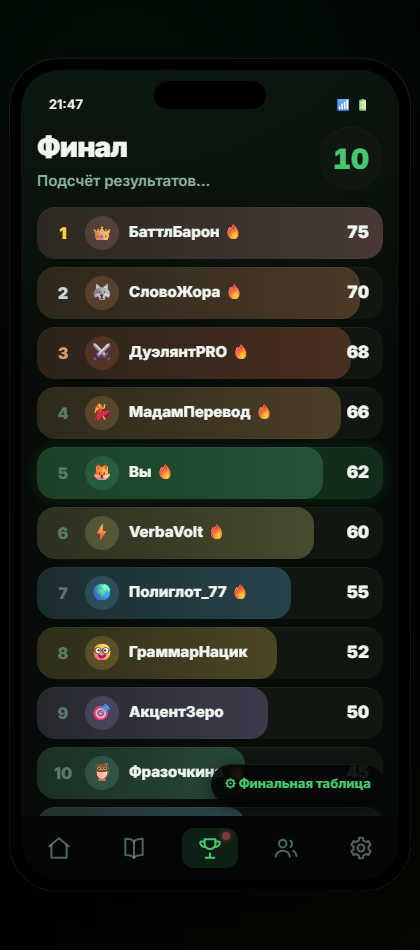

### 17-results-win

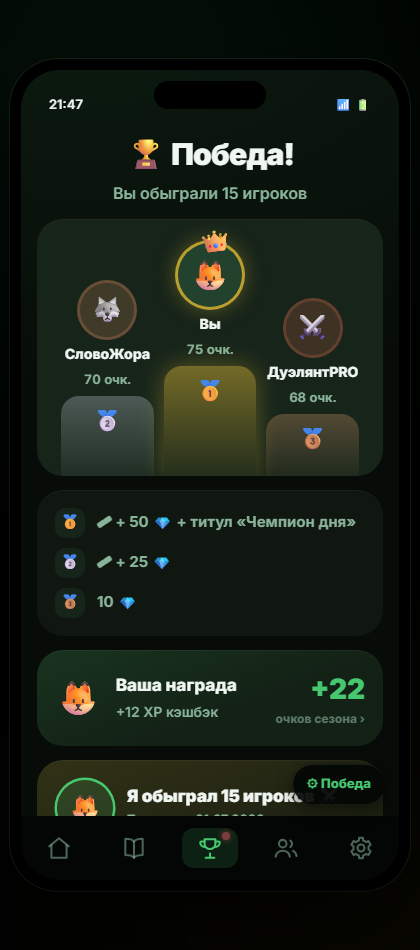

### 18-results-prize

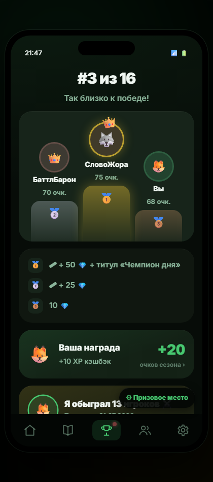

### 19-results-no-prize

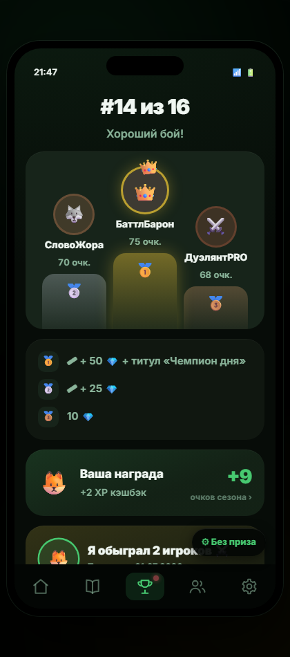

### 20-results-share

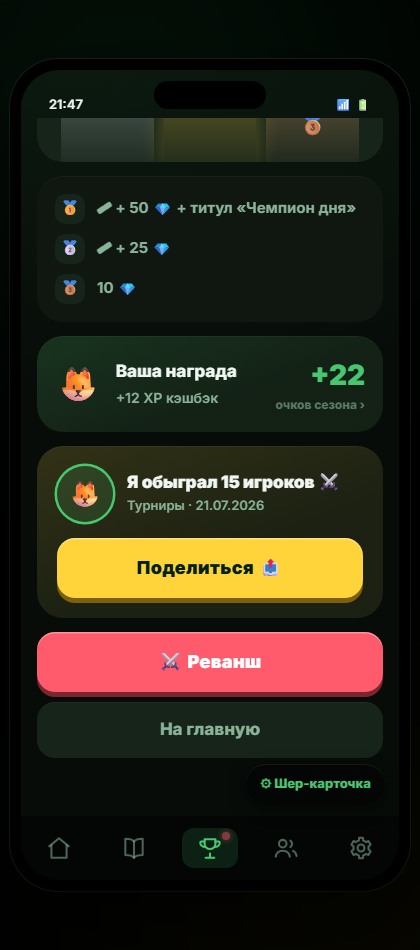

### 21-season

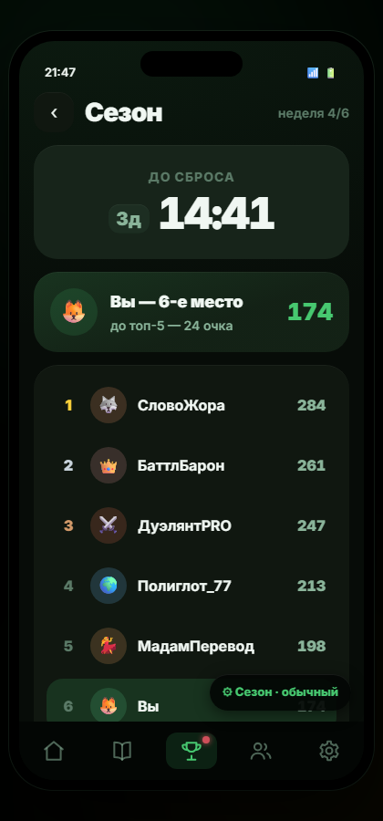

### 22-season-top5

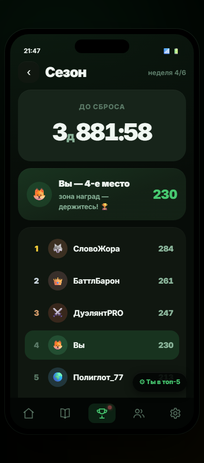

### 23-season-end

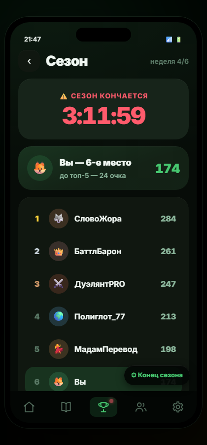

### 24-tournament-cancelled

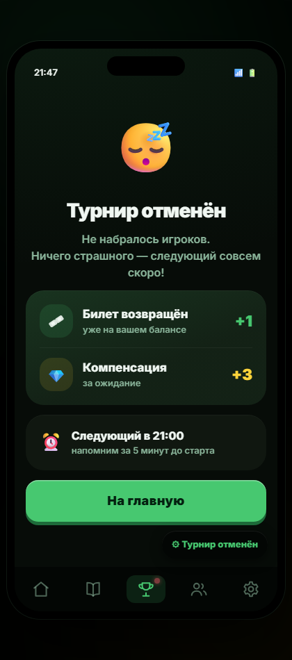

