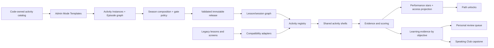

# Phraseman V2 — полный основной курс из 32 уроков

> **Передача на другой компьютер (актуально на 2026-08-15):** начинать с
> [`CODEX_NEXT_COMPUTER_START_HERE_2026-08-15.md`](./CODEX_NEXT_COMPUTER_START_HERE_2026-08-15.md).
> В нём зафиксированы текущая ветка, порядок чтения, решения владельца,
> выполненные части, открытые границы и первый безопасный следующий шаг.

**Статус:** продуктовая и техническая спецификация утверждена; реализация начата с Phase 00 security inventory, canonical contract work продолжается  
**Дата последней owner-сверки:** 2026-08-13  
**Цель:** дать генератору и карте один проверяемый основной путь на 32 урока,
не смешивая его с необязательными личными планами.

## Короткое решение

> **Граница авторства контента:** весь реальный учебный контент `E1`–`E32`
> самостоятельно создаёт только владелец. Codex разрабатывает генератор и
> техническую систему, но не пишет, не генерирует, не редактирует, не переводит,
> не утверждает и не запускает создание реального контента от имени владельца.
> Нейтральные fixtures допустимы только для проверки механики и никогда не
> считаются контентом курса.

> **Граница качества:** любой материал, который владелец собирает генератором,
> проверяется по
> [Quality Reference v3](./QUALITY_REFERENCE_GENERATED_CURRICULUM_V3.md).
> Он не определяет количество уроков/сессий, а проверяет objective alignment,
> CEFR plausibility, progression, естественность, перевод, theory, task/audio,
> retrieval, assessment и согласованность всех артефактов. BLOCKER/ERROR нельзя
> скрыть высоким средним score.

> **Последнее решение владельца о структуре:** основной курс содержит ровно
> **32 урока × 56 учебных сессий**. Первый экран показывает те же компактные
> карточки, что обычный раздел уроков. Нажатие раскрывает карту выбранного урока
> прямо под его карточкой; предыдущая карта автоматически схлопывается. Карта
> показывает семь глав по восемь сессий. Сессия рассчитана на 5–8 минут;
> целевое среднее — 7 минут. Это не `ровно 12 заданий`: стандартная сессия
> содержит 14–18 основных взаимодействий (цель 16), быстрая — 18–22, а
> насыщенная голосом/аудио/диалогом — 10–14; retries и объяснение второй ошибки
> считаются отдельно. Сессии 8/16/24/32/40/48 являются проверками главы,
> сессия 56 — итоговым экзаменом урока. Всего это 1 792 сессии и примерно
> 209 часов 4 минуты при целевом темпе.

> **Личные планы не входят в основной путь.** Курс обязан быть полноценным и
> самодостаточным без них. Если специализация Personal Plan вернётся, она будет
> отдельной новой поверхностью второй очереди; её карточки не вставляются в
> основную карту, а отдельный плановый пул не блокирует готовность основного
> генератора.

V2 строится не как ещё один изолированный экран уроков и не как полная перепись приложения. Рекомендуемая архитектура — **новый модульный движок активностей поверх существующих проверенных экранов и данных, с адаптерами для legacy**.

Курс состоит из 32 сценарных уроков. Каждый урок ведёт ученика через 56 коротких
сессий и один полный педагогический цикл:

1. понять ситуацию и смысл;
2. услышать и различить новую речь;
3. собрать и вспомнить фразы;
4. произнести их с контролируемой поддержкой;
5. быстро ответить без готового шаблона;
6. применить материал в диалоге или миссии;
7. вернуться к нему позже через персональное повторение.

Это Duolingo-like по ясности пути, Rosetta Stone-like по переходу от контекста к речи, ELSA-like по точечной обратной связи и EWA-like по историям и живому контексту — но с единой моделью прогресса Phraseman и без механического копирования интерфейсов.

## Честное обещание результата

Даже примерно 209 часов продукта нельзя автоматически приравнивать к достижению
уровня или сертификату. Cambridge оценивает ориентир от нуля до A2 примерно в
180–200 часов управляемого обучения, до B1 — 350–400, до B2 — 500–600 часов.
Поэтому курс проверяет CEFR-informed набор наблюдаемых `can-do` результатов,
каждый из которых связан с конкретной задачей и evidence limitation:

- старт с A0;
- выбранные базовые сценарии, типичные для диапазона A1;
- отдельные более сложные функции, которые могут встречаться в начале A2, без заявления о достижении A2;
- заметно меньший страх перед голосом;
- перенос выученных фраз в короткую неподготовленную беседу.

Источник: [Cambridge English — Guided learning hours](https://support.cambridgeenglish.org/hc/en-gb/articles/202838506-Guided-learning-hours).

## Что зафиксировано

| Область         | Решение                                                                                                                                                          |
| --------------- | ---------------------------------------------------------------------------------------------------------------------------------------------------------------- |
| Курс            | 32 урока; весь реальный контент создаёт владелец через генератор                                                                                                 |
| Единица курса   | Сценарный урок с ясным `can-do`, а не случайный набор грамматических карточек                                                                                    |
| Состав урока    | 56 прямых сессий без скрытых групп по 12; 5–8 минут, обычно 14–18 взаимодействий, 7 глав × 8; шесть проверок главы и итоговый экзамен №56                        |
| Учебный цикл    | Encounter → Notice → Build → Speak → Transfer → Delayed Review                                                                                                   |
| Голос           | Единый Voice Activity Shell для разрешений, записи, качества сигнала, оценки и fallback                                                                          |
| Speaking Club   | Финальный transfer/capstone, а не способ впервые познакомить ученика с материалом                                                                                |
| Personal Plan   | Отдельная необязательная специализация второй очереди; не находится на основной карте и не блокирует генератор курса                                             |
| Диалоги         | Скриптовые диалоги раньше, ограниченно-ветвящиеся позже, AI-миссии после подготовки                                                                              |
| Звёзды          | `performance stars` награждают лучший валидный результат и дают earned access; learning mastery вычисляется отдельно из evidence по целям                        |
| Покупка         | За осколки можно купить только Access Boost; нельзя купить learning evidence, checkpoint, произношение или утверждение об уровне                                 |
| Legacy          | Сохраняется до функционального паритета и подтверждённой миграции; ничего не удаляется побочно                                                                   |
| Контент         | Версионированные immutable-релизы с hash-проверкой, кэшем, bundled fallback и rollback                                                                           |
| Админка         | Content Studio создаёт versioned шаблоны режимов, упражнения и графы сессий/уроков со звёздными воротами, затем проводит preview, валидацию, review и публикацию |
| Граница no-code | Исполняемые механики и политики принадлежат коду; админка создаёт только безопасные шаблоны и экземпляры из зарегистрированных возможностей                      |
| Масштабирование | Язык, сценарий, активность, оценивание, награда и UI-рендерер разделены контрактами                                                                              |

## Что означают звёзды

В V2 нельзя смешивать игровую награду, доступ и учебное доказательство: иначе покупка начинает выглядеть как «купленное знание», аналитика становится нечестной, а интерфейс вводит ученика в заблуждение.

| Сущность                 | Как получается                                                                                                | На что влияет                                                  | Можно купить |
| ------------------------ | ------------------------------------------------------------------------------------------------------------- | -------------------------------------------------------------- | ------------ |
| `performanceStarsEarned` | Лучший валидный результат activity/star slot                                                                  | Награда, диагностика практики и derived earned access          | Нет          |
| `accessStarsEarned`      | Read-only projection из текущих `bestPerformanceStars`                                                        | Открытие следующих сессий/уроков                               | Нет          |
| `accessStarsPurchased`   | Access Boost за осколки                                                                                       | Только временно закрывает дефицит доступа                      | Да           |
| `LearningEvidence`       | Только assessed observation по objective/construct с известными phase, support, context, prompt и input route | Independent/durable mastery, review и checkpoint               | Нет          |
| `LearningNonAssessment`  | Отдельная запись accessibility/system/invalid недоступности без учебного pass/fail                            | Диагностика и честный `not_assessed` state                     | Нет          |
| `voiceBadge`             | Derived из assessed spoken evidence с microphone route, calibration и provenance                              | Честная индикация spoken evidence; не заменяет mastery целиком | Нет          |

Покупка доступа не должна изменять учебную статистику. В интерфейсе это нужно объяснять прямо: «Открывает следующий шаг, но не засчитывает владение материалом».

## Архитектура продукта

## Библиотека режимов

В пилот входит 18 пользовательских учебных поверхностей: 17 runtime activity families и отдельная checkpoint/assessment surface. UI строится на одном общем `ActivityScaffold` и шести переиспользуемых оболочках. Это сохраняет разнообразие обучения без 18 независимых реализаций и не превращает checkpoint в восемнадцатую runtime family.

1. Visual Discovery — смысл по сцене/картинке.
2. Listen & Choose — распознавание фразы на слух.
3. Sound Contrast — минимальные пары и фонемное различение.
4. Sound/Syllable Lab — звук, слог, ударение, артикуляционная подсказка.
5. Scripted Repeat & Compare — прослушать, записать, сравнить, повторить.
6. Phrase Builder — собрать фразу из блоков.
7. Listen & Build / Dictation — восстановить услышанное.
8. Context Gap / Grammar — выбрать форму в живой ситуации.
9. Quick Spoken Response — ответить голосом на короткую реплику.
10. Shadowing / Prosody — повторить за моделью с ритмом и паузами.
11. Describe the Scene — описать изображение с опорами.
12. Microstory / Radio — короткая история с проверкой понимания.
13. Branching Scene / Adventure — выполнить цель в интерактивной сцене.
14. Scripted Dialogue / Milestone — разыграть подготовленный разговор.
15. AI Speaking Club Mission — свободнее решить конкретную коммуникативную задачу.
16. Mistakes / Personalized Review — вернуться к реальным слабым местам.
17. Speed Match — необязательная быстрая автоматизация без голоса.
18. Checkpoint — перенос навыка на новые реплики и ситуации.

## Порог готовности пилота

Пилот считается технически готовым к ограниченному rollout только если одновременно выполнены условия:

- все 32 графа уроков и 1 792 сессии проходят schema, content и localization validation;
- ни один обязательный голосовой узел не блокирует пользователя из-за шума, отсутствия разрешения или недоступности STT;
- performance/access stars физически не могут подменить learning evidence, checkpoint, уровень или произносительную аналитику;
- прогресс идемпотентен, account-scoped и переживает offline/restart;
- правильность каждого ответа определяется только локальной evaluator capsule; сервер в фоне сохраняет лишь итог полностью завершённой сессии и никогда не возвращает пользователю verdict;
- незавершённый run сессии не возобновляется с середины: повторный вход всегда начинается с первого intro-экрана и нового `sessionRunId`;
- клиент проверяет `releaseId` и `contentHash`, умеет откатиться к последнему валидному релизу;
- каждый новый тип активности имеет renderer, scoring/evidence policy, progress policy, reward policy и тестовые fixtures;
- legacy остаётся доступным за rollout-флагом до подтверждённого паритета;
- аналитика различает `shown`, `started`, `valid_attempt`, `uncertain`, `completed`, `independent_evidence`, `durable_evidence`, `skipped_accessibility`, `not_assessed_accessibility`, `unavailable`;
- gate-relevant voice scoring имеет свежие calibration/fairness receipts, а network voice — approved privacy/retention policy;
- интерфейсы проверены на маленьком Android, крупном iPhone, large text, screen reader и reduced motion;
- проведён dogfood, затем закрытая когорта, затем A/B только для заранее описанных гипотез.

## Карта документов

| Документ                                                                                             | Что в нём                                                                                                                                                                               |
| ---------------------------------------------------------------------------------------------------- | --------------------------------------------------------------------------------------------------------------------------------------------------------------------------------------- |
| [GENERATOR_DELIVERY_CONTRACT.md](./GENERATOR_DELIVERY_CONTRACT.md)                                   | Обязательный порядок работы и единственный полный Definition of Done генератора: 5–10 экспертных ролей, правильная админка, языки, аудио, UI, тесты и запрет преждевременной готовности |
| [QUALITY_REFERENCE_GENERATED_CURRICULUM_V3.md](./QUALITY_REFERENCE_GENERATED_CURRICULUM_V3.md)       | Единый owner-supplied эталон качества generated curriculum: objective/content/practice/evidence, CEFR, язык, progression, task/audio/memory/assessment и actionable findings            |
| [HANDOVER.md](./HANDOVER.md)                                                                         | Живой статус реализации, точный следующий шаг, ветки, проверки, blockers и обязательный протокол продолжения между сессиями                                                             |
| [00-research-and-skill-audit.md](./00-research-and-skill-audit.md)                                   | Какие skills проверены, установлены, отклонены и как они повлияли на решения                                                                                                            |
| [01-current-state-audit.md](./01-current-state-audit.md)                                             | Что уже есть в приложении и где реальные ограничения                                                                                                                                    |
| [02-competitor-and-learning-evidence.md](./02-competitor-and-learning-evidence.md)                   | Rosetta Stone, Duolingo, ELSA, EWA/EULA, научные основания и UI-референсы                                                                                                               |
| [03-learning-architecture-and-curriculum.md](./03-learning-architecture-and-curriculum.md)           | Исторический curriculum draft на 32 единицы; актуальная продуктовая topology — 32 урока × 56 сессий                                                                                     |
| [04-activity-catalog-and-storyboards.md](./04-activity-catalog-and-storyboards.md)                   | Каталог режимов, UI shells, состояния, motion и accessibility                                                                                                                           |
| [05-stars-progress-and-mastery.md](./05-stars-progress-and-mastery.md)                               | Звёздная экономика, формулы ворот, ledger и защита от pay-to-win                                                                                                                        |
| [06-runtime-content-admin-and-release.md](./06-runtime-content-admin-and-release.md)                 | Схемы данных, activity registry, админ-генератор, релизы и offline                                                                                                                      |
| [07-migration-analytics-testing.md](./07-migration-analytics-testing.md)                             | Миграция legacy, rollout, аналитика, эксперименты и тестовая матрица                                                                                                                    |
| [08-admin-content-studio-and-mode-authoring.md](./08-admin-content-studio-and-mode-authoring.md)     | Полный authoring-контур: Mode Templates, Activity Instances, Episode Builder, Preview Lab, локализация, approval и release                                                              |
| [Master implementation plan](../superpowers/plans/2026-07-14-phraseman-v2-pilot-season.md)           | Общая последовательность GSD/TDD-реализации сезона                                                                                                                                      |
| [Content Studio implementation plan](../superpowers/plans/2026-07-14-phraseman-v2-content-studio.md) | Отдельный подробный TDD-план пересоздания генератора и authoring-пути                                                                                                                   |

## Последовательность реализации

1. Закрыть Phase 00: security boundary, hashable artifact bodies, learning/voice evidence, hypothesis registry, preview/release identity и reference-capture pack; пользовательский путь не менять.
2. Ввести code-owned activity kernel registry и support manifest версий приложения.
3. Зафиксировать `ModeTemplate`, `ActivityInstance`, versioned lesson/session draft и pure validators до написания редактора.
4. Ввести namespaced V2 progress и раздельный star/access ledger.
5. Собрать Voice Activity Shell и перенести один controlled-repeat режим.
6. Подключить существующие режимы через adapters.
7. Собрать Mode Library, Lesson Builder с course workspace/gate preview и Preview Lab на существующем stage/review/release pipeline.
8. Провести один `vertical_slice` только для lab/staging: шаблон режима → упражнение → нейтральный урок → course revision → device preview → release → rollback.
9. Добавить transfer-режимы, Speaking Club и personal review queue.
10. Дать владельцу собрать и проверить первые восемь реальных уроков после полного neutral E2E; Codex контент не создаёт.
11. Закрытый pilot chapter 1; исправить scoring, UX и generator contracts.
12. Расширить на 32 урока × 56 прямых сессий; checkpoints и миграция.
13. Запустить ограниченную когорту V2, сохраняя legacy fallback.
14. Решать судьбу legacy/Challenges только после паритета, данных и отдельного одобрения.

## Решения, которые можно подтвердить до начала UI-production

Ни один вопрос ниже не блокирует написание contracts: для каждого уже указан безопасный default. Ответ владельца продукта заменит default в decision log.

| Вопрос                                           | Рекомендуемый default                                                                                                                           | Почему                                                                                                                                 |
| ------------------------------------------------ | ----------------------------------------------------------------------------------------------------------------------------------------------- | -------------------------------------------------------------------------------------------------------------------------------------- |
| Карта вертикальная или горизонтальная?           | Вертикальная, 4 явно разделённые главы                                                                                                          | Привычная модель пути и удобство одной рукой                                                                                           |
| Видны ли все 32 урока сразу?                     | Компактные карточки видны списком; 56 сессий раскрываются inline только у выбранного урока                                                      | Даёт цель без визуального перегруза                                                                                                    |
| Сколько узлов видно внутри раскрытого урока?     | 56 сессий разделены на 7 визуальных глав по 8; один следующий шаг выделен                                                                       | Полный маршрут без скрытой структуры, но с ясным локальным фокусом                                                                     |
| Можно ли пропустить голос?                       | Да, при недоступности/доступности; контент завершён, voice evidence не выдан                                                                    | Не наказывать за среду или особые потребности                                                                                          |
| Tap-to-talk или hold-to-talk?                    | Tap start/stop по умолчанию; hold — только дополнительная настройка                                                                             | Один доступный контракт для коротких и длинных ответов; hold не становится обязательным для VoiceOver, TalkBack и моторной доступности |
| Показывать числовой pronunciation score?         | Только после task-specific calibration; до этого — качественный verdict и одна actionable cue                                                   | Валидная запись ещё не делает vendor scale педагогически валидной                                                                      |
| Нужна ли красно-жёлто-зелёная раскраска слов?    | Только вместе с значком/подписью, не цветом одним                                                                                               | Доступность и меньше ощущения наказания                                                                                                |
| Разрешить Access Boost сразу?                    | Только после двух честных попыток и объяснения дефицита                                                                                         | Не превращать оплату в первый путь прохождения                                                                                         |
| Повторять предыдущую сессию дважды?              | Первый проход + immediate `near_transfer`, а не идентичный replay; настоящий delayed review назначает scheduler и он не блокирует следующий шаг | Вариативность проверяет ближний перенос, а durable evidence требует времени                                                            |
| Награждать 1 звездой за невалидный звук?         | Нет; статус `uncertain/unavailable`, попытка не тратится                                                                                        | Техническая ошибка не является учебным результатом                                                                                     |
| Где показывать Speaking Club?                    | В финальной transfer-главе урока и отдельной Practice-полке                                                                                     | Сначала подготовка, затем перенос; остаётся возможность перепройти                                                                     |
| Делать ли AI обязательным?                       | Нет для core progression в первой версии                                                                                                        | Стоимость, сеть, safety и непредсказуемость не должны блокировать путь                                                                 |
| Нужен ли Personal Plan в основном курсе?         | Нет; только возможная будущая отдельная специализация                                                                                           | Основные 32 урока должны быть полноценными, а карта — чистой                                                                           |
| Сохранять ли отдельные Challenges?               | В rollout — да; затем side nodes после доказанного паритета                                                                                     | Безопасная миграция и отсутствие скрытого удаления функции                                                                             |
| Насколько яркими делать анимации?                | Сдержанные в упражнениях, редкая выразительная кульминация урока                                                                                | Не мешает частым повторам, сохраняет чувство награды                                                                                   |
| Нужны ли картинки в стиле Rosetta Stone?         | Да для смыслового контекста, но только функциональные и локализуемые сцены                                                                      | Контекст без перевода полезен, декоративный арт не нужен                                                                               |
| Сколько нового материала на сессию?              | Только объём, который проходит encounter → practice → retrieval → check за 5–8 минут; число определяет coverage matrix, а не квота              | Не перегружает рабочую память и не создаёт filler                                                                                      |
| Когда вводить свободный ответ?                   | После 2–3 поддержанных производящих заданий                                                                                                     | Снижает blank-page anxiety                                                                                                             |
| Можно ли открыть сессию «на будущее»?            | Да через access gate, но checkpoint использует только релевантное learning evidence                                                             | Свобода без покупки учебного достижения                                                                                                |
| Что является главным KPI?                        | Доля учеников, успешно применивших фразы в delayed transfer                                                                                     | Не XP и не количество нажатий, а наблюдаемый перенос                                                                                   |
| Что администратор может создать без app release? | Новый versioned шаблон режима, локализацию и упражнения только из зарегистрированных kernels/primitives                                         | Масштабируем контент, не превращая remote config в удалённый код                                                                       |
| Что всё ещё требует app release?                 | Совершенно новая механика UI, evidence или scoring policy                                                                                       | Native capabilities, награды и прогресс остаются проверяемым code-owned контрактом                                                     |

## GSD-правило для этого проекта

Текущая `.planning` уже относится к другому milestone, поэтому спецификация V2 не перезаписывает её. После закрытия активного milestone V2 следует запускать отдельным milestone `Phraseman V2 Pilot Season` либо отдельным GSD workstream. Implementation plan разбит на вертикальные фазы с собственными acceptance criteria; владелец начинает создавать реальные уроки только после работающего neutral end-to-end generator slice. Codex не участвует в авторстве реальных уроков.
