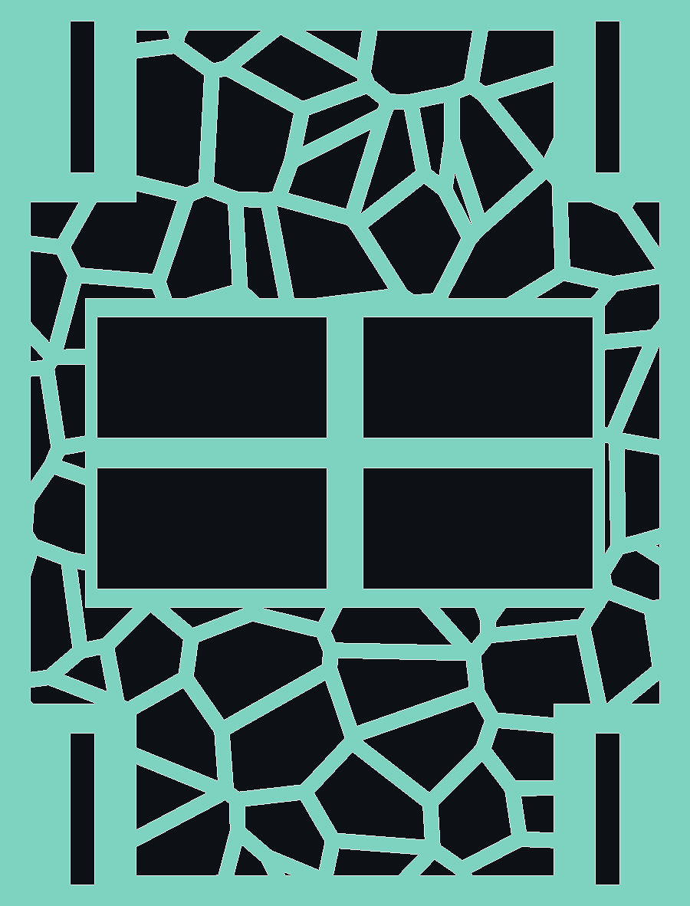

# CAST ARMOR — накладки на гипс предплечья

Футуристичные накладки поверх гипса: ажур Вороного + крепления MOLLE/PALS
под навесное снаряжение. Печать FDM, стол от 220 мм.



---

## ⚠️ СНАЧАЛА ПРОЧИТАЙ ЭТО

**Накладка НЕ должна сжимать гипс.** Она надевается сверху с воздушным
зазором и держится мягкими ремнями. Гипс под нагрузкой давит на отекающие
ткани — это реально опасно.

- Зазор `clearance` по умолчанию **6 мм**. Меньше 4 мм генератор запрещает.
- Ремни затягивать «на два пальца» — свободно проходит два пальца между
  ремнём и гипсом.
- **Немедленно снять**, если: немеют/белеют/синеют пальцы, усилилась боль,
  покалывание, гипс начал давить в одной точке.
- Не носить во сне. Не мочить. Не носить, если врач запретил что-либо
  надевать поверх гипса — **спроси травматолога**, это две минуты разговора.
- Это украшение и подставка под мелочи, **не защита**. От удара она не
  спасёт, а осколки жёсткого PLA могут навредить.

---

## Что в комплекте

| Деталь | Что это | Печать |
|---|---|---|
| `forearm` | Основная ажурная панель Вороного + MOLLE | ~6–8 ч |
| `shield` | Та же панель без ажура — глухая, прочнее | ~9–11 ч |
| `cuff` | Короткая манжета у запястья, 55 мм | ~2–3 ч |
| `pouch` | Навесной подсумок на стропу MOLLE | ~2 ч |

---

## Шаг 1. Замерь гипс

Портновской лентой, **поверх гипса**, не затягивая:

1. **Обхват у запястья** — самое узкое место. → `--circ-wrist`
2. **Обхват у локтя** — самое широкое место накрываемого участка. → `--circ-elbow`
3. **Длина** от запястья до места, где панель закончится. → `--panel-len`

Панель короче гипса — так и надо. Не закрывай сгиб локтя и подвижность кисти.

## Шаг 2. Сгенерируй STL

```bash
python generate.py --circ-wrist 205 --circ-elbow 268 --panel-len 155
```

Файлы появятся в `stl/`. Генератор печатает внутренние радиусы и проверяет,
что меш замкнут (`OK замкнут`) — если написано иначе, не печатай, напиши мне.

Полезные ключи:

```bash
python generate.py --part forearm       # только основную панель
python generate.py --seed 7             # другой рисунок Вороного
python generate.py --voronoi-seeds 400  # мельче ячейки
python generate.py --strut-w 3.0        # толще перемычки (прочнее)
python generate.py --arc-deg 170        # больше охват (плотнее сидит)
python generate.py --clearance 8        # больше зазор (гипс толстый)
```

## Шаг 3. Посмотри превью до печати

```bash
python preview_png.py
```

Даёт `preview_flat_*.png` (развёртка) и `preview_3d_forearm.png` (3D-вид).
Быстрее, чем гонять слайсер.

---

## Настройки печати

| Параметр | Значение | Почему |
|---|---|---|
| Материал | **PETG** (лучше) или PLA | PETG не хрупкий, не течёт в машине летом |
| Слой | 0.2 мм | компромисс скорость/вид |
| Периметры | 3 | ажур держится на стенках, не на заполнении |
| Заполнение | 25–30 % | перемычки тонкие, заполнение почти не работает |
| Поддержки | **не нужны** | панель печатается «лёжа», свесов нет |
| Ориентация | панель выпуклостью **вверх**, на торец | меньше свесов и слои идут вдоль нагрузки |
| Адгезия | brim 5 мм | тонкие перемычки любят отрываться |

Если панель не влезает по диагонали стола — уменьши `--panel-len` и напечатай
две секции, соединив их ремнём через проушины.

---

## Сборка

1. Зачисти проушины и окна MOLLE (4 щели по углам панели).
2. Продень **мягкую липучку** 25 мм через проушины. Не стяжки, не резинки —
   только то, что регулируется и мгновенно снимается.
3. Изнутри по всей площади наклей **мягкий фетр или EVA-пену 2–3 мм**. Это
   обязательно: голый пластик по гипсу натирает и стучит.
4. Надень, затяни «на два пальца», проверь пальцы через 10 минут.

### Что вешается на MOLLE

Стандартная стропа PALS 38×25 мм — подходит любой малый подсумок, органайзер,
карабин, крепление фонаря, держатель телефона на MOLLE. Печатный `pouch`
заводится язычком за ленту.

---

## Параметры в коде

Всё живёт в классе `Params` в [generate.py](generate.py) — там же комментарии
к каждому размеру. `validate_params()` блокирует опасные значения (малый зазор,
замкнутое кольцо, слишком тонкие перемычки).

Файл [cast_armor.scad](cast_armor.scad) — та же геометрия для OpenSCAD, если
захочешь крутить модель мышкой. Основной и проверенный путь — питон.
